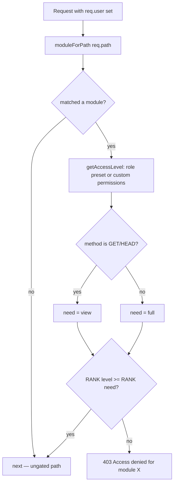

# File Walkthrough — `server/middleware/permissions.ts`

## Purpose & business value

Where `auth.ts` answers "is this a valid user, and what's their role?", `permissions.ts` answers the finer-grained question: "can *this specific role, or this specific user's custom permission overrides*, do *this specific thing* in *this specific business module*?" It's what lets a business owner configure a Warehouse-role employee to see inventory but not finance, without writing a single new line of route code — it's entirely data-driven (128 lines, no route-specific logic at all).

## Imports/exports

**Exports:** `AccessLevel` (`'hidden' | 'view' | 'print' | 'full'`), `normalizePermissions`, `getAccessLevel`, `moduleForPath`, `enforceModulePermissions`.

**Imports:** only `AuthRequest` from `./auth` — this file has zero database dependency, making it fast and trivially unit-testable (see [Unit Testing](/testing/unit)).

## Flow

## Call hierarchy

- **Called by:** mounted globally in `app.ts` as `app.use('/api/', enforceModulePermissions)`, running on literally every authenticated API request. `normalizePermissions` is also called directly inside `app.ts`'s inline JWT-verify middleware (to shape the DB's raw `permissions` column into the typed `Record<string, AccessLevel>` before attaching it to `req.user`).
- **Calls into:** nothing — pure functions, no I/O.

## Performance notes

- This entire module is O(number of `PATH_MODULE` prefixes) per request in the worst case (`moduleForPath` does a linear scan) — trivially fast (~40 entries), not worth optimizing (e.g. into a prefix trie) at current or foreseeable scale.
- Zero DB calls — all the data this needs (`user.role`, `user.permissions`) was already fetched once by the global auth middleware in `app.ts` and cached via `authCache`.

## Security notes

- **`ROLE_PRESETS` is the ground truth for what each role can do by default.** A common mistake when adding a new business module (e.g. "Payroll") is adding the routes and forgetting to add a `PATH_MODULE` entry — the module then falls through `moduleForPath` returning `null`, and `enforceModulePermissions`'s `if (!mod) return next();` means **the route is completely ungated by module permissions**, even though it might still require plain authentication. This has historically been the source of "why can Staff see the new feature when they shouldn't" bugs.
- **Admin/Super Admin always get `'full'`, short-circuiting everything else** (`if (role && ['Admin', 'Super Admin', 'super_admin'].includes(role)) return 'full';`) — this is intentional (admins aren't meant to be restrictable by the custom-permissions UI), but it also means a bug in custom permission storage for an Admin user would never be caught by testing that only exercises the Admin role — always test permission logic with a non-Admin role.
- **`GET`/`HEAD` need only `'view'`; every other method needs `'full'`.** There is no intermediate "can view and print, but not edit" enforcement at this layer for *mutations* — the `'print'` access level exists as a level between `view` and `full` for specific UI gating (e.g. Warehouse role can print distribution docs) but the blanket rule here means any non-GET request from a `'print'`-level user gets rejected. If a future feature needs print-specific write access (e.g. "mark printed" without full edit rights), this module's binary GET-vs-everything-else split would need to be extended.
- **Custom permission overrides win over role presets** when present (`getAccessLevel` prefers `permissions` object if it has any keys) — but falls back to the role preset per-module if a specific module key is *missing* from an otherwise-populated custom permissions object, not to `'hidden'`. This fallback-to-preset-per-key (rather than fallback-to-hidden) is a deliberate "fail open to the role's baseline" choice, not a "fail closed" choice — worth knowing if you're reasoning about worst-case exposure for a partially-configured custom-permissions user.

## Refactoring notes

- **Safe:** adding new entries to `PATH_MODULE`, adding new modules to `ALL_MODULES` + corresponding `ROLE_PRESETS` entries for every existing role (must update every role's preset object, since they're not automatically backfilled with a default).
- **Risky:** changing the GET/HEAD-vs-everything-else split, changing the "custom permissions missing key falls back to role preset" behavior (see above) — either could silently change existing tenants' effective access without any of their configuration changing.
- If you add a new role beyond the fixed set (Admin, Manager, Staff, Warehouse, Vendor, Super Admin), you must add both a `ROLE_PRESETS` entry here and confirm `requireRole`/`superAdminMiddleware` callers elsewhere don't need updating too.

## Common mistakes

1. Adding routes for a new module and forgetting the `PATH_MODULE` entry (see Security notes) — the single most common permissions bug in this codebase's history.
2. Testing only with Admin role — misses all module-gating bugs, since Admin always gets `'full'`.
3. Assuming `'print'` access allows some specific write operation — it doesn't at this layer; it's purely a hint the *frontend* uses to decide what UI to render (e.g. show a print button but hide edit controls) — the backend still requires `'full'` for any non-GET.

## Alternatives considered

A more granular RBAC/ABAC system (per-action permissions like `sales.create`, `sales.void`, `sales.export`) would allow finer control than four access levels per module. DG-ERP deliberately keeps it coarse — one access level per business module — because small-business owners configuring roles in the settings UI think in terms of "can this person see/touch the Sales area," not fine-grained action lists; the coarser model matches the actual mental model of the people configuring it, at the cost of not being able to express "can create sales but not void them" without a code change.

## Related pages

- [`server/middleware/auth.ts`](/files/server/middleware-auth)
- [`server/app.ts`](/files/server/app)
- [Runbook: Auth Failures](/runbooks/auth-failures)
- [Lab: Debug a 403](/labs/lab-debug-403)
- [Learning: Module — AuthZ](/learning/module-authz)
