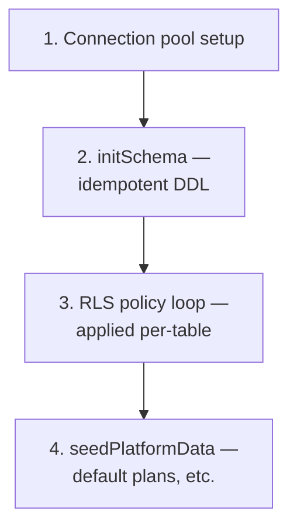

# File Deep Dive: `server/pg-db.ts`

~932 lines — the largest single file in the backend, and worth understanding in sections rather than all at once.

## The four things this file does

### 1. Connection pool

A single `pg.Pool` instance, exported and imported everywhere else in the backend (`import { pool } from '../pg-db'`). Configured from `DATABASE_URL`, with SSL settings that differ between local development and hosted Postgres (Render requires SSL; local Docker Postgres typically doesn't). This pool connects as the table-owning role — the fact that makes RLS a backstop rather than the primary isolation mechanism. See [RLS](/database/rls).

### 2. `initSchema()`

A long, linear sequence of `CREATE TABLE IF NOT EXISTS` and `ALTER TABLE ... ADD COLUMN IF NOT EXISTS` statements, run once at server boot. No versioning, no migration table — the function itself, as it exists in the current codebase, *is* the schema definition. See [Migrations Strategy](/database/migrations-strategy) for the full rationale.

:::tip Reading strategy
Don't try to read all ~30+ `CREATE TABLE` statements linearly in one sitting. Instead, grep for the specific table you care about (`rg "CREATE TABLE IF NOT EXISTS orders" server/pg-db.ts`) and read just that block plus any `ALTER TABLE orders` statements that follow later in the file — schema evolution for one table is often scattered across the file in the order changes were made over time, not grouped together.
:::

### 3. RLS policy application

After all tables exist, a loop iterates over an array of tenant-scoped table names (`rlsTables`) and applies a standard policy to each: `ENABLE ROW LEVEL SECURITY` plus a `CREATE POLICY` restricting rows to `tenant_id = current_setting('app.tenant_id')::text`. Adding a new tenant-scoped table means adding its name to this array — easy to forget, and forgetting it doesn't break anything visibly (since the app bypasses RLS as pool owner anyway), which is exactly why it's easy to forget. See [RLS](/database/rls).

### 4. `seedPlatformData()`

Ensures baseline platform-level rows exist — default subscription plans, for instance — using the same `IF NOT EXISTS` idempotent pattern. Runs after schema creation, before the server starts accepting requests.

## Why one 932-line file instead of several smaller ones?

Similar rationale to [`app.ts`](/files/server/app): a single file means the entire schema is visible via one file read (or one `grep`) rather than reconstructed from multiple migration files. The cost is real — this file is genuinely large and requires disciplined navigation (see the reading strategy tip above) — but splitting it by table domain would reintroduce a version-ordering problem (which file's `ALTER TABLE` ran first?) that the current single-file, top-to-bottom-execution-order approach avoids entirely.

## Common mistakes when editing this file

- Adding a new table but forgetting to add it to `rlsTables` — no error, just a table without the RLS backstop.
- Writing a `DROP` or destructive `ALTER` directly, instead of following the two-release deprecate-then-drop pattern (see [Migrations Strategy](/database/migrations-strategy)).
- Adding a `NOT NULL` column without a `DEFAULT` — this fails immediately on any database with existing rows in that table, since Postgres can't backfill a NOT NULL value out of nowhere.

## Related

- [Database → Schema Overview](/database/schema-overview)
- [Database → RLS](/database/rls)
- [Database → Migrations Strategy](/database/migrations-strategy)
- [Lab: Add an Endpoint](/labs/lab-add-endpoint)
