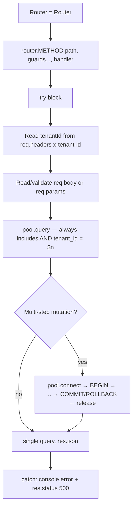

# File Walkthrough — `server/routes/*` (the pattern)

## Purpose & business value

There are ~35 files in `server/routes/`, ranging from 36 lines (`masters.ts`) to 1,522 lines (`distribution.ts`). Rather than document all 35 individually, this page documents **the pattern they all share** — once you understand `sales.ts`, you can read any of the other 34 with the same mental model. Business value of the pattern itself: a new engineer who's read one route file can be productive in any of them, which matters a lot given how much of the codebase is route files.

## The shared shape

Every route file exports a single `Router` instance as its default export, mounted in `app.ts`.

## Walking through `sales.ts` as the representative example

`GET /api/sales/validate/:barcode` (barcode scan validation) demonstrates the **read path** pattern:
1. Pull `tenantId` from `req.headers['x-tenant-id']` (set by the global auth middleware in `app.ts`, not trusted from the client directly).
2. Call `assertVendorLinked`/`vendorScopeId` (from [`middleware/auth.ts`](/files/server/middleware-auth)) to scope Vendor-role users to only their own vendor's stock.
3. Query in priority order — distributed-to-vendor stock, then already-sold/returned, then owner inventory, then not-found — each a separate `pool.query`, returning as soon as a case matches. This is a deliberate "waterfall of specific checks" rather than one giant query, because each case needs a **different error message** for the frontend to show.

`POST /api/sales` demonstrates the **write path** pattern, and the more interesting one:
1. An initial *unlocked* read (outside any transaction) to fail fast on obviously-invalid input before paying for a transaction.
2. Then `pool.connect()` → `BEGIN` → **re-run the same lookup query, this time with `FOR UPDATE`** to lock the specific barcode row — this is the row-level lock that prevents two concurrent scans of the same barcode from both succeeding (a double-sell race). The comment `// #9 fix: lock the barcode rows inside the transaction to prevent double-sell race` documents that this was a real bug found and fixed, not a defensive pattern added preemptively.
3. Insert the sale, update distribution/inventory status, `COMMIT`.
4. `catch` → `ROLLBACK` → re-throw or respond; `finally` → `client.release()`.

## Call hierarchy

- **Called by:** mounted in `app.ts`; invoked per-request by Express's router matching.
- **Calls into:** `pool`/`pool.connect()` from `pg-db.ts`; helpers from `utils/helpers.ts` (`uid`, `parsePagination`, `applyDateFilter`, `logAudit`); guards from `middleware/auth.ts`.

## Performance notes

- **The double-query pattern in `POST /api/sales`** (unlocked check, then locked re-check) is a deliberate trade-off: it avoids holding a transaction (and its row lock) open for the common failure case (invalid barcode), only paying transaction overhead once you're reasonably confident the write will succeed. The cost is a small amount of duplicated query logic between the two checks — acceptable given how much more expensive holding locks under contention would be.
- **N+1 risk is the single most common performance bug shape across all route files** — a list endpoint that loops over rows and issues a query per row instead of one JOIN or one batched query. When reviewing a new route, specifically look for `for`/`.map()` loops containing `await pool.query(...)` inside them.
- Every list endpoint should use `parsePagination` (`utils/pagination.ts`) rather than returning unbounded result sets — a tenant with years of sales history and an unpaginated "get all sales" endpoint is a real, demonstrated way to slow down or crash the process on a large query result.

## Security notes

- **`tenantId` always comes from `req.headers['x-tenant-id']`, which is set server-side by auth middleware from the verified JWT — never trust a `tenantId` sent in the request body or query string as the source of truth for scoping a query.** Every route file should follow this rule; a route that reads `req.body.tenantId` and uses it in a query instead of the header would be a cross-tenant vulnerability.
- **Every `pool.query` touching a multi-tenant table must include `tenant_id = $n` in its `WHERE`** — this is enforced by convention and code review, not by a lint rule or the type system. See [Failure Scenarios → forgetting tenant_id](/sre/failure-scenarios) for what happens when this is missed.
- **`FOR UPDATE` locks** should be scoped as narrowly as possible (a specific barcode, not a whole table) and always inside a `BEGIN`/`COMMIT` with a bounded amount of work between them — a long-held lock blocks other transactions touching the same row and, at scale, could contribute to pool exhaustion.

## Refactoring notes

- **Safe:** adding new endpoints to an existing route file, adding new validation before a query.
- **Needs care:** touching the transaction boundaries in existing write paths — the exact placement of `BEGIN`, the re-check-with-lock pattern, and what's inside vs. outside the transaction all encode a specific race-condition fix; changing them without understanding the original bug risks reintroducing it.
- **`distribution.ts` at 1,522 lines and `super-admin.ts` at 1,399 lines are the two largest route files** — both are candidates for splitting by sub-resource if they keep growing (tracked conceptually in [Scaling → When to Split](/scaling/when-to-split)), but there's no urgent need today; they're still one clear resource area each, just a large one.

## Common mistakes

1. Trusting a client-supplied `tenantId`/`vendorId` instead of the server-derived one from the JWT/headers.
2. Writing a multi-step mutation without a transaction — leaves the DB in a partially-updated state if a later step fails.
3. Missing the "lock before mutating" pattern for anything that reads-then-writes based on current state (stock counts, distribution status) — a classic TOCTOU (time-of-check-to-time-of-use) race.
4. Forgetting `logAudit` on sensitive mutations — breaks the audit trail relied on by [Disaster Recovery](/sre/disaster-recovery) investigations and general accountability.

## Alternatives considered

A layered architecture (controller → service → repository) would separate "HTTP concerns" from "business logic" from "data access," each independently testable and reusable. DG-ERP inlines all three into the route handler because, empirically, almost none of this logic is reused outside its one HTTP endpoint — the abstraction would mostly add indirection without adding reuse, for a team of this size. The trade-off shows up in the biggest files (`distribution.ts`, `super-admin.ts`) which would benefit most from *some* extraction, but even there, the team has judged it's not worth the churn yet.

## Related pages

- [`server/pg-db.ts`](/files/server/pg-db)
- [`server/middleware/auth.ts`](/files/server/middleware-auth)
- [Testing → API Integration](/testing/api-integration)
- [Lab: Add an Endpoint](/labs/lab-add-endpoint)
- [Tutorials: First Feature](/tutorials/first-feature)
