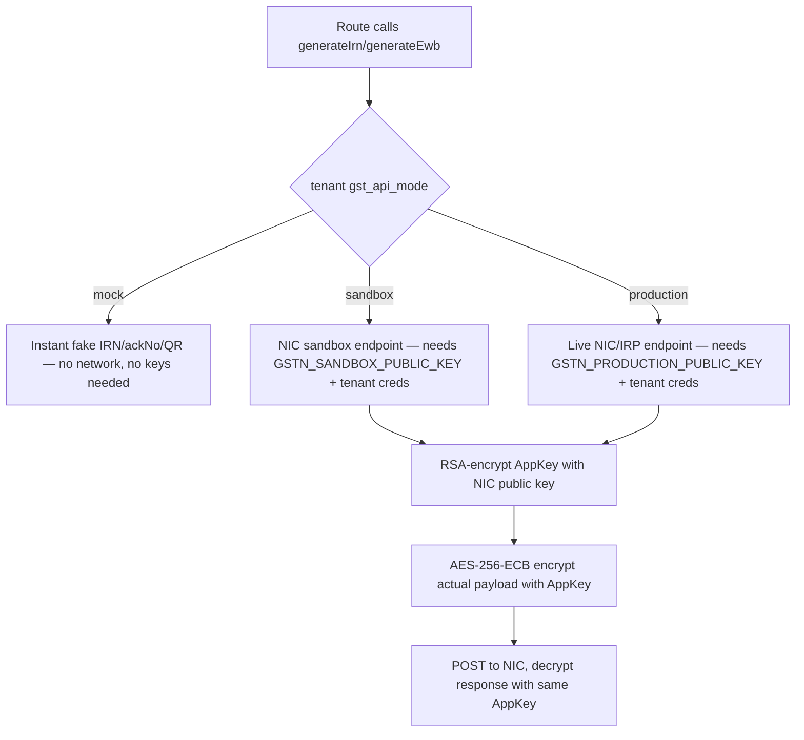

# File Walkthrough — `server/services/nic-api.ts`

## Purpose & business value

This is the only file in `server/services/` today, and it exists specifically because integrating with India's government GST e-invoicing (IRN) and e-way bill (EWB) system is genuinely complex enough to deserve isolation from route logic: RSA/AES crypto per the NIC's specific (non-standard) requirements, three distinct operating modes, and payload-building logic with real regulatory shape (HSN codes, GSTIN validation, tax split by CGST/SGST/IGST). Business value: without a compliant e-invoice, a business's GST filings and legal invoicing are non-compliant — this file is what makes DG-ERP usable as a real invoicing system in India, not just an internal tracker.

## Imports/exports

**Exports:** types (`GstApiMode`, `GstApiCredentials`, `IrnResult`, `EwbResult`), `getGstnPublicKey(mode)`, `isValidPin`, `resolveSupplyType`, `buildIrnPayload`, and (further in the file, not shown above but present) the actual IRN/EWB generation functions that call NIC's endpoints per mode.

**Imports:** Node's `crypto`; `decryptSecret` from `utils/secret-crypto.ts` (tenant GST credentials are stored encrypted); `isValidGstin` from `utils/helpers.ts`.

## Flow — the three modes

## Call hierarchy

- **Called by:** `server/routes/gst-api.ts` (the route layer that exposes IRN/EWB generation to the frontend) and `server/routes/invoices.ts` where invoice finalization needs a compliant IRN.
- **Calls into:** Node `crypto` (RSA encrypt for AppKey exchange, AES-256-ECB for payload), `decryptSecret` (to get plaintext tenant GST credentials out of encrypted storage right before use), the actual NIC/sandbox HTTPS endpoints (further down in the file, via `fetch`).

## Performance notes

- Mock mode is instant by design (no network) — used in dev, demos, and tenants without live GST credentials configured yet, so the rest of the invoicing flow can be built/tested without a NIC account.
- Sandbox/production modes involve a real external HTTPS round-trip to a government API with no documented SLA the team controls — treat generation latency as inherently variable and never block a whole invoice save on it without a timeout and a clear user-facing "retry" path. See [Runbook: GST API Failures](/runbooks/gst-api-failures).

## Security notes

- **`getGstnPublicKey` fails closed** — for `sandbox`/`production` modes, if the configured PEM doesn't parse as a valid public key, it throws rather than silently falling back to something insecure. This is exactly the right failure direction for crypto configuration.
- **AES-256-ECB, no IV** is unusual — ECB mode is normally avoided (it leaks structural patterns in the ciphertext for repeated plaintext blocks) but is used here strictly because **the NIC API mandates this exact scheme** (`AES/ECB/PKCS5Padding`, per their FAQ, as the file's header comment notes) — this is not a DG-ERP design choice, it's a hard external protocol requirement. Do not "fix" this to a more modern mode; it would break interoperability with the government API.
- **Tenant GST credentials are stored encrypted** (via `secret-crypto.ts`) and only decrypted transiently right before use in a request — never logged, never returned to the frontend in plaintext. See [`secret-crypto.ts` walkthrough](/files/server/utils) for the `JWT_SECRET`-derived-key implication.
- **`resolveSupplyType`** determines B2B vs B2C purely from buyer GSTIN validity — getting this wrong has real tax-classification consequences downstream, so it's kept as an isolated, easily-unit-tested pure function rather than inlined logic scattered across invoice code.

## Refactoring notes

- **Safe:** adding new payload fields as NIC's schema evolves (they do occasionally revise required fields), adding more validation helpers.
- **Unsafe:** changing the crypto scheme (ECB, RSA/PKCS1) to "more standard" alternatives — this must match NIC's spec exactly, not general crypto best practice.
- **If NIC changes their API** (they have, historically, across versions), this file is the one place that needs updating — that isolation is the entire reason it's a separate service file rather than inlined into `gst-api.ts` route handlers.

## Common mistakes

1. Testing only in mock mode and assuming sandbox/production will "just work" — the crypto and payload-building paths are entirely different code paths from mock; they need their own testing against real sandbox credentials before trusting production.
2. Forgetting a tenant's GST credentials need to be present *and* correctly encrypted before switching their `gst_api_mode` from `mock` to `sandbox`/`production` — see [Runbook: GST API Failures](/runbooks/gst-api-failures) for the exact symptom this produces.
3. Logging raw NIC request/response payloads for debugging — these can contain decrypted tenant credentials or customer PII; route any such debugging through `pii.ts`-aware logging, not raw `console.log`.

## Alternatives considered

A commercial GST Suvidha Provider (GSP) SDK/wrapper library could have been used instead of hand-rolling the NIC protocol. DG-ERP implements it directly because GSP integrations often come with per-transaction fees and less control over failure modes — for a product where GST compliance is core, not incidental, owning this integration directly was judged worth the crypto complexity, at the cost of needing to track NIC's API changes manually rather than relying on a vendor to do so.

## Related pages

- [Runbook: GST API Failures](/runbooks/gst-api-failures)
- [`server/utils/*` (secret-crypto.ts)](/files/server/utils)
- [Glossary: India GST Terms](/glossary/india-gst-terms)
- [Learning: Module — GST](/learning/module-gst)
