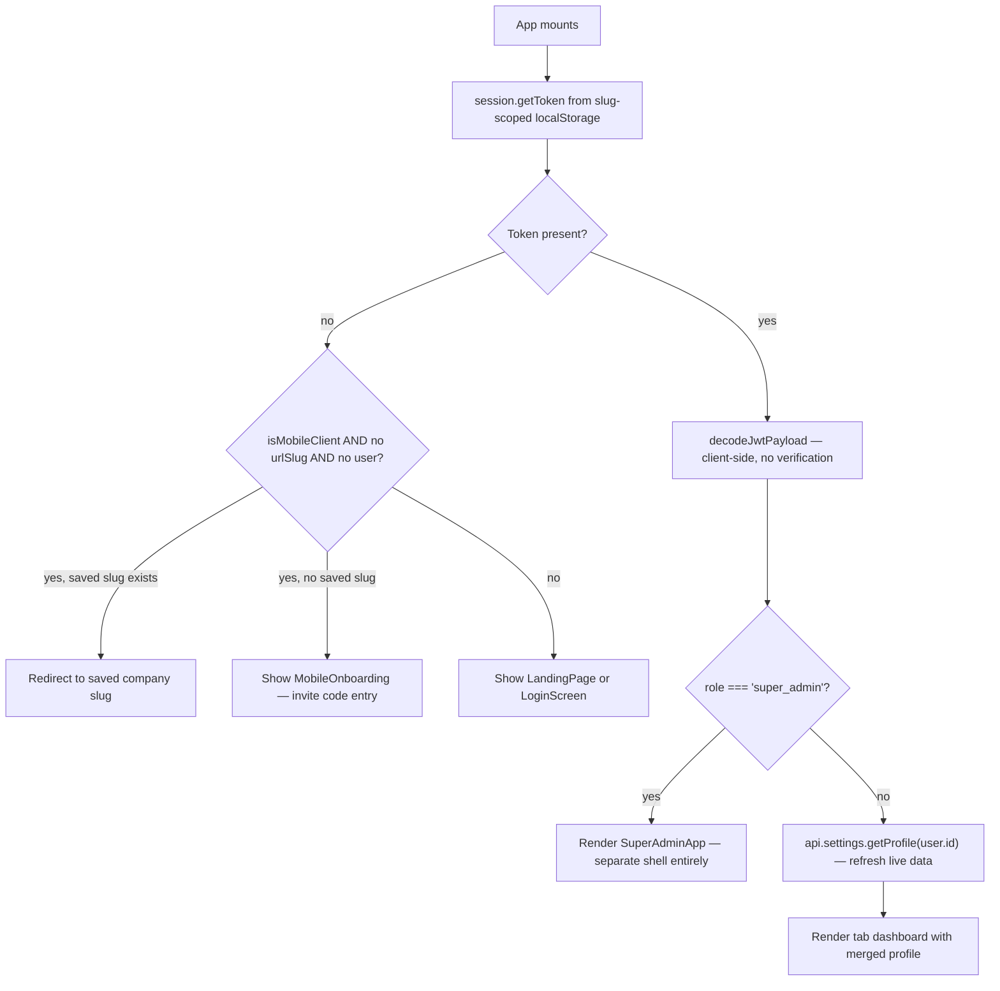

# `src/App.tsx` — The Hand-Rolled App Shell

:::tip Why one file does so much
There's no React Router, no separate "layout" framework, no state management library. `App.tsx` is the router, the layout, and the session bootstrapper — because the product genuinely is "one dashboard with tabs," not a multi-page site. See [Design Decisions](/architecture/design-decisions) for why this was chosen over React Router.
:::

## 1. Slug-scoped session storage — the cleverest small idea in the codebase

```ts
function getSessionSlug(): string {
  const path = window.location.pathname;
  if (path.startsWith('/admin')) return '_admin';
  const match = path.match(/^\/([a-z0-9][a-z0-9-]*)/i);
  return match ? `_${match[1].toLowerCase()}` : '';
}
function scopedKey(key: string): string {
  return `${key}${getSessionSlug()}`;
}
```

Every `localStorage` key (`auth_token`, `tenant_id`, `tenant_slug`, `dhandho_user`) is suffixed with the **current URL slug**. This means opening `dhandho.app/acme-motors` in one browser tab and `dhandho.app/other-biz` in another tab **do not fight over the same localStorage keys** — each tenant's session lives in its own namespaced slot, letting a single browser genuinely hold multiple tenant sessions simultaneously (useful for support staff, or a user who manages two different SME businesses on Dhandho).

## 2. PII minimization at the storage layer

```ts
function sanitizeUserForStorage(user: unknown): Record<string, unknown> {
  const { phone: _phone, address: _address, gstNumber: _gst, gst_number: _gst2, ...rest } = user;
  return rest;
}
```

`session.setUser()` **strips** `phone`, `address`, and GST number before writing to `localStorage` — because `localStorage` is XSS-readable (see the accepted-risk discussion in [Threat Model](/security/threat-model)), and these fields are more sensitive than the rest of the profile. The frontend instead re-fetches them on demand via `GET /api/settings/profile` whenever needed. This is a small but real defense-in-depth move: even in an XSS worst case, the blast radius of what's sitting in `localStorage` is deliberately reduced.

## 3. The tab router

```ts
const [activeTab, setActiveTabRaw] = useState<Tab>('analytics');
const [tabKey, setTabKey] = useState(0);
const setActiveTab = (tab: Tab) => {
  setActiveTabRaw(tab);
  setTabKey(k => k + 1);                                    // forces a remount, not just a re-render
  window.history.pushState({ tab }, '', window.location.pathname);
};
```

Two details worth noticing: `tabKey` increments on every tab switch and is presumably used as a `key` prop on the active view — **forcing React to fully remount** the feature component rather than re-render it in place, which resets all local state cleanly (no stale form state leaking between visits to the same tab). And `window.history.pushState` is called **without changing the URL path** — it's there purely so browser back/forward has *something* to do (fire a `popstate` the app can listen to), not to create real per-tab URLs.

## 4. Session bootstrap sequence



Note step "Decode" — the client decodes the JWT payload **without verifying the signature** (it can't; it doesn't have the secret). This is purely for UI convenience (deciding which shell to render); it is **never** treated as an authorization decision — the server independently verifies and re-derives everything on every API call, exactly as covered in [Authentication](/security/authentication). A tampered client-side-only JWT payload could fool the UI into showing the wrong shell, but every subsequent API call would still fail server-side verification.

## 5. Mobile onboarding — invite codes instead of self-service signup

```ts
if (isMobileClient()) {
  if (getSavedCompanySlug()) { /* show a spinner, restoring saved slug */ }
  return <MobileOnboarding onComplete={slug => { window.history.replaceState(...); window.location.reload(); }} />;
}
```

Because there's no self-service tenant signup ([Authentication](/security/authentication) covers why `/api/auth/signup` is `410 Gone`), the mobile app's first-run experience is an **invite code** flow (`MobileOnboarding`, backed by `POST /api/mobile/redeem-invite`) rather than a generic "create your account" form — a deliberate reflection of Dhandho's admin-provisions-everything business model even on the surface most likely to be used by a brand-new field employee.

## 6. Lazy loading — the entire feature catalog

```ts
const DashboardView = lazy(() => import('./features/dashboard/DashboardView').then(m => ({ default: m.DashboardView })));
// ...16 more, one per feature
```

Every single feature view is wrapped in `lazy()` and rendered inside a shared `<Suspense fallback={<LoadingSpinner />}>`. This means the **initial JS payload** a user downloads is just the shell (`App.tsx` itself, `LoginScreen`/`LandingPage`, and shared UI primitives) — the ~19 feature bundles only download the first time each tab is actually opened. See [Bundle Performance](/performance/bundle) for how this interacts with `vite.config.ts`'s `manualChunks`.

## 7. Special-case components inside `App.tsx`

| Component | Purpose | Where it appears |
|---|---|---|
| `ElectronSlugEntry` | A "which company?" text input shown when the Electron shell has no tenant context yet | Electron cloud shell, first launch |
| `QuotationsAndOrdersView` | A local toggle between two related feature views sharing screen real estate | Rendered as a single tab that internally switches sub-view |
| `SuperAdminApp` (lazily loaded, separate) | An entirely separate app shell for the platform-operator surface — not a tab, a different top-level render branch | When `role === 'super_admin'` |

## 8. Why this scales fine (so far) despite being "just" `useState`

A router library earns its keep when an app has (a) many distinct URL-addressable resources, (b) nested layouts with independent loading states, or (c) a need for deep-linking. Dhandho's dashboard has none of these strongly: it's one shell, ~19 sibling tabs, no nesting, and deep-linking to a *specific record* (not just a tab) genuinely isn't a current product requirement. The moment that changes — e.g. "email me a link to this exact invoice" — is explicitly called out in [Design Decisions](/architecture/design-decisions) as the trigger to revisit this choice.

## Hands-on exercise

1. Open two browser tabs, log into two *different* tenant slugs (or the same tenant twice), and inspect `localStorage` in DevTools. Confirm the key names differ by the slug suffix, and that logging out of one doesn't affect the other's session.
2. Decode a captured JWT client-side (base64-decode the payload segment) and try modifying the `role` field, then reload the app with that tampered value stored. Does the UI shell change? Does any actual API call succeed with elevated access? Explain the gap.
3. Find where `tabKey` is used as a React `key` prop. Remove it in a scratch branch, switch to a tab, submit a partial form, switch away and back — does the form now retain stale state where it previously reset cleanly?

## Debugging exercise

A user reports "I switched from Sales to Inventory and back, and my half-filled Sales form was gone — I lost my work." Given the deliberate remount-on-tab-switch behavior (`tabKey` incrementing), is this a bug or the intended trade-off? What UX pattern (without adding a full router/state-persistence library) could preserve in-progress form state across a tab switch while keeping the "clean remount" benefit for every other case?

## Quiz

1. Why does every localStorage key get suffixed with the current URL slug?
2. Why are `phone`, `address`, and GST number excluded from the persisted user object?
3. Why is decoding the JWT client-side considered safe even though the signature isn't verified?
4. What UI pattern replaces "create your account" on the mobile app's first run?

<details>
<summary>Answers</summary>

1. So multiple tenant sessions can coexist in the same browser without overwriting each other's token/user data — each tenant's session lives in its own namespaced localStorage slot.
2. Because `localStorage` is readable by any XSS payload, and these fields are considered more sensitive than the rest of the cached profile; they're fetched on demand via an authenticated API call instead of persisted.
3. Because the client-side decode is used purely to decide *which UI shell to render* (a UX decision), never to authorize an action — every actual API call independently re-verifies the token's signature and re-derives role/permissions server-side.
4. An invite-code redemption flow (`MobileOnboarding`), reflecting that all tenant/user provisioning happens through an admin, not self-service signup.

</details>

## Related pages

- [Frontend Overview](/frontend/overview)
- [API Client](/frontend/api-client)
- [Authentication](/security/authentication)
- [Session State](/frontend/session-state)
- [Bundle Performance](/performance/bundle)
