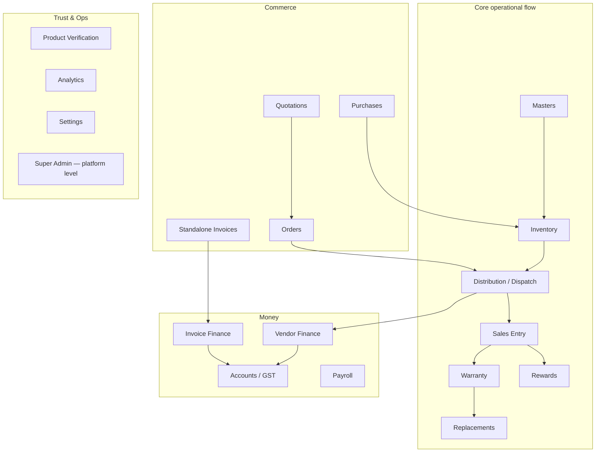

# Features Catalog

`src/features/` holds 18 top-level business modules. Each is a folder with one primary `*View.tsx` (lazy-loaded from `App.tsx` — see [app-shell.md](./app-shell.md)) and usually several sub-components for detail screens, modals, and forms. This document is organized around one question per module: **what business problem does this solve, for whom, and why does it look the way it does?**

> [!NOTE]
> **The `businessType` thread runs through nearly every module.** Dhandho supports four business archetypes — `manufacturer`, `dealer`, `retail`, `service` — configured per tenant and read via `useBusinessConfig()` (`src/lib/businessTypeConfig.ts`). The same `DistributionView` component, for instance, is labeled "Dispatch" for a manufacturer and effectively becomes the sales flow for a dealer. Rather than forking the UI per business type, one component adapts its **labels and visible features** based on this config object. Keep this in mind as you read below — many modules described as one thing are really "the same screen wearing a different business type's vocabulary."

## Dashboard / Analytics

**`features/dashboard/DashboardView.tsx`, `features/analytics/AnalyticsView.tsx`**

The landing tab (`activeTab: 'analytics'` is the default in `App.tsx`). Answers "how is my business doing right now": revenue, collections, outstanding balances, top vendors, recent activity, and quick counts of masters (customers/vendors/products). `AnalyticsView` calls `api.dashboard.overview(from, to)` for a date-ranged summary and `api.dashboard.recentActivity()` for a live feed. The `businessType` config supplies which money tiles to show and what to call them (e.g. "Outstanding" vs. "Invoice Outstanding" — see `analytics.outstandingKey` in `businessTypeConfig.ts`), so a manufacturer and a service consultancy see structurally the same dashboard with different vocabulary and different underlying numbers.

**Business value:** a single screen that answers "should I be worried about anything today" for an owner who doesn't have time to read five separate reports.

## Masters

**`features/masters/MastersView.tsx` + `CustomerMasterView`, `VendorMasterView`, `BankMasterView`, `StaffMasterView`, `RewardRulesView`, `PriceListView`, `VendorCustomerMappingView`**

The "reference data" hub — customers, vendors, banks, staff, reward rules, and price lists. `MastersView` itself is a card-grid launcher (not a form) that lazy-loads whichever sub-master the user clicks, and fetches count badges from `api.masters.counts()` once on mount. Masters are filtered by both `businessType` (e.g., a `retail`/`dealer` tenant hides the separate Customer master because it sells direct — see `isDirectSell` in the component) and by role (`isVendor` sees only their own Customer master, a self-service view of who they've sold to).

**Offline Mobile (`isServiceMobileMode`):** **Products / Catalog inventory pill** and **Vendor-Customer Map** are hidden from Masters (no stock inventory; no local mapping routes). **Price List** remains with **Catalog** + **Clients** scope tabs as the sellable rate book; invoice/quote lines pick Price List items (resolve) or custom free-text. Cloud manufacturer Masters keep Products → Inventory and Mapping unchanged.

**Service labels:** `businessTypeConfig` sets `labels.vendors` to **Clients** for `service` (manufacturer keeps **Vendors**). Offline Masters pills, VendorMaster headers/FABs, invoice/quote party fields, Analytics “Outstanding Clients”, and Accounts party columns use that config — API paths stay `/vendors`.

**Client invoice hub:** In Masters → Clients (`VendorMasterView`), tapping a client card (or a phone hub Client row with `initialVendorId`) opens that client’s Invoice Finance detail — outstanding / received / invoice list, **New Invoice** (`CreateInvoiceModal` with party prefill), and **Record Payment** via `api.invoiceFinance`. Offline: with no outstanding bill, Record Payment stores a **client advance** (`partyKey`, no `invoiceId`); the next invoice auto-applies it and UI/print show **Advance payment** + **Outstanding**. Edit/Delete icons use `stopPropagation` and stay on the card. Back returns to the Clients list. Finance tab’s `InvoiceFinanceView` keeps the same APIs.

**Business value:** every other module (sales, distribution, warranty) references a vendor/customer/product by ID — Masters is where those IDs are created and kept clean (deduplication via `uq_vendors_tenant_name`-style unique indexes server-side).

## Inventory

**`features/inventory/InventoryView.tsx`**

Product catalog + stock tracking, keyed by **barcode**, not just SKU. Products can be added with a range of barcodes (`rangeStart`/`rangeEnd`), a prefix pattern, or auto-generated, and stock is added in batches (`api.products.addStock`). Every unit — not just every SKU — is individually trackable through `product_inventory` rows, which is what makes per-unit warranty and replacement tracking possible downstream. `accessLevel` (`hidden`/`view`/`print`/`full`) is passed in from `App.tsx`'s permission derivation and used to hide mutating controls for roles that can only view or print.

**Business value:** counterfeit and warranty-fraud prevention in Indian consumer-goods distribution relies on being able to say "this exact barcode was manufactured on this date, dispatched to this vendor, and sold to this customer" — that chain starts here.

## Distribution

**`features/distribution/DistributionView.tsx`**

Moves stock **out** to vendors — "Dispatch" in manufacturer vocabulary. Supports batch creation (`api.distribution.createBatch`) with per-item discount and GST toggles, and integrates with India's **e-Invoice (IRN)** and **e-Way Bill** government systems (see the "E-Invoice + E-Way Bill buttons" section in the file, and [../security/secrets.md](../security/secrets.md) for how the underlying GST portal credentials are protected). Vendor-role users see a heavily scoped version of this view (their own distributions only — enforced server-side via `vendorScopeId`/`assertVendorAccess`, see [../security/authorization.md](../security/authorization.md)).

**Business value:** this is the legal and financial record of goods leaving the business — the basis for vendor invoicing, GST compliance, and vendor balance tracking.

## Sales Entry

**`features/sales/SalesEntryView.tsx`**

Records a **retail sale** to an end consumer, validated by barcode scan (`api.sales.validate`) to confirm the unit exists, hasn't already been sold, and belongs to the scanning vendor. On success, it creates a `product_sales` row, computes reward points, and can generate a bill (`getBill`) shareable via WhatsApp/email using the plain-text formatters in `src/lib/utils.ts` (`formatSalesInvoiceText`). This is the module most likely to be used by front-line shop staff, often via the mobile app in a store with unreliable Wi-Fi — see [platforms.md](./platforms.md) for how a sale gets queued if the connection drops mid-scan.

**Business value:** turns a barcode scan into a compliant, itemized bill and a warranty registration in one action, without the cashier needing to think about either.

## Warranty & Replacements

**`features/warranty/WarrantyView.tsx`, `features/replacements/ReplacementsView.tsx`**

Warranty rows are created automatically at time of sale and tracked here by status (Active/Expired/Replaced). `ReplacementsView` handles the actual swap: scan the old (defective) barcode, validate it against warranty records, scan a new unit, and the system atomically closes the old warranty and opens a new one under the same customer. This is one of the more fraud-sensitive flows in the app — `validateOld`/`validateNew` API calls exist specifically to stop a shop from replacing a unit that was never actually sold, or double-claiming a replacement.

**Business value:** protects the manufacturer from warranty fraud while making legitimate replacements a two-scan operation instead of a paperwork exercise.

## Rewards

**`features/rewards/RewardsView.tsx`, `features/masters/RewardRulesView.tsx`**

A loyalty-points ledger. `RewardRulesView` (in Masters) defines the threshold rules ("sell 10 units, earn 50 points"); `RewardsView` shows the resulting ledger and lets an admin adjust/redeem balances subject to `redemptionSettings` minimums (`minBalance`, `minPoints`) that exist specifically to stop micro-redemptions from generating disproportionate admin overhead.

**Business value:** an incentive layer that keeps vendors motivated to sell a specific manufacturer's product over a competitor's, without manual point-tracking in a notebook.

## Purchases

**`features/purchases/PurchasesView.tsx`**

The inbound mirror of Distribution: recording stock **received** from suppliers, with cost price, GST, and discount tracking, feeding `product_purchases` and `supplier_payments`. This is what lets a dealer/retailer business type compute true margin (purchase cost vs. sale price) rather than just tracking sales in isolation.

**Business value:** closes the loop from "what did this cost me" to "what did I sell it for," which is the foundation of every profitability report in Accounts.

## Quotations & Orders

**`features/quotations/QuotationsView.tsx`, `features/orders/OrdersView.tsx`**

A pre-sale pipeline: a `Quotation` (Draft → Sent → Accepted) can be converted into an `Order`, and an Order can later be fulfilled into a Distribution batch (`converted_batch_id`/`fulfilled_batch_id` link the three tables together). In `App.tsx` these two views are shown together under one tab via a small local `QuotationsAndOrdersView` toggle component (see [app-shell.md](./app-shell.md)) rather than being two separate top-level tabs — a UI decision to keep the sidebar from growing past what fits comfortably.

**Business value:** lets a sales team commit numbers to a customer (a quote) before committing real inventory (an order), matching how B2B sales actually negotiate.

## Invoices & Invoice Finance

**`features/invoices/InvoicesView.tsx`, `features/finance/InvoiceFinanceView.tsx`**

For the `service` business type (consultants, agencies) that don't move physical inventory, `InvoicesView` provides **standalone billing** — invoices not tied to a barcode/product record (`standalone_invoices` table). `InvoiceFinanceView` is the `financeView: 'invoice'` branch of `businessType` — the alternative to `VendorFinanceView` for tenants that sell services, not distributed goods.

What the UI actually does today:

| Surface | Behavior |
|---|---|
| **Invoices (all types with the tab)** | Create modal picks a **vendor or customer** party; stores `party_type` + `party_id`. Line items can be catalog products; rate prefers price-list resolve (vendor slab → general slab → `product.price`). Custom free-text lines still allowed. |
| **Invoice Finance (service)** | Distribution-style **client cards** from `GET /api/invoice-finance/summary`, keyed by `partyKey` (`vendor:ID` \| `customer:ID` \| legacy `name:DisplayName`). Drill-down loads invoices/payments for that key. **New Invoice** from client detail opens `CreateInvoiceModal` with party prefills. |

:::warning Shared modal coupling
Finance imports `CreateInvoiceModal` from `InvoicesView` today. Prefer extracting the modal if you grow either feature — otherwise Finance and Invoices stay coupled at the module boundary.
:::

**Business value:** the same ERP serves a manufacturer *and* a service consultancy by swapping which finance module is active; party links keep one client's ledger together even when the typed display name changes.

## Price Lists (Masters)

**`features/masters/PriceListView.tsx`**

Quantity-slab pricing rules (`price_lists`): optional `vendor_id` (null = applies to all vendors). Used by Distribution (server `GET /api/price-lists/resolve`) and by the invoice create modal (client-side mirror of the same priority). Masters UI supports CSV import (`POST /api/price-lists/bulk` resolves product/vendor by name), CSV export, and branded PDF/print via bill settings.

**Business value:** one place to maintain dealer rates and volume breaks without hard-coding prices into every distribution or invoice line.

## Vendor Finance

**`features/finance/VendorFinanceView.tsx`**

Tracks running balances per vendor: total value distributed, total paid, outstanding balance, with configurable payment reminders (`vendor_reminder_settings` — "remind this vendor every N days if balance > 0"). This is the module that answers "who owes us money and how much," derived automatically from Distribution + payment records rather than manually reconciled.

**Business value:** replaces the ledger book a small manufacturer would otherwise keep by hand to track "which shopkeeper still owes for last month's stock."

## Accounts

**`features/accounts/AccountsView.tsx`**

The compliance-heavy module: GSTR-2B reconciliation (upload the government portal's JSON, match line-by-line against recorded purchases to catch missing/mismatched input tax credit), and GSTR-3B computation (output tax, input tax credit, net payable). This is genuinely one of the most complex UI flows in the app because Indian GST reconciliation is inherently a matching problem between two independently-maintained datasets (what you recorded vs. what your suppliers filed).

**Business value:** turns a task accountants normally do by hand in a spreadsheet (matching hundreds of purchase invoices against a government-provided JSON export) into an in-app reconciliation screen.

## Payroll

**`features/payroll/PayrollView.tsx`**, alongside **`features/masters/StaffMasterView.tsx`**

A deliberately "mini" payroll: staff directory + salary/advance payment records (`staff_payments`), summarized by month/year with advance-outstanding tracking. In Masters → Staff, tapping a staff card (or a phone hub Staff row) opens that person’s payment history + Add payment (`GET/POST /payroll`). Back from a hub Staff-row deep-link returns to the Masters hub Staff tab; Back from full Staff Management returns to the staff list. Edit/Delete on the card do not open payments. It does not attempt full statutory payroll (PF, ESI, TDS slabs) — this is a small-business tool for "who did I pay, how much, when," not a full HR/payroll suite.

**Business value:** gives an owner a paper trail for cash salary/advance payments without needing a dedicated HR system they don't have the headcount to justify.

## Product Verification

**`features/verification/ProductVerificationView.tsx`**

A public-facing-adjacent trust feature: scan or type a barcode to instantly see its full lifecycle (manufactured → distributed to which vendor → sold to which customer → warranty status), calling `api.products.verify(barcode)`. This is the tool a shop staff member or even an end customer uses to answer "is this a genuine unit, and what's its warranty status" — directly counters the counterfeit-goods problem the barcode-per-unit inventory model (see Inventory above) was built to solve.

**Business value:** anti-counterfeiting and warranty-status lookup in one scan, without needing to dig through paper receipts.

## Settings

**`features/settings/SettingsView.tsx`**

Per-tenant configuration: user profile, password change, bill customization (logo, terms, bank details for printed bills — `bill_settings` table), and the GST API integration settings (NIC e-Invoice/e-Way Bill credentials — see the "GST API Settings" section of the file and [../security/secrets.md](../security/secrets.md) for how those credentials are encrypted at rest with AES-256-GCM before storage).

**Business value:** the one place an Admin configures everything that makes bills/invoices look like *their* company's bills, and everything that connects the tenant to government tax infrastructure.

## Super Admin

**`features/super-admin/*`** — `SuperAdminApp`, `TenantsView`/`TenantListView`/`TenantDetailView`, `PlanManagementView`, `SAAnalyticsView`, `OnPremView`, `SuperAdminBilling`, `SuperAdminAuditLog`, `GuideView`

This is a **separate application**, not a tenant feature — it's Dhandho-the-company's internal tool for running Dhandho-the-product: provisioning new tenants, managing subscription plans, viewing cross-tenant analytics, managing on-prem license activations, and — notably — **impersonating a tenant admin** for support purposes (a short-lived, audited token; see [../security/authentication.md](../security/authentication.md)). It's gated entirely separately from tenant RBAC, via `superAdminMiddleware` and the `/admin` route in `App.tsx` (see [app-shell.md](./app-shell.md)).

**Business value:** the operational backbone that lets a small platform team run hundreds of tenants — billing, support impersonation, plan enforcement, on-prem device fleet visibility — without touching any individual tenant's day-to-day screens.

## Quiz

1. Name two features whose *component* is shared but whose *vocabulary* differs based on `businessType`, and explain what config drives that difference.
2. Why does the "Quotations & Orders" tab render two views through one local toggle component instead of being two separate sidebar entries?
3. Why is the Super Admin app's authentication and authorization completely separate from tenant RBAC, rather than "Super Admin" simply being the highest permission level within a tenant?
4. Why does Invoice Finance group by `partyKey` instead of `customer_name`, and what are the three key shapes?

Answers

1. `DistributionView` is labeled "Dispatch" for a manufacturer and functions closer to a sales flow for a dealer; `VendorFinanceView`/`InvoiceFinanceView` swap entirely based on `financeView: 'vendor' | 'invoice'`. Both are driven by the per-tenant `BusinessConfig` returned from `useBusinessConfig()` in `src/lib/businessTypeConfig.ts`.
2. To avoid growing the sidebar past a comfortable size for a feature pair that's conceptually one workflow (quote → order); the toggle keeps related screens visually grouped under one tab.
3. Because a Super Admin operates across *all* tenants — a role that must never be assignable via any tenant's own user-management screen (that would let a compromised or malicious tenant admin grant themselves platform-wide access). Keeping it a fully separate auth system (`superAdminMiddleware`, its own login, its own JWT role check) means tenant RBAC bugs can never escalate into platform-level access.
4. Display names change; party ids do not. Keys are `vendor:<id>`, `customer:<id>`, and legacy `name:<display>` for invoices created without a party link.

## Related reading

- [App Shell](./app-shell.md) — how these views are lazy-loaded and permission-gated.
- [Patterns](./patterns.md) — the conventions (props shape, `accessLevel`, `onBack`/`onRefresh`) repeated across these modules.
- [../security/authorization.md](../security/authorization.md) — the server-side RBAC and vendor-portal IDOR guards these views depend on.
