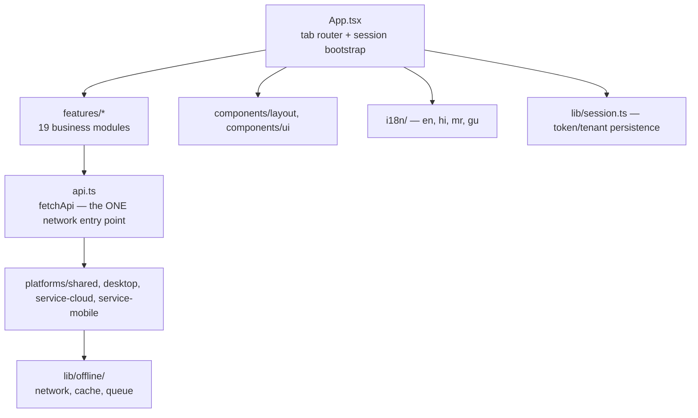
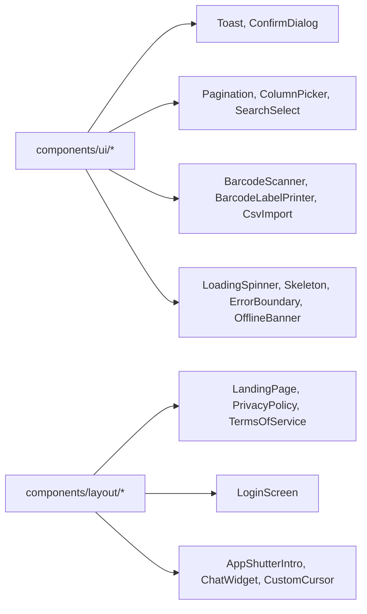

# Frontend Overview — The React 19 SPA

:::tip One codebase, four faces
The exact same `src/` tree, built with `vite build`, renders in a browser tab or Electron `BrowserWindow`. See [Product Surfaces](/architecture/four-surfaces).
:::

## 1. The shape of `src/`

## 2. `App.tsx` — the tab-router shell

`src/App.tsx` (~950 lines) is the single most important frontend file to read first. It does five jobs at once:

1. **Session bootstrap** — reads persisted token/tenant from `session` (localStorage-backed) on mount, decides whether to show `LoginScreen`, `LandingPage`, or the authenticated dashboard.
2. **Tab routing** — `useState<Tab>` plus a big `switch`/lookup rendering the active feature's lazily-imported view component.
3. **Lazy loading everything** — every feature view is `lazy(() => import(...))`, wrapped in `<Suspense>`, so the initial bundle only pays for the shell, not every module.
4. **Platform-aware chrome** — mounts `OfflineBanner` (mobile), `OnlineStatus` (desktop), `MobileOnboarding` (invite-code flow), `AppShutterIntro` (first-load animation), `ChatWidget`.
5. **Slug entry** — `ElectronSlugEntry` component: when the Electron shell has no tenant context yet, it shows a "which company?" prompt that redirects to `/{slug}`.

Full breakdown in [App Shell](/frontend/app-shell).

## 3. `api.ts` — the one door to the backend

Every feature, without exception, talks to the server exclusively through `fetchApi()` in `src/api.ts`. This single chokepoint is what makes the offline queue, the tenant header, the auth header, and the response caching *consistent* across all 19 feature modules without each one reinventing fetch logic. Full breakdown in [API Client](/frontend/api-client).

## 4. `src/features/*` — one folder per business module

| Folder | Backs which server routes |
|---|---|
| `dashboard/`, `analytics/` | `dashboard.ts`, `search.ts` |
| `inventory/`, `masters/` | `products.ts`, `masters.ts`, `mapping.ts`, `price-lists.ts` |
| `distribution/` | `distribution.ts`, `vendors.ts` |
| `sales/`, `invoices/` | `sales.ts`, `invoices.ts`, `customers.ts` |
| `orders/`, `quotations/`, `purchases/` | `orders.ts`, `quotations.ts`, `purchases.ts` |
| `warranty/`, `replacements/`, `rewards/` | `warranties.ts`, `replacements.ts`, `rewards.ts` |
| `finance/`, `accounts/`, `payroll/` | `finance.ts`, `invoice-finance.ts`, `accounts.ts`, `payroll.ts`, `expenses.ts`, `banks.ts` |
| `verification/` | `search.ts`, `products.ts` (barcode lookups) |
| `settings/` | `admin.ts`, `bill-settings.ts` |
| `super-admin/` | `super-admin.ts` — a **separate app shell**, not a tab in the tenant dashboard |

Each feature folder is largely self-contained: its own view component, its own sub-components, its own local state — with `api.ts` and shared `components/ui/*` as the only cross-cutting dependencies. This mirrors the backend's one-file-per-domain route structure, making "find the code for X" a consistent mental operation on both sides of the stack.

## 5. `components/` — the shared vocabulary

`components/ui/BarcodeScanner.tsx` and `BarcodeLabelPrinter.tsx` are worth special attention — they wrap `html5-qrcode` and `jsbarcode` respectively, and are the two heaviest, most physical-world-facing UI primitives in a product whose core value proposition is tracking physical goods by barcode.

## 6. `hooks/` and `i18n/` — small but load-bearing

- `useDebounce` — used everywhere a search box shouldn't fire a request per keystroke (barcode/customer/product search fields).
- `useConfirm` — a hook-based imperative confirm dialog, avoiding prop-drilling a `<ConfirmDialog>` through every delete button.
- `i18n/{en,hi,mr,gu}.json` + `useTranslation()` — four languages (English, Hindi, Marathi, Gujarati) reflecting the real-world linguistic diversity of Indian SME staff, not just the business owner. Toggled per-tenant via `multi_language_enabled`.

## 7. `ErrorBoundary` — the last line of frontend defense

`components/ui/ErrorBoundary.tsx` wraps the app so a single feature's render crash doesn't white-screen the whole dashboard — it's the frontend mirror of the backend's global error handler in `server/app.ts`, and the same philosophy applies: fail gracefully, never expose a raw stack trace to a non-technical SME shop-floor user.

## Hands-on exercise

1. Open `src/App.tsx` and find every `lazy(() => import(...))` call. Count them. What does this tell you about the initial JS payload a user downloads before they can even see the login screen?
2. Pick one feature folder (e.g. `src/features/warranty/`) and map every file in it to a specific backend endpoint in `server/routes/warranties.ts`. Are there any frontend-only concepts (e.g. a client-side computed "days until expiry" field) that don't correspond to a stored column?
3. Find where `useTranslation()` is called in a feature you haven't looked at yet, and identify one hard-coded English string nearby that was *not* run through translation — is it a bug, or a deliberate exception (e.g. a brand name)?

## Debugging exercise

A user on a slow rural connection reports the app "flashes blank" briefly when switching tabs for the first time. Given the `lazy()`/`<Suspense>` pattern, explain exactly why this happens on the *first* visit to a tab but not on subsequent visits, and propose one lightweight change (without adding a heavy loading library) that would improve the perceived experience.

## Quiz

1. What is the one function every feature must call to reach the backend, and why does that matter for offline support?
2. Why does `src/features/super-admin/` get its own app shell instead of being a tab in the main dashboard?
3. Name two of the four supported UI languages besides English.

Answers

1. `fetchApi()` in `src/api.ts` — because every network call funnels through one place, offline queuing, caching, and auth-header injection can all be implemented once and apply everywhere automatically.
2. Because Super Admin is a platform-operator identity with a completely different role vocabulary, data scope (cross-tenant), and login flow — mixing it into the tenant dashboard's tab system would blur a critical trust boundary (see [Multi-tenancy](/architecture/multi-tenancy)).
3. Hindi and Marathi (also Gujarati).

## Related pages

- [API Client](/frontend/api-client)
- [App Shell](/frontend/app-shell)
- [Platforms](/frontend/platforms)
- [Cloud Mobile UX](/frontend/cloud-mobile)
- [Features Catalog](/frontend/features-catalog)
- [Folder Structure](/overview/folder-structure)
