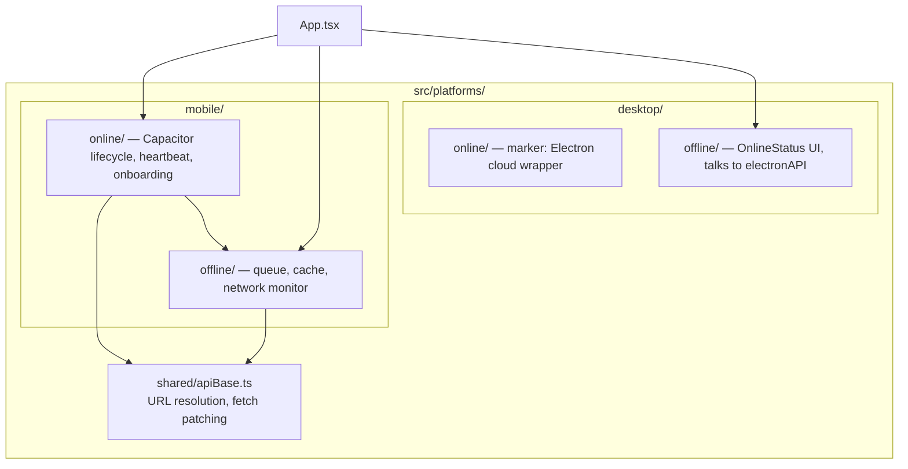

# Platforms — `src/platforms/`

This is the folder that makes "one codebase, three targets" (see [overview.md](./overview.md)) actually true. It contains **only** the code that generically cannot be shared: talking to native network APIs, resolving which server to talk to, and surfacing connectivity state to the user. Everything else — every feature, every form — is platform-agnostic React that happens to run inside a browser tab, a Capacitor WebView, or an Electron `BrowserWindow`.



## `shared/apiBase.ts` — one function decides where every request goes

```1:48:src/platforms/shared/apiBase.ts
const DEFAULT_CLOUD_ORIGIN = 'https://dhandho.app';

export function isNativeApp(): boolean {
  try {
    const cap = (window as unknown as { Capacitor?: { isNativePlatform?: () => boolean } }).Capacitor;
    return !!cap?.isNativePlatform?.();
  } catch { return false; }
}

export function getApiOrigin(): string {
  const env = (import.meta.env.VITE_API_ORIGIN as string | undefined)?.trim();
  if (env) return stripTrailingSlash(env);
  if (isNativeApp()) return DEFAULT_CLOUD_ORIGIN;
  return '';
}

export function getApiBase(): string {
  const envBase = (import.meta.env.VITE_API_BASE as string | undefined)?.trim();
  if (envBase) return stripTrailingSlash(envBase);
  const origin = getApiOrigin();
  return origin ? `${origin}/api` : '/api';
}

export function resolveApiUrl(path: string): string { /* ... */ }
```

> [!IMPORTANT]
> **Why does this matter so much?** A web build served from `dhandho.app` and loaded in a normal browser can use **relative URLs** (`/api/products`) — same origin, no CORS, no config. A Capacitor app's WebView, though, loads from `capacitor://localhost` (Android) or a similar native scheme, **not** `https://dhandho.app`. A relative `/api/products` request from inside that WebView would try to hit `capacitor://localhost/api/products` — which doesn't exist. `getApiOrigin()` is the single function that detects this ("am I running natively?") and returns the real cloud origin instead, so every other piece of code — the entire `api.*` object in [api-client.md](./api-client.md), the offline queue's flush logic, the mobile heartbeat — can keep writing `/api/whatever` and trust `resolveApiUrl` to make it work regardless of platform.

### `installNativeApiFetch` — patching `window.fetch` itself

```54:83:src/platforms/shared/apiBase.ts
export function installNativeApiFetch(): void {
  if (typeof window === 'undefined') return;
  const origin = getApiOrigin();
  if (!origin) return;
  if ((window as unknown as { __dgApiFetchPatched?: boolean }).__dgApiFetchPatched) return;

  const orig = window.fetch.bind(window);
  window.fetch = (input, init) => {
    try {
      if (typeof input === 'string' && (input.startsWith('/api/') || input === '/api')) {
        return orig(resolveApiUrl(input), init);
      }
      /* also handles Request-object inputs with a relative /api URL */
    } catch { /* fall through */ }
    return orig(input, init);
  };
  (window as unknown as { __dgApiFetchPatched?: boolean }).__dgApiFetchPatched = true;
}
```

This is a deliberate, guarded **monkey-patch of the global `fetch`**, applied once (the `__dgApiFetchPatched` flag prevents double-patching across hot-reloads or repeated calls). It exists as a **safety net**, not the primary mechanism — most calls already go through `fetchApi`/`resolveApiUrl` explicitly. But third-party code, an overlooked direct `fetch('/api/...')` call, or a future contributor who doesn't know about `resolveApiUrl` will still work correctly on native, because the global `fetch` itself now understands how to route `/api/*` paths. This is a good example of **defense in depth applied to internal code correctness**, not just security: one deliberate design decision (relative `/api` paths everywhere) is backed up by a second mechanism that catches violations of the first.

## `mobile/offline/` — the three-piece offline system

Full API-client integration is covered in [api-client.md](./api-client.md); this section covers the three modules themselves.

### `queue.ts` — durable write queue

```16:80:src/platforms/mobile/offline/queue.ts
const KEY = 'dg_offline_queue_v1';
const MAX = 100;
const SENSITIVE_HEADER = /^(authorization|x-tenant-id)$/i;

function sanitizeHeaders(headers?: Record<string, string>): Record<string, string> | undefined {
  // Drop auth headers — flush rebinds a fresh session token (never persist JWTs)
  ...
}

export function enqueueOfflineMutation(m: Omit<OfflineMutation, 'id' | 'createdAt'>): OfflineMutation {
  const item: OfflineMutation = { ...m, headers: sanitizeHeaders(m.headers), id: `OQ${Date.now()}-${...}`, createdAt: new Date().toISOString() };
  const key = dedupeKey(item);
  const next = read().filter((x) => dedupeKey(x) !== key); // identical method+path+body replaces prior pending entry
  next.push(item);
  write(next);
  return item;
}
```

Every failed write (a `POST`/`PUT`/`DELETE` attempted while offline, from `fetchApi` — see [api-client.md](./api-client.md)) is appended to a `localStorage`-backed array, capped at 100 entries. Three details worth understanding:

> [!WARNING]
> **`sanitizeHeaders` strips the `Authorization` and `X-Tenant-ID` headers before persisting the queue entry.** A JWT sitting in `localStorage` inside a queue entry for hours or days (a shop with no signal overnight) would be a needlessly long-lived credential exposure if that storage were ever compromised. Instead, when the queue is flushed on reconnect (`flushOfflineQueue`), a **fresh** token is re-attached from the current session at flush time — see `tryFlush()` in `network.ts` below. This means a queued mutation is bound to whoever is logged in *at flush time*, not whoever queued it — an intentional trade-off (see the Trade-offs table).

- **Deduplication by `method|path|body`.** If a user edits the same product's price three times while offline, only the *last* edit survives in the queue — not three redundant writes. This models "offline edits" the way most users actually think about them: the queue holds *intended end states*, not a literal operation log.
- **Permanent-failure pruning on flush.** `flushOfflineQueue` drops a queued item if the server responds with a 4xx **other than 401/429** — a validation error (e.g., a since-deleted product ID) would otherwise block the entire queue forever, since flushing processes items in order and stops on the first failure that looks like "still offline" (see below).

### `network.ts` — knowing when to flush

```44:69:src/platforms/mobile/offline/network.ts
export async function initNetworkMonitor(): Promise<void> {
  if (isNativeApp()) {
    try {
      const status = await Network.getStatus(); // @capacitor/network
      state = { connected: status.connected, connectionType: status.connectionType };
      emit();
      Network.addListener('networkStatusChange', (s) => {
        state = { connected: s.connected, connectionType: s.connectionType };
        emit();
        if (s.connected) void tryFlush();
      });
      if (status.connected) void tryFlush(); // cold start while online — replay any leftover queue
      return;
    } catch { /* fall through to browser events */ }
  }
  // Browser fallback: navigator.onLine + 'online'/'offline' window events
}
```

Note the **cold-start replay**: even if the device was never observed going offline *during this app session* — e.g., the user force-quit the app while offline, and reopened it later already connected — the queue is still flushed on startup if online, because a non-empty queue from a *previous* session could be sitting there. This is why `tryFlush()` unconditionally runs both on `networkStatusChange` events *and* on initial mount when already connected.

> [!NOTE]
> **Why detect native connectivity via `@capacitor/network` instead of just `navigator.onLine`?** `navigator.onLine` on many mobile OS/WebView combinations is unreliable — it can report `true` while connected to a Wi-Fi network with no actual internet route (captive portals, a router with no upstream), a well-known browser API limitation. The native Capacitor plugin queries the OS's actual network reachability APIs, which is meaningfully more accurate on a phone that might be on airplane mode, weak cellular, or a offline Wi-Fi hotspot. The code still falls back to `navigator.onLine` for plain web builds where the native plugin isn't available.

### `cache.ts` — the 7-day durable read cache

```1:45:src/platforms/mobile/offline/cache.ts
const PREFIX = 'dg_offline_cache:';
const DEFAULT_TTL_MS = 7 * 24 * 60 * 60 * 1000; // 7 days

export function cacheSet<T>(key: string, data: T): void { /* localStorage.setItem with {ts, data} */ }
export function cacheGet<T>(key: string, ttlMs = DEFAULT_TTL_MS): T | null { /* returns null if stale or missing */ }
export function cacheInvalidateForApiPath(path: string): void {
  const segment = path.replace(/^\//, '').split(/[/?]/)[0] || '';
  if (!segment) { cacheClear(); return; }
  cacheClear(segment);
}
```

7 days is a deliberately generous TTL compared to the 3-second in-memory cache in `fetchApi` — this cache exists for the scenario where a phone has **no connectivity at all for an extended period** (a rural distributor visiting shops with no signal for several days at a stretch), and stale-but-present product/vendor data is strictly better than a blank screen. It is only populated for the small `CACHEABLE_GET` allow-list (`/products`, `/vendors`, `/tenant/`) — see [api-client.md](./api-client.md) for why financial data is deliberately excluded from this durable cache.

## `mobile/online/` — Capacitor lifecycle

### `bootstrap.ts` — everything that runs once, at app start, only on native

```9:40:src/platforms/mobile/online/bootstrap.ts
export async function initCapacitorApp(): Promise<void> {
  installNativeApiFetch();
  await initNetworkMonitor();
  if (isMobileClient()) startMobileHeartbeat();
  if (!isNativeApp()) return;

  document.documentElement.classList.add('native-app');
  await StatusBar.setStyle({ style: Style.Light });
  await StatusBar.setOverlaysWebView({ overlay: true }).catch(() => undefined);
  await StatusBar.setBackgroundColor({ color: '#F27D26' }).catch(() => undefined);
  await SplashScreen.hide();

  App.addListener('backButton', ({ canGoBack }) => {
    if (canGoBack) window.history.back();
    else void App.exitApp();
  });
}
```

Notice the graceful layering: `installNativeApiFetch` and `initNetworkMonitor` run **unconditionally** for any mobile-flavored build (including a `VITE_MOBILE=1` dev/web build used for testing mobile behavior in a regular browser), while the truly native-only calls (status bar styling, splash screen, hardware back button) are gated behind `isNativeApp()` and individually wrapped in `try/catch` — a `StatusBar` call failing (because it's running in a browser tab, not an actual device) never blocks app startup. This is [patterns.md](./patterns.md)'s "defensive by default" convention applied to platform bootstrapping specifically.

The **hardware back button** listener is the connective tissue between Capacitor's native lifecycle and the hand-rolled routing described in [routing.md](./routing.md): pressing Back calls `window.history.back()`, which triggers the exact same `popstate` handler `App.tsx` already wires up for browser back/forward — no separate "mobile navigation" logic needed.

### `mobileSync.ts` — the heartbeat: the platform team's remote control

```1:93:src/platforms/mobile/online/mobileSync.ts
const HEARTBEAT_MS = 60_000;

export async function mobileHeartbeat(): Promise<void> {
  if (!isMobileClient()) return;
  const body = { deviceId: getMobileDeviceId(), platform: platformLabel(), appVersion: APP_VERSION, slug, tenantId };
  const res = await fetch(resolveApiUrl('/api/mobile/heartbeat'), { method: 'POST', ... });
  const data = await res.json(); // { forceSyncAt?, forceUpdate?, updateAvailable?, latestVersion? }
  if (data.forceSyncAt) await applyForceSync(data.forceSyncAt);
  if (data.forceUpdate) window.dispatchEvent(new CustomEvent('dg-mobile-force-update', { detail: data }));
  else if (data.updateAvailable) window.dispatchEvent(new CustomEvent('dg-mobile-update-available', { detail: data }));
}
```

Every 60 seconds, a mobile client "checks in" with the platform. This does three things a platform team genuinely needs for a fleet of devices they cannot physically touch:

1. **Device registry** — the server's `mobile_devices` table (see [../security/tenant-isolation.md](../security/tenant-isolation.md)) gets an up-to-date `last_seen`, which is what a Super Admin sees in `MobileTenantPanel`.
2. **Forced cache invalidation (`forceSyncAt`)** — a Super Admin can push a signal ("clear every device's durable cache and reload") without any app-store update, useful after a data-correcting operation or schema change that makes old cached data actively wrong (`applyForceSync` calls `cacheClear()` then `window.location.reload()`).
3. **Version enforcement (`forceUpdate`/`updateAvailable`)** — dispatched as `window` custom events rather than handled directly here, so any UI component (e.g., a banner) can listen and react without this low-level module needing to know about React state at all.

## `desktop/offline/OnlineStatus.tsx` — the Electron-specific status widget

```20:50:src/platforms/desktop/offline/OnlineStatus.tsx
export function OnlineStatus({ collapsed }: { collapsed: boolean }) {
  const [conn, setConn] = useState<ConnectionStatus>({ status: 'offline', lastSync: null, version: '', validUntil: null });
  const refresh = useCallback(async () => {
    const data = await window.electronAPI?.getConnectionStatus?.();
    if (data) setConn(data);
  }, []);
  useEffect(() => {
    refresh();
    const iv = setInterval(refresh, 30000); // poll every 30s for UI freshness
    ...
  }, [refresh]);
  ...
}
```

This component is rendered in `App.tsx`'s sidebar **only** when `window.electronAPI?.deploymentMode === 'onprem'` (see [app-shell.md](./app-shell.md)) — it does not exist for web or mobile builds, and does not exist for the cloud-hosted Electron wrapper either, only the on-prem one. `window.electronAPI` is injected by Electron's preload script (outside `src/`, in `electron/onprem/`), which is how a React component reaches across the process boundary into Electron's main process — the main process is the one that actually knows about license expiry (`validUntil`), local sync state, and app version, none of which the renderer's sandboxed JS could otherwise access.

> [!NOTE]
> **Why on-prem specifically?** An on-prem deployment runs against a **local embedded Postgres** (see `embedded-postgres` in `package.json` and [../performance/database.md](../performance/database.md)) inside a factory/warehouse with genuinely no reliable internet — the whole point of choosing on-prem over cloud. `OnlineStatus` is the operator-facing answer to "is my local data in sync with the cloud master," including a license expiry countdown, because an expired on-prem license needs a visible warning well before it becomes a blocking error.

## Trade-offs

| Choice | Benefit | Cost |
|---|---|---|
| Offline support scoped to mobile only (not desktop/web) | Avoids building and testing offline-first UX for every target | Electron on-prem needs an entirely separate sync mechanism (at the Electron-process level, not the `fetchApi` level) to solve a similar problem |
| Auth headers stripped from the queue, re-attached at flush | A queued mutation can never leak a long-lived token from `localStorage` | A queued write executes with *whoever is logged in when connectivity returns*, not necessarily who made the change — a real (accepted) risk on a shared device |
| 60s heartbeat polling instead of push notifications | Simple, works identically across Android/iOS/web-mobile without push infrastructure | Up to 60s of latency before a force-sync/force-update signal reaches a device; battery/data cost of a periodic request even when nothing has changed |
| Monkey-patching global `fetch` as a safety net | Catches any code that forgets to use `resolveApiUrl` | A global patch is a subtle thing for a new contributor to discover; debugging "why did this request go to a different origin than I expected" requires knowing this patch exists |

## Exercise

1. A field technician's phone goes fully offline for three days while visiting shops. They edit the same product's price twice, create two new sales, and the queue reaches 100 items exactly as they walk back into Wi-Fi range. Walk through, in order, what happens from the moment connectivity returns to the queue being empty (or not).
2. Why does `cacheInvalidateForApiPath('/products/123')` clear the **entire** `products` durable cache rather than just the `/products/123` entry?
3. `OnlineStatus` polls `window.electronAPI.getConnectionStatus()` every 30 seconds even though the component also listens for `window.addEventListener('online'/'offline', ...)`. Why keep the poll if the event listeners already exist?

<details>
<summary>Answers</summary>

1. On reconnect, `networkStatusChange` fires with `connected: true`, triggering `tryFlush()`. `flushOfflineQueue` re-attaches a fresh `Authorization`/`X-Tenant-ID` header pair from the *current* session and processes the queue in order, one request at a time; the deduplication logic already collapsed the two price edits into one (the latest) before this point, so only the final price and the two sales requests actually get sent. If the queue had exceeded 100 entries at any point, the oldest entries beyond the cap would already have been silently dropped by `write()`'s `.slice(-MAX)` — a real, accepted data-loss edge case for extremely long offline periods with heavy usage.
2. Because the durable cache's `cacheGet`/`cacheSet` keys are built from the *list* path (`offlineCacheKey('/products', tenantId)`), not per-entity — the cache stores whole API responses, not normalized individual records. There's no way to surgically invalidate one product's entry without knowing every cached response shape that might contain it, so the safe, simple choice is clearing everything under the `products` segment.
3. The `online`/`offline` browser events only fire on *transitions* and only reflect basic network-interface state (similar caveats to `navigator.onLine` described above) — they don't carry the richer `electronAPI`-reported state (license expiry, last sync timestamp, app version) that Electron's main process tracks independently. The 30s poll is the mechanism that actually refreshes those richer fields; the event listeners are a faster-but-shallower signal just for the connected/disconnected color state.

</details>

## Related reading

- [API Client](./api-client.md) — how `fetchApi` calls into `getConnectionState()`, `cacheGet`/`cacheSet`, and `enqueueOfflineMutation`.
- [Routing](./routing.md) — how the hardware back button ties into `popstate`.
- [../performance/caching.md](../performance/caching.md) — this durable cache in the context of the full caching stack.
- [../security/tenant-isolation.md](../security/tenant-isolation.md) — the `mobile_devices` registry this heartbeat feeds.
