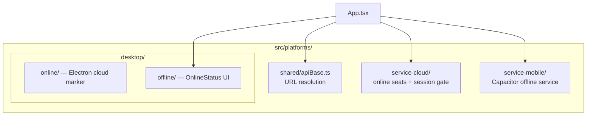

# Platforms — `src/platforms/`

| Path | Runtime | Notes |
|------|---------|--------|
| `shared/` | Web + Electron | `resolveApiUrl` / optional `VITE_API_ORIGIN` |
| `desktop/online/` | Electron cloud | Thin wrapper around hosted app |
| `desktop/offline/` | Electron on-prem | `OnlineStatus` for license sync |
| `service-cloud/` | Electron cloud + online Capacitor | Device seats for any cloud business type; service gets company session lock, others claim-only; `isServicePhoneUx()` when Cap Online + `businessType=service` |
| `service-mobile/` | Capacitor phone (Offline latch) | Offline PGlite + SA `DG-SM-` licenses; service type only; also makes `isServicePhoneUx` true |

**One Cap APK:** Online vs Offline is a first-launch latch (`getPhoneMode`), not a second installer. Offline latch remains service-only (`DG-SM-`). Online latch serves any cloud tenant with mobile access mode.

**Phone IA vs Offline runtime:** `isServicePhoneUx` shares Emergent bottom nav / Masters pills across Offline Mobile and Cap Online (service). Sync, demo seed, Show Accounts, advances, and PGlite stay behind `isServiceMobileMode` only. `ServiceCloudGate` runs for all Cap Online + Cloud Electron (browser skipped).

**Android system back (Cap):** `App.addListener('backButton')` in `src/lib/androidBackButton.ts` (wired from `ToastProvider`). Order: close print overlay → LIFO handlers from `useEscapeKey` / `androidBackStack` (modals, sheets, invoice/quote detail, Masters manage) → at tab root toast **Press back again to exit** and second press within ~2s calls `App.minimizeApp()` (fallback `exitApp`). Native tab switches use `history.replaceState` so prior tabs do not stack into a deep back history.

**Do not mix** Cap Online seats (cloud API) with Offline Mobile (`DG-SM` / PGlite). Same APK, different latches and SA panels (Cloud seats vs Offline Mobile licenses).

Native Electron processes live under repo-root `electron/` — see [Deployment → Electron](/deployment/electron).  
Service Mobile packaging — see [Deployment → Service Mobile](/deployment/service-mobile).  
Service Cloud seats — see [Deployment → Service Cloud](/deployment/service-cloud).  
Phone layout for the cloud SPA — see [Cloud Mobile UX](/frontend/cloud-mobile).

## Related

- [Product Surfaces](/architecture/four-surfaces)
- [On-Prem API](/api/mobile-onprem)
- [Service Mobile API](/api/service-mobile)
- [Service Cloud Seats API](/api/service-cloud)
