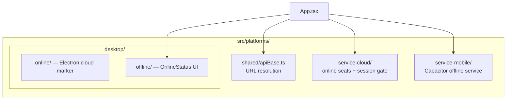

# Platforms — `src/platforms/`

| Path | Runtime | Notes |
|------|---------|--------|
| `shared/` | Web + Electron | `resolveApiUrl` / optional `VITE_API_ORIGIN` |
| `desktop/online/` | Electron cloud | Thin wrapper around hosted app |
| `desktop/offline/` | Electron on-prem | `OnlineStatus` for license sync |
| `service-cloud/` | Electron cloud + online Capacitor | Device claim + company-wide session lock; `ServiceCloudGate` freeze overlay |
| `service-mobile/` | Capacitor phone | Offline PGlite + SA `DG-SM-` licenses; service type only |

**Do not mix** Service Cloud (online seats) with Service Mobile (offline `DG-SM`). Different Capacitor configs, download URLs, and SA panels.

Native Electron processes live under repo-root `electron/` — see [Deployment → Electron](/deployment/electron).  
Service Mobile packaging — see [Deployment → Service Mobile](/deployment/service-mobile).  
Service Cloud seats — see [Deployment → Service Cloud](/deployment/service-cloud).  
Phone layout for the cloud SPA — see [Cloud Mobile UX](/frontend/cloud-mobile).

## Related

- [Product Surfaces](/architecture/four-surfaces)
- [On-Prem API](/api/mobile-onprem)
- [Service Mobile API](/api/service-mobile)
- [Service Cloud Seats API](/api/service-cloud)
