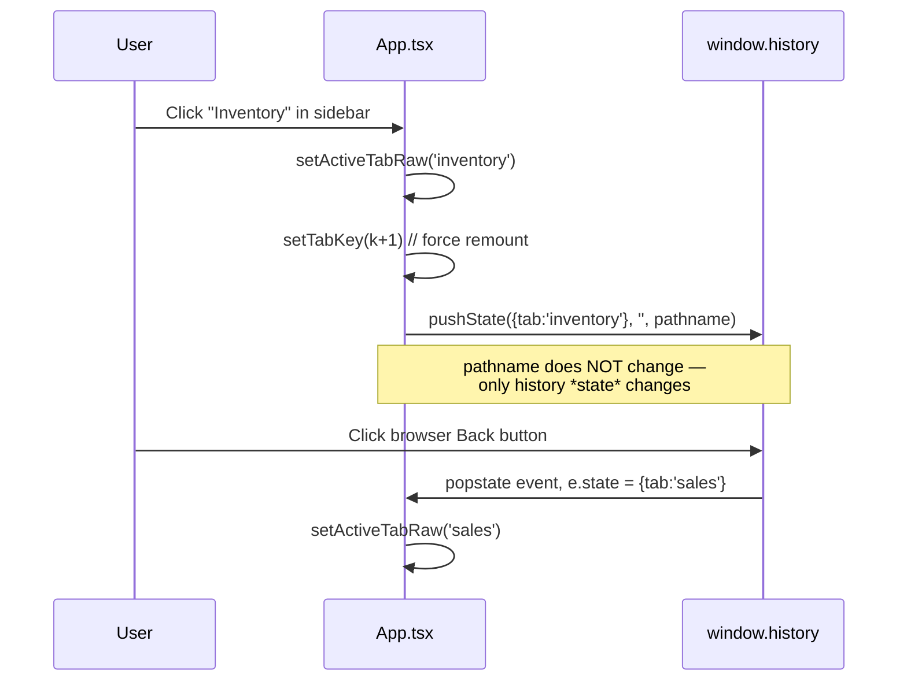

# Routing — hand-rolled, no React Router

Search `package.json` and you will not find `react-router`, `react-router-dom`, `@tanstack/router`, or any routing library. There is no `<Routes>`, no `<Route path="...">`, no `useParams`. Navigation is built from three primitives that ship with the browser:

1. `window.location.pathname` — read once per render, matched with a hand-written regex.
2. A React state variable, `activeTab: Tab` — the *actual* thing that decides which feature view renders.
3. `window.history.pushState` / `popstate` — wired up manually to make the browser back/forward buttons behave.



## The core mechanism

```231:238:src/App.tsx
export default function App() {
  const [activeTab, setActiveTabRaw] = useState<Tab>('analytics');
  const [tabKey, setTabKey] = useState(0);
  const setActiveTab = (tab: Tab) => {
    setActiveTabRaw(tab);
    setTabKey(k => k + 1);
    window.history.pushState({ tab }, '', window.location.pathname);
  };
```

Notice the second argument to `pushState` — the URL — is **unchanged** (`window.location.pathname`). Every tab switch pushes a *new history entry* but keeps the *same URL*. The tab identity lives entirely in the history entry's `state` object, not in the address bar.

```297:309:src/App.tsx
  useEffect(() => {
    const onPopState = (e: PopStateEvent) => {
      if (e.state?.tab) {
        setActiveTabRaw(e.state.tab);
      } else {
        window.history.pushState({ tab: 'analytics' }, '', window.location.pathname);
        setActiveTabRaw('analytics');
      }
    };
    window.addEventListener('popstate', onPopState);
    window.history.replaceState({ tab: 'analytics' }, '', window.location.pathname);
    return () => window.removeEventListener('popstate', onPopState);
  }, []);
```

The `popstate` listener is the only place `activeTab` is set from something *other* than a direct user click on a nav item — it fires on browser back/forward and restores whichever tab was active at that point in history.

## What the URL pathname is actually used for

The pathname is reserved almost entirely for **tenant identity**, not in-app navigation:

```457:461:src/App.tsx
  const pathname = window.location.pathname;
  const isSuperAdminRoute = pathname.startsWith('/admin');
  const slugMatch =
    pathname.match(/^\/([a-z0-9][a-z0-9-]*[a-z0-9])(\/.*)?$/i) || pathname.match(/^\/([a-z0-9]+)(\/.*)?$/i);
  const urlSlug = !isSuperAdminRoute && slugMatch ? slugMatch[1].toLowerCase() : null;
```

`https://dhandho.app/acme-electronics` is a real URL a customer bookmarks — `acme-electronics` is their **tenant slug**, resolved server-side via `GET /api/tenant/by-slug/:slug` to fetch branding (logo, primary color, tagline) *before* the user even logs in. That's the entire routing surface: a handful of static paths (`/privacy`, `/terms`, `/download`, `/admin`) and `/{slug}`. Once a user is authenticated, the pathname **never changes again** for the rest of the session — all navigation from that point is `activeTab` state changes.

## Why not React Router?

This is a legitimate question a router library would answer well, so it's worth being honest about the reasoning rather than treating "no dependency" as automatically correct.

> [!NOTE]
> **The WHY, as best reconstructed from the codebase's shape:**
>
> 1. **There genuinely aren't many routes.** The entire public surface is: static pages, `/admin`, `/{slug}`. Everything past login is not URL-addressable by design — see the callout below on *why that's actually intentional*, not an oversight.
> 2. **`activeTab` needed to already exist as permission-gated state** (see [app-shell.md](./app-shell.md)'s `canAccess`/`getAccess`). A router's `<Route>` tree would just be a thin wrapper generating the same conditional renders `App.tsx` already does with `{canAccess(activeTab) && activeTab === 'x' && <X />}`. Introducing a router doesn't remove the permission-gating logic; it just adds an abstraction on top of it.
> 3. **Multi-target constraint.** The same `src/` ships inside a Capacitor WebView (`capacitor://localhost`) and an Electron `BrowserWindow` (custom protocol handling, `file://`-adjacent quirks in some configs). Deep-linking behavior of a general-purpose router (matching `/products/:id`, redirect components, nested layouts) buys little when the shell explicitly does **not** want per-tab deep URLs (see below), while it does add a dependency whose edge cases (history mode vs hash mode, base path handling across three different hosting mechanisms) must be re-verified on all three targets.
> 4. **Bundle size discipline.** The project enforces a 256 KB gzip budget on the main chunk (see [../performance/bundle.md](../performance/bundle.md)). React Router itself is small, but it's one more thing competing for that budget on a project that already ships `motion`, `lucide-react`, and `xlsx` as separate vendor chunks.

> [!IMPORTANT]
> **Why *not* having deep-linkable tabs is a deliberate business decision, not a gap:** Dhandho's users are shop owners and warehouse staff, frequently on shared devices, often mid-task when they get interrupted. A bookmarked or shared link like `/acme-electronics#inventory?product=123` sounds convenient until you consider: (a) permissions can change between when a link is created and clicked — a Staff user might bookmark a page an Admin later hides for their role; (b) most business data here is sensitive (customer phone numbers, GST numbers, vendor balances) and a shareable deep link is an accidental disclosure vector; (c) the mental model this product wants to reinforce is "the shell + tabs is the app," closer to a native app than a document-oriented website. A single stable `/{slug}` URL you can bookmark to "get back into your company" is the actual user need, and that's exactly what's supported.

## Trade-offs, honestly assessed

| | With hand-rolled routing (current) | With React Router |
|---|---|---|
| Deep-linkable tabs (`/inventory`) | ❌ Not supported by design | ✅ Native |
| Back/forward between tabs | ✅ Works (via `popstate` + history state) | ✅ Works |
| Bundle size | Zero extra bytes | ~+10-20 KB gzip depending on version/features |
| Route-level code splitting | Manual (`React.lazy` per view, wired by hand) | Built-in helpers, same result achievable |
| Nested layouts / route guards | Hand-written `canAccess()` checks sprinkled through `App.tsx` | Could centralize via loader/guard patterns, at the cost of learning the library's specific API |
| Onboarding cost for new engineers | Read one file (`App.tsx`) top to bottom | Learn the router's mental model, then read the route tree |
| Testability | Must render the whole `App` shell to test tab switches | Route-level unit testing is a common library feature |

The honest verdict: this is the right call **for this product's shape today** (few real routes, tabs intentionally non-linkable, small team). It would stop being the right call if the product needed shareable deep links, nested route hierarchies, or a much larger team that benefits from a shared, well-documented navigation abstraction instead of tribal knowledge of one file.

## How this interacts with mobile & desktop

- **Capacitor (mobile):** the WebView's origin is `capacitor://localhost`. `history.pushState`/`popstate` work identically to a normal browser — no native navigation stack is involved. The Android hardware back button is wired separately in `src/platforms/mobile/online/bootstrap.ts` via `App.addListener('backButton', ...)`, which calls `window.history.back()` — routing back into the same `popstate` handler above. See [platforms.md](./platforms.md).
- **Electron (desktop):** loads the same built `dist/index.html`; pathname-based tenant slug matching works the same way once a URL like `/acme-electronics?desktop=1` is loaded. The `?desktop=1` query flag (see `ElectronSlugEntry` in `App.tsx`) is how the Electron shell prompts an operator for their company slug on first launch, before any tenant is known.

## Quiz

1. If you navigate to Sales, then Inventory, then click the browser Back button, what `activeTab` do you land on, and what mechanism restores it?
2. Why does `setActiveTab` call `window.history.pushState({tab}, '', window.location.pathname)` with the *same* pathname instead of `/inventory`?
3. Give two concrete business reasons (not "it's simpler") why Dhandho intentionally does not support deep-linking into a specific tab.

<details>
<summary>Answers</summary>

1. You land back on Sales. The browser's `popstate` event fires with the history entry's `state.tab` (`'sales'`), and the `onPopState` listener in `App.tsx` calls `setActiveTabRaw('sales')`.
2. Because the pathname is reserved for tenant slug identity (`/{slug}`), not in-app navigation. Tab identity lives in the history entry's `state`, which lets `pushState`/`popstate` still support back/forward without ever changing the address bar.
3. (a) Permissions can change between when a link is shared and when it's opened, so a deep link could either 403 or leak access to something since revoked; (b) most screens display sensitive PII (phone numbers, GST numbers, balances) and a shareable URL is an unintended disclosure channel.

</details>

## Related reading

- [App Shell](./app-shell.md) — where `activeTab` lives and how permissions gate it.
- [Platforms](./platforms.md) — how the Android back button and Electron slug entry interact with this routing model.
- [../performance/bundle.md](../performance/bundle.md) — the bundle budget this design helps preserve.
