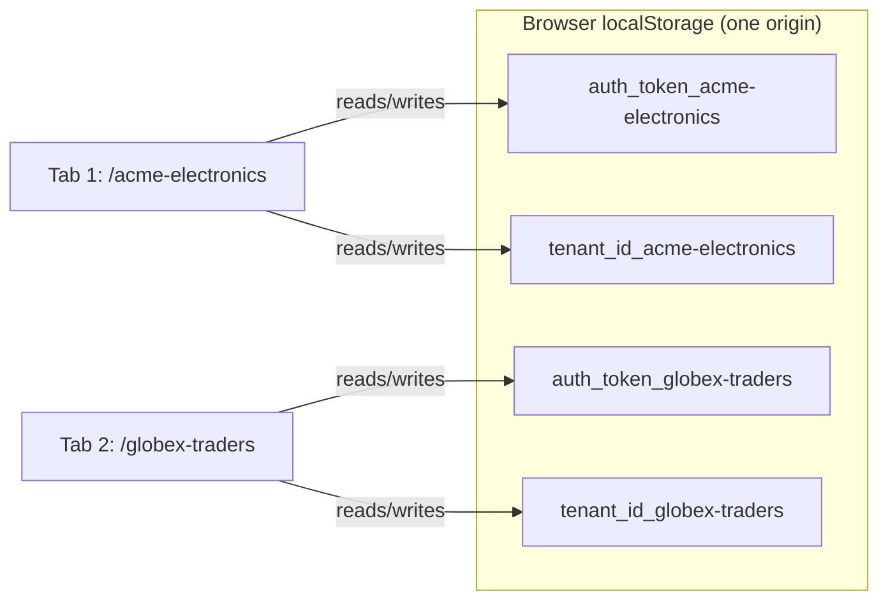

# Session & Global State

Dhandho has **no global state management library**. No Redux, no Zustand, no MobX, no Jotai, no Recoil. Check `package.json` — it isn't there. Global-ish concerns are handled by three small, purpose-built mechanisms instead:

1. **`session.ts`** — a thin wrapper over `localStorage` for auth/tenant identity.
2. **`ToastContext`** — a React Context for one thing: firing toast notifications.
3. **`LangContext`** — a React Context for the active language + translation function.

That's the entire "global state" surface of a multi-module ERP with 18 feature areas. Everything else — product lists, sales records, form drafts — lives as **local `useState` inside the feature component that needs it**, fetched fresh (subject to the 3-second cache in [api-client.md](./api-client.md)) whenever that component mounts.

## `session.ts` — tenant-scoped localStorage

```1:53:src/lib/session.ts
function getSessionSlug(): string {
  const path = window.location.pathname;
  if (path.startsWith('/admin')) return '_admin';
  const match = path.match(/^\/([a-z0-9][a-z0-9-]*)/i);
  return match ? `_${match[1].toLowerCase()}` : '';
}

function scopedKey(key: string): string {
  return `${key}${getSessionSlug()}`;
}

function sanitizeUserForStorage(user: unknown): Record<string, unknown> {
  const u = (user && typeof user === 'object') ? user as Record<string, unknown> : {};
  const { phone: _phone, address: _address, gstNumber: _gst, gst_number: _gst2, ...rest } = u;
  return rest;
}

export const session = {
  getToken: () => localStorage.getItem(scopedKey('auth_token')),
  setToken: (token: string) => localStorage.setItem(scopedKey('auth_token'), token),
  removeToken: () => localStorage.removeItem(scopedKey('auth_token')),
  getTenantId: () => localStorage.getItem(scopedKey('tenant_id')),
  setTenantId: (id: string) => localStorage.setItem(scopedKey('tenant_id'), id),
  getSlug: () => localStorage.getItem(scopedKey('tenant_slug')),
  setSlug: (slug: string) => localStorage.setItem(scopedKey('tenant_slug'), slug),
  getUser: () => { const raw = localStorage.getItem(scopedKey('dhandho_user')); return raw ? JSON.parse(raw) : null; },
  setUser: (user: unknown) => { localStorage.setItem(scopedKey('dhandho_user'), JSON.stringify(sanitizeUserForStorage(user))); },
  clearAll: () => { /* removes token, tenant_id, tenant_slug, dhandho_user, remember_me */ },
};
```

Two design decisions here are worth understanding deeply, because both were clearly added to fix a real production problem rather than designed upfront.

### 1. Every storage key is scoped by the URL's tenant slug

`scopedKey('auth_token')` doesn't return `'auth_token'` — it returns `'auth_token_acme-electronics'` (or `'auth_token_admin'` on the super-admin portal). This matters because `localStorage` is scoped to the **origin**, not the path. If Company A (`/acme-electronics`) and Company B (`/globex-traders`) are the same web app served from the same domain, an unscoped `auth_token` key would mean **logging into Company B in one browser tab silently logs you out of Company A in another tab**, because they'd overwrite the same key. Scoping every key by slug means each tenant effectively gets its own isolated "namespace" inside the one origin's `localStorage`, and a user can genuinely be logged into two different companies in two different tabs simultaneously.



> [!TIP]
> This is a low-tech alternative to `sessionStorage` (which is *tab*-scoped) or a more elaborate multi-tenant session manager. It solves the exact problem ("don't let tenant sessions collide") with the simplest possible mechanism: string concatenation on the storage key.

### 2. PII minimization: phone, address, and GST number are never persisted

```12:26:src/lib/session.ts
/**
 * Persist only what the SPA needs for auth/nav. Phone, address, and GST stay
 * off localStorage (XSS-readable) — load those via GET /api/settings/profile.
 */
function sanitizeUserForStorage(user: unknown): Record<string, unknown> {
  const u = (user && typeof user === 'object') ? user as Record<string, unknown> : {};
  const { phone: _phone, address: _address, gstNumber: _gst, gst_number: _gst2, ...rest } = u;
  return rest;
}
```

`session.setUser()` runs every user object through this destructure-and-drop filter before it ever touches `localStorage`. The comment states the threat model plainly: **`localStorage` is readable by any JavaScript running on the page**, including an XSS payload injected via a compromised dependency or an unescaped render somewhere. If that ever happens, this filter is the difference between "the attacker sees a name and email" and "the attacker sees a name, email, home address, phone number, and GST registration number." The screens that actually need phone/address/GST call `api.settings.getProfile(userId)` fresh from the server — see [App.tsx`'s startup effect](./app-shell.md) which does exactly this on every load. See [../security/secrets.md](../security/secrets.md) and [../security/accepted-risks.md](../security/accepted-risks.md) for the fuller discussion of storing the JWT itself in `localStorage`.

## `ToastContext` — the simplest possible global notification bus

```1:71:src/components/ui/Toast.tsx
export const ToastContext = createContext<{ toast: (message: string, type?: ToastType) => void }>({ toast: () => {} });
export const useToast = () => useContext(ToastContext);

export function ToastProvider({ children }: { children: React.ReactNode }) {
  const [toasts, setToasts] = useState<Toast[]>([]);
  let nextId = 0;
  const toast = useCallback((message: string, type: ToastType = 'info') => {
    const id = ++nextId + Date.now();
    setToasts((t) => [...t, { id, message, type }]);
    setTimeout(() => setToasts((t) => t.filter((x) => x.id !== id)), TOAST_DURATION);
  }, []);
  ...
  return (
    <ToastContext.Provider value={{ toast }}>
      {children}
      <div className="fixed top-4 right-4 z-[200] flex flex-col gap-2 max-w-sm">
        <AnimatePresence>{toasts.map((t) => <ToastItem key={t.id} .../>)}</AnimatePresence>
      </div>
    </ToastContext.Provider>
  );
}
```

This is textbook "the smallest Context that solves the problem." Any component, anywhere in the tree, calls `const { toast } = useToast(); toast('Vendor created', 'success')` and a floating notification appears top-right, auto-dismissing after 4 seconds (`TOAST_DURATION`), animated in/out with `motion`. `ToastProvider` wraps the entire authenticated shell (and the super-admin shell, and the login screens — see `App.tsx`), so `useToast()` works from any feature view without prop drilling.

> [!NOTE]
> **Why is this a Context and not, say, an event emitter + a single toast-rendering component at the root?** A Context gives every consumer a typed hook (`useToast()`) with zero import-order concerns and integrates naturally with React's render cycle for the exit animations (`AnimatePresence` needs toasts to be React state, not imperative DOM manipulation, to animate their removal). The `id` generation (`++nextId + Date.now()`) is a pragmatic non-cryptographic unique-enough key — toasts don't need cryptographic uniqueness, just uniqueness within one browser tab's lifetime.

## `LangContext` — locale state, not a general i18n framework

```31:97:src/i18n/index.tsx
interface LangContextValue { lang: Lang; setLang: (l: Lang) => void; t: (key: string) => string; }
const LangContext = createContext<LangContextValue>({ lang: 'en', setLang: () => {}, t: key => key });

export function LanguageProvider({ children }: { children: React.ReactNode }) {
  const [lang, setLangState] = useState<Lang>(getStoredLang);
  const [dict, setDict] = useState<Translations>(en);
  useEffect(() => { /* lazy-load hi/gu/mr on demand, cache in module-level `cache` object */ }, [lang]);
  const setLang = useCallback((l: Lang) => { localStorage.setItem(LANG_KEY, l); setLangState(l); }, []);
  const t = useCallback((key: string): string => lookup(dict, key), [dict]);
  return <LangContext.Provider value={{ lang, setLang, t }}>{children}</LangContext.Provider>;
}
export function useTranslation() { return useContext(LangContext); }
```

Full detail (locale files, lazy-loading strategy, fallback behavior) is in [i18n.md](./i18n.md). The state-management-relevant point here: `lang` and `t` are the *only* two pieces of truly global, cross-cutting UI state in the entire app besides auth/toast. Every feature view calls `const { t } = useTranslation()` and gets re-rendered automatically when the language changes, because changing `lang` changes the Context value, which by React's Context semantics re-renders every consumer.

> [!CAUTION]
> **Context re-render cost is a real, if usually invisible, trade-off.** Because `LangContext`'s value object (`{ lang, setLang, t }`) is a *new object* on every `LanguageProvider` re-render (not memoized with `useMemo`), and because it wraps the entire authenticated app, changing language triggers a re-render of every mounted component that calls `useTranslation()` — which, given `App.tsx`'s heavy use of `t('nav.x')` for every sidebar label, is effectively the whole visible UI. This is fine because language changes are rare, user-initiated events, not something that happens on every keystroke. See [../performance/frontend.md](../performance/frontend.md) for when Context-driven re-renders *do* become a performance concern versus when they don't.

## Why not Redux/Zustand/MobX?

> [!NOTE]
> **The reasoning, inferred from the shape of the codebase:**
>
> 1. **There is very little state that is genuinely shared across distant parts of the tree.** Redux (and friends) earn their cost when many unrelated components need to read and write the *same* piece of state, or when you need time-travel debugging / middleware / devtools for complex state transitions. Here, the shared state is: "am I logged in," "what language," "show this toast." Three Contexts fully cover that.
> 2. **Business data is not global state — it's server state.** Product lists, sales records, vendor balances: these aren't values the UI "owns" and mutates locally; they're fetched from the API, displayed, and re-fetched after mutations (see the cache-invalidation behavior in [api-client.md](./api-client.md)). Treating server data as global client state (as early Redux-heavy apps often did, with normalized entity caches) invites a whole category of cache-invalidation bugs that this app avoids simply by not doing it — each feature component fetches what it needs, when it mounts, and the API client's short TTL cache absorbs the redundancy cost.
> 3. **Team size and bundle budget.** A small team maintaining 18 feature modules benefits more from "just use `useState`, fetch what you need" being uniformly true everywhere than from a shared state architecture that needs its own onboarding. And every dependency competes for the [256 KB gzip budget](../performance/bundle.md).

## Trade-offs

| Choice | Benefit | Cost |
|---|---|---|
| No global store for business data | No cache-invalidation bugs from a stale global entity cache; each screen is independently correct | Potential duplicate fetches across sibling components (mitigated by the 3s `fetchApi` cache) |
| `localStorage` scoped by slug string concatenation | Solves multi-tenant tab collision with zero new dependencies | Slug must be parseable from the pathname at every call site (`getSessionSlug()`); a slug rename would silently orphan old session data under the old key |
| PII stripped before persisting `user` | Materially reduces XSS blast radius | Every screen needing phone/address/GST must re-fetch via `api.settings.getProfile`, adding a network round trip those screens wouldn't otherwise need |
| Three separate, tiny Contexts instead of one "app state" Context | Each Context only re-renders its own consumers' concern; simple to reason about | No time-travel debugging, no middleware pipeline, no devtools extension |

## Exercise

1. A user opens `/acme-electronics` in one tab and `/globex-traders` in another, both logged in as different accounts. Trace, key by key, what `localStorage` actually contains, and confirm the two sessions cannot interfere with each other.
2. Suppose `session.setUser()` did **not** strip `phone`/`address`/`gstNumber`. Describe a realistic attack chain (starting from any client-side script execution) that would now additionally expose those fields, and explain why the current design limits the damage.
3. Why does `LanguageProvider` fall back to `setDict(en)` on a failed locale import (see the `.catch()` in `src/i18n/index.tsx`) rather than leaving the UI in a loading state indefinitely?

<details>
<summary>Answers</summary>

1. Every key is scoped: `auth_token_acme-electronics`, `tenant_id_acme-electronics`, `dhandho_user_acme-electronics` vs. `auth_token_globex-traders`, etc. Since the keys differ by suffix, writes/reads in one tab never touch the other tenant's keys, even though both tabs share the same browser origin and thus the same physical `localStorage`.
2. Any JS execution on the page (e.g., an XSS payload from an unescaped user-supplied string rendered somewhere, or a compromised third-party script) can read `localStorage` directly. Without the strip, `JSON.parse(localStorage.getItem('dhandho_user_...'))` would hand the attacker phone, address, and GST number for free, in addition to name/email. With the strip in place, the attacker still gets name/email (already a partial win for them) but not the more sensitive fields, which only exist in memory transiently after an explicit `GET /api/settings/profile` call and are never written back to storage.
3. Falling back to English keeps the app usable — a partially-translated or perpetually-loading UI is worse than an English UI that at least functions. This is a graceful-degradation choice consistent with the rest of the codebase's defensive style (see [patterns.md](./patterns.md)).

</details>

## Related reading

- [API Client](./api-client.md) — how `session.getToken()`/`getTenantId()` feed every request.
- [i18n](./i18n.md) — full detail on `LangContext` and locale loading.
- [../security/secrets.md](../security/secrets.md) — the broader discussion of what belongs and doesn't belong in client-side storage.
- [../security/accepted-risks.md](../security/accepted-risks.md) — the accepted risk of storing the JWT itself in `localStorage`.
