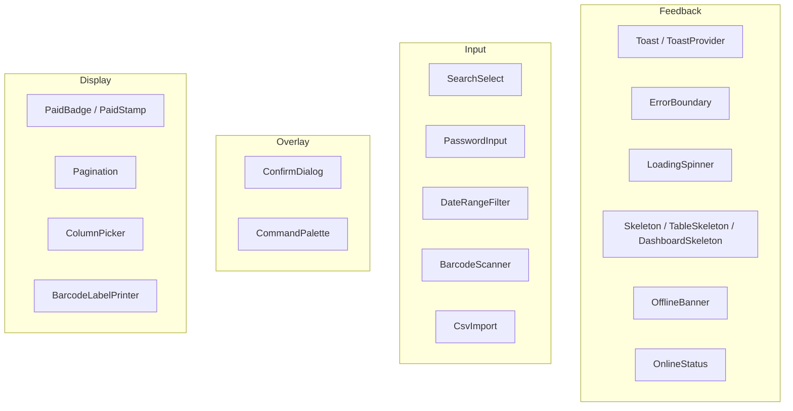

# UI Kit — `src/components/ui/`

Dhandho has no Material UI, no Ant Design, no shadcn/ui, no Radix. `components/ui/` is a small, hand-built design system — 18 components, none larger than a few hundred lines, all sharing three conventions: **Tailwind + `cn()`** for styling (see [patterns.md](./patterns.md)), **`motion`** for the handful of components that animate, and **accessibility primitives written by hand** (focus trapping, `Escape` handling, ARIA roles) rather than pulled from a headless-UI library.



## Feedback components

### `ErrorBoundary`

A hand-written class component (the one legitimate use case for a class component in this codebase — see [app-shell.md](./app-shell.md) for the full explanation of why hooks can't replace `componentDidCatch`). Catches render-time exceptions in the active feature view and shows a "Something went wrong / Try again" card instead of a blank screen.

### `Toast` / `ToastProvider` / `useToast`

The app's only notification mechanism — a `Context` + floating stack, covered in depth in [session-state.md](./session-state.md). Auto-dismisses after 4 seconds, animated with `motion`'s `AnimatePresence`.

### `LoadingSpinner`

The universal `Suspense` fallback (`LazyFallback` in `App.tsx` wraps it) and the default "data is loading" indicator inside feature views. Deliberately generic — one spinner, reused everywhere, rather than a bespoke loading state per screen.

### `Skeleton`, `TableSkeleton`, `DashboardSkeleton`

Layout-shaped placeholder blocks (gray animated rectangles matching the eventual content's dimensions) used where a spinner would cause a jarring layout jump once real data arrives — e.g., a data table that renders as a skeleton with the right number of rows/columns while `api.products.list()` resolves. This is the classic "perceived performance" trick: users tolerate the same real load time better when the loading state visually previews the coming layout instead of showing an unrelated spinner.

### `OfflineBanner` (re-exported from `platforms/mobile/offline`) and `OnlineStatus` (re-exported from `platforms/desktop/offline`)

Both are documented in depth in [platforms.md](./platforms.md); they're included in the `components/ui` public export surface (`index.ts`) purely for import convenience, even though their implementation lives under `platforms/`.

## Input components

### `SearchSelect`

```20:39:src/components/ui/SearchSelect.tsx
export function SearchSelect({ options, value, onChange, placeholder = 'Search...', className }: SearchSelectProps) {
  const [open, setOpen] = useState(false);
  const [search, setSearch] = useState('');
  ...
  const filtered = search ? options.filter(o => o.label.toLowerCase().includes(search.toLowerCase())) : options;
  const grouped: Record<string, Option[]> = {};
  for (const o of filtered) {
    const letter = o.label.charAt(0).toUpperCase();
    if (!grouped[letter]) grouped[letter] = [];
    grouped[letter].push(o);
  }
  ...
```

A typeahead dropdown (using `ReactDOM` directly for portal positioning) that groups filtered options alphabetically by first letter — the standard pattern for picking one item out of a long list (vendors, products, customers) without scrolling through hundreds of entries. Used everywhere a form needs "pick a customer/vendor/product" rather than a plain HTML `<select>`, because native selects don't support search-as-you-type or the visual grouping this product's long master lists need.

### `PasswordInput`

A password field with a show/hide toggle — small, but worth noting it exists as a shared component rather than being re-implemented per login/change-password/settings screen, keeping the show/hide icon and behavior consistent everywhere a password is entered.

### `DateRangeFilter`

Standard date-range picker used across every module with a "list" view that supports filtering by date (`Sales`, `Warranties`, `Audit Log`, `Expenses`, `Payroll` — see the `dateRange`/`dateFrom`/`dateTo` params scattered through `api.ts`). One component, one set of preset ranges (e.g., "This Month," "Last 30 Days"), reused by every module instead of each screen inventing its own date UI.

### `BarcodeScanner`

```26:44:src/components/ui/BarcodeScanner.tsx
useEffect(() => {
  let cancelled = false;
  (async () => {
    try {
      const { Html5Qrcode } = await import('html5-qrcode');
      if (cancelled) return;
      const scanner = new Html5Qrcode(containerId);
      scannerRef.current = scanner;
      await scanner.start(
        { facingMode: 'environment' },
        { fps: 10, qrbox: { width: 250, height: 150 } },
        (decodedText) => { if (scannedRef.current) return; scannedRef.current = true; ... }
      );
```

Wraps the `html5-qrcode` library behind a **dynamic `import()`** — this library (and its camera-access machinery) is only downloaded when a user actually opens the scanner, not as part of any initial bundle (it lands in the `vendor-scanner` manual chunk — see [../performance/bundle.md](../performance/bundle.md)). `facingMode: 'environment'` requests the rear/world-facing camera specifically, since this is used for scanning physical product barcodes, not selfies. `scannedRef` (a ref, not state) guards against the scan callback firing multiple times for the same physical barcode in the brief window before the component reacts and closes the scanner.

### `CsvImport`

```14:25:src/components/ui/CsvImport.tsx
function parseCsv(text: string): { headers: string[]; rows: Record<string, string>[] } {
  const lines = text.split(/\r?\n/).filter((l) => l.trim());
  if (lines.length < 2) return { headers: [], rows: [] };
  const headers = lines[0].split(',').map((h) => h.trim().replace(/^"|"$/g, ''));
  const rows = lines.slice(1).map((line) => { /* naive split(',') per row */ });
  return { headers, rows };
}
```

A **hand-rolled CSV parser** — `split(',')`, not a library like `papaparse`. This is a deliberate scope trade-off: it correctly handles the simple, quoted-or-plain CSV that Dhandho's own `exportToCsv` (`src/lib/utils.ts`) produces and that Excel/Google Sheets export by default, but it does **not** handle edge cases like commas embedded inside unescaped fields or multi-line quoted values. Given this is used for bulk-importing masters (vendors, products) via a template the user downloads from the app itself (`templateName` prop), the input is a controlled, known shape — the "why" here is that a general-purpose CSV parser is solving a harder problem than this feature actually has.

> [!NOTE]
> Contrast this with `xlsx` (the SheetJS library), which the project **does** pull in as a real dependency for spreadsheet import/export elsewhere (bank statement upload — see [../security/accepted-risks.md](../security/accepted-risks.md) for the known CVE this carries). The project reaches for a dependency when the format is genuinely complex (binary `.xlsx`) and hand-rolls when the format is simple and self-controlled (plain CSV).

## Overlay components

### `ConfirmDialog`

```7:38:src/components/ui/ConfirmDialog.tsx
export function ConfirmDialog({ title, message, confirmLabel = 'Confirm', cancelLabel = 'Cancel', variant = 'danger', onConfirm, onCancel }: {...}) {
  const titleId = 'confirm-dialog-title';
  const descId = 'confirm-dialog-desc';
  ...
  useEscapeKey(onCancel, true);
  useEffect(() => { confirmRef.current?.focus(); }, []);
  const trapFocus = useCallback((e: KeyboardEvent) => { /* Tab/Shift+Tab cycling within panel */ }, ...);
  ...
```

The universal "are you sure you want to delete this vendor" dialog, used before every destructive action across all 18 feature modules. Three accessibility behaviors are hand-implemented rather than assumed: **auto-focus** on the confirm button on mount, a **focus trap** (Tab/Shift+Tab cycles only within the dialog, never escaping to the page behind it), and `Escape`-to-cancel via the shared `useEscapeKey` hook (see [patterns.md](./patterns.md)). `variant` (`danger`/`warning`/`info`) drives the confirm button's color — red for a delete, amber for a less-destructive warning, brand-orange for a neutral confirmation.

### `CommandPalette`

```8:34:src/components/ui/CommandPalette.tsx
export function CommandPalette({ items, onSelect, onClose }: { items: PaletteItem[]; onSelect: (id: string) => void; onClose: () => void; }) {
  const [query, setQuery] = useState('');
  const [activeIdx, setActiveIdx] = useState(0);
  ...
  const filtered = query ? items.filter(i => i.label.toLowerCase().includes(query.toLowerCase())) : items;
  ...
  const handleKey = useCallback((e: React.KeyboardEvent) => {
    if (e.key === 'ArrowDown') { ...; setActiveIdx(i => Math.min(i + 1, filtered.length - 1)); }
    else if (e.key === 'ArrowUp') { ...; setActiveIdx(i => Math.max(i - 1, 0)); }
    else if (e.key === 'Enter' && filtered[activeIdx]) { onSelect(filtered[activeIdx].id); onClose(); }
    else if (e.key === 'Escape') { onClose(); }
  }, [filtered, activeIdx, onSelect, onClose]);
```

The `⌘K`/`Ctrl+K` fuzzy-navigation palette (wired up in `App.tsx` — see [app-shell.md](./app-shell.md)). Receives the exact same `visibleNavItems` the sidebar and mobile bottom-bar use — one permission-filtered list of "what can this user navigate to," rendered in three different UI surfaces. Arrow-key navigation with auto-scroll-into-view (`el?.scrollIntoView({ block: 'nearest' })`) is entirely hand-implemented, not from a combobox library.

## Display components

### `PaidBadge` / `PaidStamp` / `isBillFullyPaid`

```4:23:src/components/ui/PaidBadge.tsx
export function isBillFullyPaid(billValue: number, balance: number): boolean {
  return billValue > 0 && balance <= 0;
}
export function PaidBadge({ className, size = 'md' }: { className?: string; size?: 'sm' | 'md' }) {
  return ( <span ...><BadgeCheck .../>Paid</span> );
}
```

A tiny but telling example of centralizing **business logic**, not just visual style, in a shared UI component: `isBillFullyPaid` is the single definition of "what counts as fully paid" (bill value is positive AND balance is zero-or-negative), used everywhere a paid/unpaid badge needs to render across Sales, Distribution, Vendor Finance, and Invoices. Two presentation variants — `PaidBadge` (a small pill for table rows) and `PaidStamp` (a large diagonal-stamp look for printed bill headers) — share the same underlying truth so a table and a printed invoice for the same record can never disagree about whether it's marked paid.

### `Pagination` (`PaginationControls`)

The shared page-number control for every paginated list endpoint (`api.sales.list`, `api.warranties.list`, `api.auditLog.list`, ... — all of which return `{ data, total, page, totalPages }`, a consistent server-side pagination shape covered further in [../performance/backend.md](../performance/backend.md)).

### `ColumnPicker`

Lets a user choose which columns are visible in a data table — used on the denser list screens (inventory, sales, purchases) where the full column set doesn't comfortably fit a phone screen or a user's specific workflow doesn't need every column.

### `BarcodeLabelPrinter`

Generates printable barcode labels (leaning on `jsbarcode`, bundled in the `vendor-scanner` chunk alongside `html5-qrcode` — see [../performance/bundle.md](../performance/bundle.md)) for physically labeling inventory units — the print-side counterpart to `BarcodeScanner`'s scan-side reading.

## The public export surface

```1:8:src/components/ui/index.ts
export { ToastProvider, ToastContext, useToast } from './Toast';
export { OfflineBanner } from '../../platforms/mobile/offline';
export { LoadingSpinner } from './LoadingSpinner';
export { DateRangeFilter } from './DateRangeFilter';
export { PaginationControls } from './Pagination';
export { PaidBadge, PaidStamp, isBillFullyPaid } from './PaidBadge';
export { PasswordInput } from './PasswordInput';
export { Skeleton, DashboardSkeleton, TableSkeleton } from './Skeleton';
```

Notice `index.ts` re-exports only a **subset** of the 18 components — `ErrorBoundary`, `ConfirmDialog`, `CommandPalette`, `BarcodeScanner`, `BarcodeLabelPrinter`, `SearchSelect`, `ColumnPicker`, and `CsvImport` are imported directly from their own files at call sites, not through the barrel file. This isn't an inconsistency to "fix" — a barrel file that re-exports *everything* forces every consumer's bundler analysis to consider the whole barrel as one unit, which can work against tree-shaking and against the `React.lazy` per-feature code-splitting this project relies on (see [../performance/bundle.md](../performance/bundle.md)). Keeping the barrel small and importing the rest directly is a (probably instinctive, possibly deliberate) way of avoiding that.

## Trade-offs

| Choice | Benefit | Cost |
|---|---|---|
| Hand-built components instead of a UI library (MUI, Ant, Radix) | Zero dependency weight beyond what's actually used; full control of markup/behavior; no fighting a library's opinions on styling | Every accessibility behavior (focus trap, ARIA roles, keyboard nav) must be correctly hand-implemented and hand-tested, component by component |
| Hand-rolled CSV parser | Zero dependency for a simple, self-controlled format | Would silently mishandle CSVs with embedded commas/newlines if ever fed a more complex file than this app produces |
| Business logic (`isBillFullyPaid`) co-located with its display component | One source of truth used identically everywhere | A future engineer must know to look in a "UI" file for what feels like a business rule |

## Quiz

1. Why is `BarcodeScanner`'s `html5-qrcode` import a dynamic `import()` rather than a top-level `import`?
2. What problem does `isBillFullyPaid` solve by existing as a shared function instead of being reimplemented inline in each screen that shows a paid/unpaid badge?
3. Why does `components/ui/index.ts` deliberately not re-export every component in the folder?

<details>
<summary>Answers</summary>

1. So the `html5-qrcode` library (and its camera-access code) is excluded from every bundle except the moment a user actually opens the scanner — it lands in its own lazily-loaded chunk instead of inflating the main bundle for users who never scan a barcode in a given session.
2. It guarantees every screen (a table row, a printed bill, a vendor summary card) applies the exact same rule for "paid" — if the definition ever changes (e.g., adding a grace-period tolerance), there's one function to update instead of hunting down every inline `billValue > 0 && balance <= 0` comparison across the codebase.
3. To keep the barrel file's surface small and avoid bundler/tree-shaking friction — importing components directly from their own files lets each `React.lazy`-loaded feature pull in exactly the UI components it uses, without the barrel forcing bundlers to reason about a large re-export unit.

</details>

## Related reading

- [Patterns](./patterns.md) — the `cn()` styling convention and shared hooks (`useEscapeKey`, `useConfirm`) these components build on.
- [../performance/bundle.md](../performance/bundle.md) — how `BarcodeScanner`/`BarcodeLabelPrinter` map to the `vendor-scanner` chunk.
- [App Shell](./app-shell.md) — where `ErrorBoundary` and `CommandPalette` are wired into the root component.
