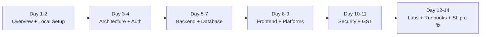

# Welcome to the Dhandho Engineering Academy

**You are taking ownership of an AI-developed multi-tenant ERP.**  
This portal exists so you never need to ask the original author: *“Where does X live?”*, *“Why was Y chosen?”*, or *“What breaks if I change Z?”*

**Product:** [Dhandho](https://dhandho.app) (repo: [prathame/DG-ERP](https://github.com/prathame/DG-ERP), npm name `splendor-erp`)  
**Domain:** GST-aware business management for Indian SMEs — inventory, distribution, sales, accounts, payroll, warranties, rewards.  
**Surfaces:** Web SPA · Electron cloud · Electron on-prem · Service Cloud seats (online) · Service Mobile (offline Capacitor, service type only). Phone layout for the cloud SPA: [Cloud Mobile UX](/frontend/cloud-mobile).

:::tip How to use this academy
Treat chapters like a **bootcamp**, not a wiki dump. Do the labs. Fail the quizzes. Trace one request from browser to Postgres with the debugger. That is how ownership sticks.
:::

## What this academy teaches

| Dimension | You will learn |
|---|---|
| **WHAT** | Every major file, route, table, and UI module |
| **WHY** | Business value + design decisions + rejected alternatives |
| **HOW** | Algorithms, middleware order, GST math, offline queues |
| **WHEN** | Boot sequence, request lifecycle, heartbeats, CI gates |
| **WHO** | Callers/callees, roles (Admin → Vendor → Super Admin) |
| **WHAT IF** | Failure modes, runbooks, security threat model, scale paths |

## Recommended learning path (2 weeks)

1. **[Day-1 Onboarding](./tutorials/day-1-onboarding.md)** — environment, first login, mental models  
2. **[Business Goals](./overview/business-goals.md)** — who the customer is  
3. **[System Overview](./architecture/system-overview.md)** — four surfaces, one Express core  
4. **[Multi-tenancy](./architecture/multi-tenancy.md)** — the non-negotiable invariant  
5. **[Request Lifecycle](./architecture/request-lifecycle.md)** — middleware to SQL  
6. **[Auth](./security/authentication.md)** + **[AuthZ](./security/authorization.md)**  
7. **[Database ERD](./database/erd.md)**  
8. **[API Overview](./api/overview.md)**  
9. **[Frontend App Shell](./frontend/app-shell.md)**  
10. **[Security Threat Model](./security/threat-model.md)** + **[Quiz: Security](./quizzes/quiz-security.md)**  
11. **[Deployment Overview](./deployment/overview.md)**  

:::info Deferred
**SRE** and **Labs** tracks are skipped for now (sidebar collapsed). Come back later.
:::

## Curriculum map

### 01 Overview
[Business](./overview/business-goals.md) · [Stack](./overview/tech-stack.md) · [Folders](./overview/folder-structure.md)

### 02 Architecture
[System](./architecture/system-overview.md) · [Decisions](./architecture/design-decisions.md) · [Workflows](./architecture/business-workflows.md)

### 03–05 Engineering
[Backend](./backend/overview.md) · [Frontend](./frontend/overview.md) · [Database](./database/schema-overview.md)

### 06–08 Depth
[API](./api/overview.md) · [Files](./files/index.md) · [Security](./security/threat-model.md)

### 09–12 Ops
[Performance](./performance/overview.md) · [SRE](./sre/overview.md) · [Deploy](./deployment/overview.md) · [Test](./testing/overview.md)

### 13–19 Practice
[Labs](./labs/index.md) · [Quizzes](./quizzes/index.md) · [Animations](./animations/index.md) · [Glossary](./glossary/index.md)

## Non-negotiable mental models

:::warning The three locks of tenancy
Every tenant-scoped row is protected by **(1)** `WHERE tenant_id = $1` in application SQL, **(2)** JWT-derived `tenantId` (never trust the client to pick a tenant), and **(3)** Postgres RLS as a safety net. Skip any layer and you risk **cross-tenant data leakage** — a career-ending bug class in SaaS.
:::

**Analogy:** Think of each tenant as an apartment in a building. The JWT is your keycard. `tenant_id` in SQL is the door lock. RLS is the fire door that still closes if someone props the main door open. The pool owner can bypass RLS — so the door lock (explicit SQL) remains primary.

## AI-origin assumptions

This codebase shows patterns common to AI-assisted development: large feature views, pragmatic ESLint/TS strictness, excellent audit markdown, and occasional duplication. Read **[AI Origin Assumptions](./overview/ai-origin-assumptions.md)** before you “clean up” anything — some shortcuts are deliberate product velocity; others are debt with a scorecard (production audits tracked ~82 → ~88).

## Search everything

Use the search box (local full-text). Prefer searching **symbol names** (`withTenantClient`, `enforceModulePermissions`, `fetchApi`) over vague English.

## Related

- [Technology Stack](./overview/tech-stack.md)
- [Design Decisions](./architecture/design-decisions.md)
- [Interview Question Bank](./learning/interview-bank.md)
