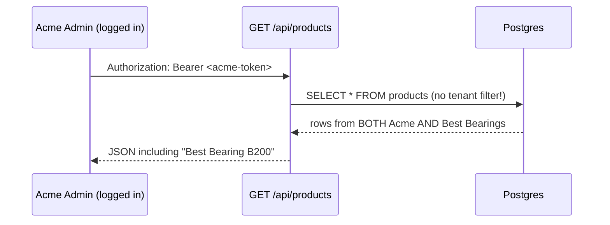

# Lab: Find and Fix a Cross-Tenant Leak

:::danger Do this on a local/scratch database only
This lab intentionally creates a security vulnerability in a scratch branch. Never commit the vulnerable version, and never run this against a shared or production database.
:::

## Learning objectives

- Reproduce a real cross-tenant data leak end to end, not just read about one
- Understand exactly which of the [three locks](/architecture/multi-tenancy) catches (or fails to catch) the leak
- Fix the bug correctly and write a regression test that would have caught it

## Prerequisites

- Local dev environment running ([Local Setup](/tutorials/local-setup))
- Comfortable running `psql` and reading TypeScript route handlers
- Read [Multi-tenancy](/architecture/multi-tenancy) first — this lab assumes you understand the three-lock model

## Step 1 — Seed two tenants

```bash
# Using the Super Admin API (or provisionTenant directly in a scratch script)
curl -X POST http://localhost:3001/api/super-admin/tenants \
  -H "Authorization: Bearer $SUPER_ADMIN_TOKEN" \
  -H "Content-Type: application/json" \
  -d '{"companyName":"Acme Motors","adminEmail":"admin@acme.test","adminName":"Acme Admin","planId":"TRIAL"}'

curl -X POST http://localhost:3001/api/super-admin/tenants \
  -H "Authorization: Bearer $SUPER_ADMIN_TOKEN" \
  -H "Content-Type: application/json" \
  -d '{"companyName":"Best Bearings","adminEmail":"admin@best.test","adminName":"Best Admin","planId":"TRIAL"}'
```

Note the returned `credentials.password` for each — you'll need them to log in as each tenant's admin. Create one or two distinctive products under **each** tenant (e.g. "Acme Fan X1" for Acme, "Best Bearing B200" for Best) so a leak is unmistakable when you see it.

## Step 2 — Introduce the bug

Open `server/routes/products.ts` and find the list handler. It should look like:

```ts
router.get('/api/products', authMiddleware, async (req: AuthRequest, res) => {
  const tenantId = req.tenantId;
  const rows = await pool.query('SELECT * FROM products WHERE tenant_id = $1', [tenantId]);
  res.json(rows.rows);
});
```

In a **scratch branch**, remove the tenant predicate to simulate a realistic mistake (e.g. a developer refactoring a query and accidentally dropping the `WHERE` clause, or adding a new filter that replaces it instead of appending to it):

```ts
router.get('/api/products', authMiddleware, async (req: AuthRequest, res) => {
  const rows = await pool.query('SELECT * FROM products');   // BUG: no tenant filter
  res.json(rows.rows);
});
```

## Step 3 — Prove the leak



Log in as Acme's admin, then call the products list endpoint:

```bash
ACME_TOKEN=$(curl -s -X POST http://localhost:3001/api/auth/login \
  -H "Content-Type: application/json" \
  -d '{"email":"admin@acme.test","password":"<acme-password>"}' | jq -r .token)

curl -s http://localhost:3001/api/products -H "Authorization: Bearer $ACME_TOKEN" | jq '.[].name'
```

**Confirm you see "Best Bearing B200" in Acme's response** — this is the leak, live and reproduced.

## Step 4 — Check whether RLS would have saved you

It won't — and understanding *why* is the point of this step. `products` is in the `rlsTables` array in `pg-db.ts`, with a policy `USING (tenant_id = current_setting('app.tenant_id', true))`. But the application's own `pool.query()` call runs as the **table owner**, who bypasses RLS by default (RLS is `ENABLE`d, not `FORCE`d — see [Multi-tenancy](/architecture/multi-tenancy) for why `FORCE` was tried and reverted). Confirm this yourself:

```sql
-- Connect as your app's pool user and run the exact vulnerable query directly:
SELECT * FROM products;
-- You'll get rows from every tenant — RLS did not filter them, because the
-- pool owner bypasses RLS and no `app.tenant_id` was ever SET for this connection.
```

This is the single most important realization in this lab: **the explicit `WHERE tenant_id` in application code is the actual, primary defense — not RLS.**

## Step 5 — Fix it correctly

Restore the tenant predicate:

```ts
router.get('/api/products', authMiddleware, async (req: AuthRequest, res) => {
  const tenantId = req.tenantId;
  const rows = await pool.query('SELECT * FROM products WHERE tenant_id = $1', [tenantId]);
  res.json(rows.rows);
});
```

Re-run the Step 3 curl command and confirm Acme's admin now sees **only** Acme's products.

## Step 6 — Write a regression test

Add a test to `tests/api/products.test.ts` (or wherever the existing suite lives) that would have caught this bug on its own, without a human needing to notice a missing `WHERE` clause during review:

```ts
it('never returns another tenant\'s products', async () => {
  const acmeToken = await loginAs('admin@acme.test', 'password');
  const res = await request(app).get('/api/products').set('Authorization', `Bearer ${acmeToken}`);
  const names = res.body.map((p: { name: string }) => p.name);
  expect(names).not.toContain('Best Bearing B200');
  expect(names.every((n: string) => n.startsWith('Acme'))).toBe(true);
});
```

This is exactly the shape of test in [Testing Overview](/testing/overview) and `tests/api/security.test.ts` that exists specifically to catch this class of regression across the codebase — go read that file after finishing this lab to see the real version.

## Reflection questions

1. If this bug had shipped to production, what would the *first external signal* likely have been — a customer noticing, a support ticket, or something else? How would you have found it faster?
2. Look through `server/routes/*.ts` for any query you can find that filters by a *different* column than `tenant_id` alone in a JOIN (e.g. joining `users` to `tenants`) — is the tenant predicate present on **both** sides of every JOIN, or could a similar bug hide in a multi-table query?
3. Why does this lab deliberately walk you through confirming RLS *doesn't* save you, rather than just telling you that fact?

## Quiz

1. What's the exact SQL clause that was missing, and on which table?
2. Why does the pool owner bypass RLS by default in Postgres?
3. What's the one regression test pattern that would generalize to catch this bug class across many endpoints, not just `products`?

<details>
<summary>Answers</summary>

1. `WHERE tenant_id = $1` on the `products` table query.
2. Because Postgres RLS policies don't apply to the table owner unless the table has `FORCE ROW LEVEL SECURITY` set — and Dhandho explicitly does not force it, for the reasons documented in `pg-db.ts` and [Multi-tenancy](/architecture/multi-tenancy).
3. A parameterized test helper that logs in as two distinct seeded tenants and asserts that any list endpoint's response never contains the other tenant's known-distinctive seed data — applied systematically across every list endpoint in the API surface.

</details>

## Related pages

- [Multi-tenancy](/architecture/multi-tenancy)
- [Tenant Isolation (Security)](/security/tenant-isolation)
- [Database Schema Overview](/database/schema-overview)
- [Testing Overview](/testing/overview)
- [Lab: Debug a 403](/labs/lab-debug-403)
