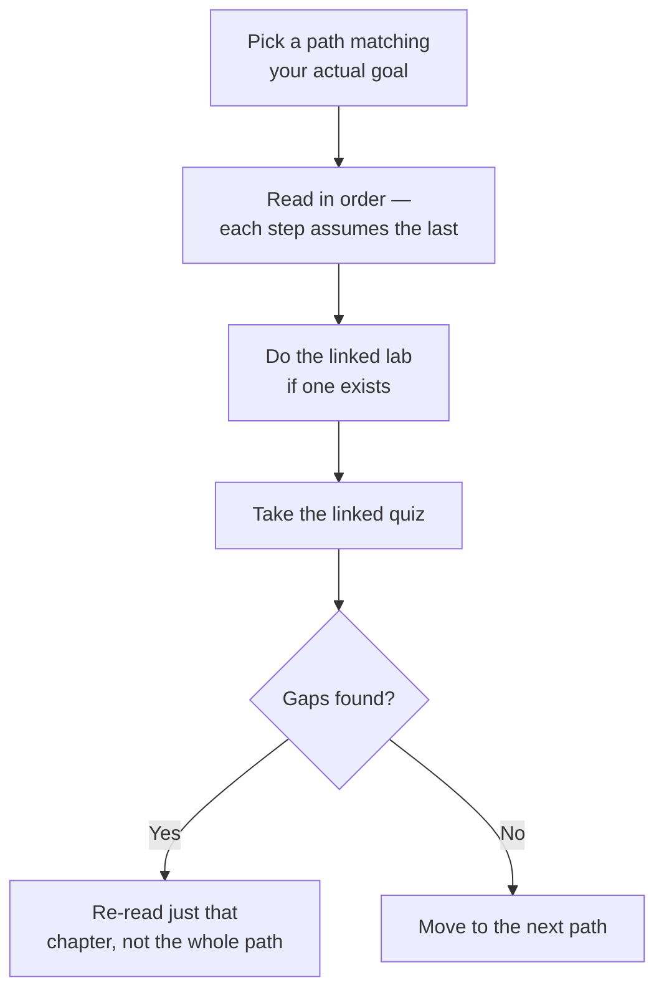

# Learning Paths

The Academy's sidebar is organized by *topic*; this section is organized by *goal*. Use whichever path matches what you're trying to accomplish.

## Paths

| Path | For | Est. time |
|---|---|---|
| [Multi-Tenancy Module](/learning/module-multitenancy) | Anyone touching backend queries — the single most load-bearing concept in the codebase | 45 min |
| New backend engineer, week 1 | Ramping up on the server | ~half day |
| New frontend engineer, week 1 | Ramping up on the client | ~half day |
| On-call preparation | Anyone about to go on call | ~1 hour |

## New backend engineer, week 1

1. [Overview → Product Domain](/overview/product-domain) and [Tech Stack](/overview/tech-stack)
2. [Architecture → Business Workflows](/architecture/business-workflows)
3. [Backend → Overview](/backend/overview), [App Bootstrap](/backend/app-bootstrap), [Patterns](/backend/patterns)
4. [Database → Schema Overview](/database/schema-overview), [RLS](/database/rls)
5. [Security → Authorization](/security/authorization), [Tenant Isolation](/security/tenant-isolation)
6. Do [Lab: Add an Endpoint](/labs/lab-add-endpoint)
7. Take [Quiz: Security](/quizzes/quiz-security) and [Quiz: Database](/quizzes/quiz-database)

## New frontend engineer, week 1

1. [Overview → Product Domain](/overview/product-domain)
2. [Architecture → Four Surfaces](/architecture/four-surfaces), [Component Tree](/architecture/component-tree)
3. [Frontend → Overview](/frontend/overview), [App Shell](/frontend/app-shell), [Session State](/frontend/session-state)
4. [API → Overview](/api/overview), [Conventions](/api/conventions)
5. [Performance → Bundle](/performance/bundle), [Caching](/performance/caching)
6. Take [Quiz: Frontend](/quizzes/quiz-frontend)

## On-call preparation

1. [SRE → Overview](/sre/overview), [Logging](/sre/logging), [Failure Scenarios](/sre/failure-scenarios)
2. Read every page in [Runbooks](/runbooks/index) once, even ones for problems you've never seen — you want pattern recognition, not memorization
3. Confirm you actually have the access each runbook assumes (server logs, direct DB access, Render dashboard) *before* your shift starts, not during an incident

## How these paths are structured

## Related

- [Labs](/labs)
- [Quizzes](/quizzes)
- [Glossary](/glossary)
