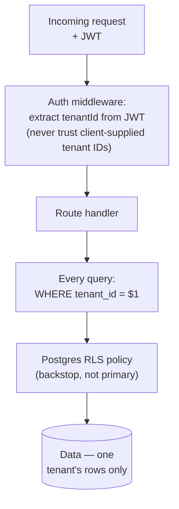

# Learning Module: Multi-Tenancy

If you only fully internalize one concept from this entire Academy, it should be this one. Almost every serious security incident in a multi-tenant system traces back to a gap in tenant isolation, and almost every gap in this codebase's tenant isolation is a missing `WHERE tenant_id` clause that looked, at a glance, like a perfectly normal query.

## The mental model



Three independent layers, from most to least load-bearing day-to-day:

1. **JWT-derived tenant ID** — the server decides which tenant a request belongs to based on the *signed, server-issued* JWT, never from a client-supplied header or body field. This is the trust boundary.
2. **Explicit `WHERE tenant_id` in every query** — this is the mechanism doing the real work on every single request. There is no ORM enforcing this automatically (see [Backend Overview](/backend/overview)) — it's a discipline, not a guarantee.
3. **Postgres RLS** — a defense-in-depth backstop that does *not* protect the application's own queries, because the app connects as the table owner, which bypasses RLS by default. See [RLS](/database/rls) for the full explanation, including why `FORCE ROW LEVEL SECURITY` was tried and reverted.

:::danger The most common way this breaks
A join between two tenant-scoped tables where only one side is filtered by tenant:

```sql
-- WRONG: leaks other tenants' orders if product_id happens to collide
SELECT * FROM orders o
JOIN products p ON o.product_id = p.id
WHERE p.tenant_id = $1;

-- RIGHT: both tables filtered
SELECT * FROM orders o
JOIN products p ON o.product_id = p.id AND p.tenant_id = o.tenant_id
WHERE o.tenant_id = $1;
```

This kind of bug can pass code review easily because the query "looks" scoped — there IS a `WHERE tenant_id` clause, just not on every table it needed to be on.
:::

## Why not just rely on RLS and skip the manual `WHERE` clauses?

This was a real design fork. RLS-as-primary would mean the database enforces isolation regardless of application bugs — strictly safer in theory. It was not adopted as the primary mechanism because:

- It requires the app's connection pool to *not* be the table owner, and to set a per-request session variable (`app.tenant_id`) on a **single, transaction-scoped connection** — the current pool model doesn't guarantee that, and mixing connections mid-request with `FORCE RLS` caused **silent data loss** (queries returning zero rows instead of erroring) when it was tried.
- It moves the point of failure from "a visible, reviewable line of SQL" to "an invisible session-variable-setting step" — arguably harder to reason about, not easier, for the common case.

The trade-off accepted: RLS remains a real backstop against non-application access paths (a rogue analytics connection, a future service with different credentials), while the application's own correctness rests on discipline plus tests, not the database.

## Vendor scoping — a second, inner tenant boundary

Within a single tenant, `Vendor`-role users need a *further* restriction: they should see their own vendor's data, not every vendor's, even though both are in the same tenant. This is enforced with a separate check (`assertVendorAccess`/`vendorScopeId`) layered *inside* the tenant boundary, not instead of it — see [Authorization](/security/authorization). The lesson generalizes: tenant isolation and row-ownership scoping are two different problems, and solving one does not solve the other.

## Self-check

1. Why is a client-supplied `tenantId` in a request body or header never trusted, even if it matches the user's actual tenant?
2. What's the specific failure mode that made `FORCE ROW LEVEL SECURITY` worse than not using it?
3. You're reviewing a PR with a new query joining `orders` and `customers`. What's the one-line check you run before approving it?

<details>
<summary>Answers</summary>

1. Because trusting client input for authorization decisions means any user could simply supply a different tenant's ID and read/write that tenant's data — the JWT, being server-signed at login time, is the only source the server can trust.
2. Different `pool.query()` calls can execute on different physical Postgres connections; `SET app.tenant_id` on one connection has no effect on a later query using a different connection, and with `FORCE RLS` active, the result was an unfiltered/misconfigured session silently returning **zero rows** instead of raising an error — a worse failure mode than the current bypass, since it fails silently rather than loudly.
3. Confirm every table in the join has its own `tenant_id` condition, not just one table in the `WHERE` clause — specifically check the `JOIN ... ON` clause itself, not just the final `WHERE`.

</details>

## Related

- [Learning Paths](/learning)
- [Security → Tenant Isolation](/security/tenant-isolation)
- [Database → RLS](/database/rls)
- [Lab: Tenant Isolation](/labs/lab-tenant-isolation)
- [Quiz: Security](/quizzes/quiz-security)
