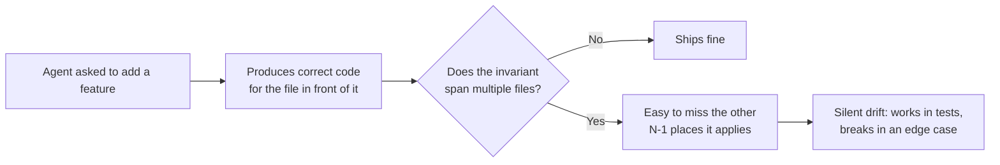

# AI Origin Assumptions

Dhandho (DG-ERP / `splendor-erp`) was built with heavy AI-agent assistance across most of its lifetime — not just autocomplete, but multi-file features, whole routes, and schema changes generated in agent sessions and then human-reviewed. That is not a confession; plenty of production SaaS is built this way now. But it changes *where* you should point extra scrutiny as a new engineer, and this page exists so you don't have to rediscover those spots the hard way.

:::info Why this page exists at all
Most onboarding docs assume "the person who wrote this code understood the whole system." That assumption is weaker here. An AI agent is extremely good at producing locally-correct, plausible-looking code for the file it's currently editing, and much weaker at noticing that the *same* invariant needs to hold in twelve other files it isn't looking at right now. Multi-tenancy, permission gating, and GST math are exactly this kind of cross-cutting invariant — see the pattern below.
:::

## The core failure mode: local correctness, global drift

Concretely, in this codebase that shows up as:

1. **A new route file that forgets `WHERE tenant_id = $1` on one query out of ten.** The other nine were copy-pasted correctly from an existing route; the tenth was hand-written for a new query shape and the filter was easy to omit because nothing *forces* it — there's no ORM, no lint rule, no type system boundary that catches a missing tenant predicate. See [Multi-tenancy](/architecture/multi-tenancy) for why RLS is a safety net, not a fix, for this exact class of mistake.
2. **A new route added without registering it in `moduleForPath()`** (`server/middleware/permissions.ts`). The route works, the feature demos fine, and it is *silently ungated* by module permissions until someone notices a `Staff` user can do something they shouldn't. See [Permissions](/backend/permissions) for the mechanics.
3. **Duplicated GST rounding logic that drifts slightly between two report exports.** GST math (`splitGst`, `gstFromExclusive` in `server/utils/helpers.ts`) has exact rounding rules; an agent asked to "add a new report with the same numbers" will sometimes reimplement the arithmetic inline instead of importing the shared helper, and small floating-point/rounding differences between the two copies show up only when a customer cross-checks two PDFs.
4. **Frontend feature flags that assume `business_type` presets are exhaustive.** A Service-tenant crash from calling an inventory endpoint that doesn't apply to them is the recurring shape of this bug — see [Product Domain](/overview/product-domain) → "Common mistakes."

## What to trust without re-deriving

Not everything needs a skeptical eye. These areas have been through enough iteration, tests, and production traffic that treating them as ground truth is the efficient default:

| Area | Why it's trustworthy | Evidence |
|---|---|---|
| Schema shape (`server/pg-db.ts`) | Battle-tested by `initSchema()` running on every boot across cloud + on-prem for a long time | Idempotent DDL, RLS policies, composite keys — see [Schema Overview](/database/schema-overview) |
| Auth token verification | Narrow, well-tested, security-critical surface that gets focused review every time it's touched | `middleware/auth.ts`, `HS256` algorithm pinned explicitly |
| GST split math (`splitGst`, `gstFromExclusive`) | One canonical implementation, used everywhere it matters | `server/utils/helpers.ts` |
| CI bundle-size / TypeScript gates | Mechanical, can't silently regress | `.github/workflows/build.yml` |

## What to re-verify, every time

| Area | Why it's riskier | What to actually do |
|---|---|---|
| Any new route's tenant scoping | No structural enforcement — a missing `WHERE tenant_id` compiles and runs | Grep the new route file for every `pool.query` call and manually confirm a `tenant_id` parameter is bound. |
| `moduleForPath()` registration | Silent no-op failure mode — unmapped paths are simply ungated, not rejected | Every PR that adds a router must also add its prefix(es) to `PATH_MODULE`. |
| Duplicated business math (GST, pricing, warranty expiry) | Agents reach for "write it inline" over "import the shared helper" unless explicitly told not to | Search for the calculation pattern (e.g. `* rate / 100`) before writing a new one; import from `helpers.ts` instead. |
| Error messages exposed to the client | AI-written error paths sometimes leak internal detail (SQL fragments, stack traces, internal IDs) "to be helpful" | Compare against [API Conventions](/api/conventions) — errors should be `{ error: string }`, never a raw exception. |
| Anything touching `xlsx` parsing (bank statement upload) | A known accepted CVE lives here — see [Accepted Risks](/security/accepted-risks) | Treat uploaded files as hostile input; don't extend this surface without reading that page first. |

:::warning The "looks complete" trap
AI-generated code frequently *looks* more finished than it is — consistent formatting, plausible variable names, a docstring-style comment at the top. None of that is evidence of correctness. The tells that something was rushed are usually structural: no test file next to it, no entry in `PATH_MODULE`, a TODO-shaped gap in error handling. Read for those, not for style.
:::

## How this shaped the documentation you're reading

This Academy itself continues the pattern — it is AI-generated documentation of an AI-assisted codebase, cross-checked against the actual source files (not invented from the API surface alone). Where a page cites a specific file and line-level behavior, that was read from the repository at write time; where a page makes a broader claim ("this is the only place X happens"), treat it with the same "trust the schema, re-verify the narrative" split described above. If a page here disagrees with the code, **the code wins** — this is stated explicitly on several pages ([Product Domain](/overview/product-domain), [Tech Stack](/overview/tech-stack)) and it's worth internalizing as a general rule for this whole Academy, not just those two pages.

## Practical checklist for your first PR

- [ ] Does every new SQL query touching a tenant-scoped table include `tenant_id`?
- [ ] Did you register any new route prefix in `moduleForPath()`?
- [ ] Did you reuse `helpers.ts` / `nic-api.ts` math instead of re-deriving it?
- [ ] Does your error response match the `{ error: string }` shape, with no internal detail leaked?
- [ ] If you touched anything file-upload related, did you re-read [Accepted Risks](/security/accepted-risks) first?

## Interview question

> **Q: You're reviewing a PR that adds a new `/api/coupons` router with five endpoints. What are the two things you check *before* reading a single line of the SQL inside the handlers?**
>
> Expected answer: (1) is `/coupons` registered in `PATH_MODULE` in `server/middleware/permissions.ts`, mapped to a sensible module — otherwise every endpoint is permission-ungated regardless of how careful the SQL is; (2) is the router actually mounted in `server/app.ts` with `app.use(couponsRouter)` — a perfectly correct router that's never `app.use()`'d is a common "it worked in my local test" gap when a feature was built across two files by an agent in one session and the wiring step got missed.

## Related

- [Product Domain](./product-domain.md)
- [Multi-tenancy](/architecture/multi-tenancy)
- [Design Decisions](/architecture/design-decisions)
- [Accepted Risks](/security/accepted-risks)
- [Tech Debt Register](/scaling/tech-debt-register)
