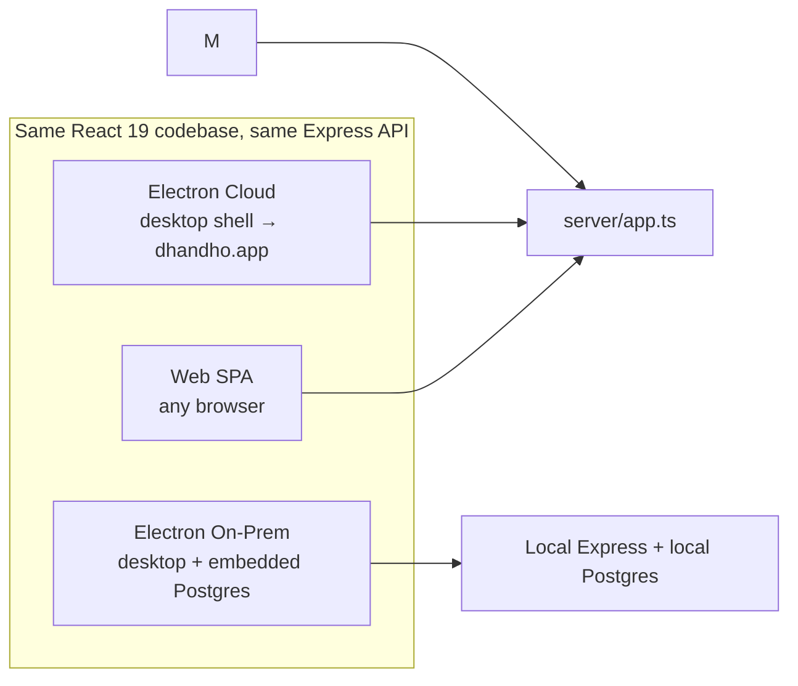

# Business Goals — Why Dhandho Exists

:::tip North star
Dhandho turns a WhatsApp-and-notebook-run Indian manufacturing/distribution SME into a GST-compliant, auditable digital business — **without** asking the owner to hire an IT department.
:::

## 1. The customer, in one paragraph

The target customer is a small-to-mid manufacturer or distributor in India — think a fan manufacturer in Coimbatore, a pipe-fittings maker in Rajkot, an FMCG distributor in Indore. They sell through a network of **vendors** (dealers/retailers), need to track **warranty** on physical goods identified by **barcode**, must issue **GST-compliant invoices**, and increasingly need an **e-invoicing IRN** and **e-way bill** because government thresholds keep dropping. They are not going to run Kubernetes. They might not have reliable internet at the shop floor. Dhandho is built for exactly this buyer, not for a Silicon Valley SaaS audience.

The product name itself — "Dhandho" (धंधा, Gujarati/Hindi for "business/trade") — signals the audience: practical, no-nonsense, ROI-obsessed small business owners, not enterprise procurement committees.

## 2. Business goals mapped to code

| Business goal | How the code encodes it | Where |
|---|---|---|
| Sell to many SMEs from one codebase | Multi-tenant schema, `tenant_id` on every row | `server/pg-db.ts` |
| Charge for what they use | `plans` table with `max_products/vendors/users/barcodes`, feature JSON | `server/utils/planLimits.ts`, `pg-db.ts` |
| Trace a physical product from factory to warranty claim | `product_inventory` → `product_distribution` → `product_sales` → `warranties` → `product_replacements` chain, all keyed by `barcode` | `server/routes/{products,distribution,sales,warranties,replacements}.ts` |
| Be usable by a dealer network, not just HQ | `Vendor` role with `vendorId` scoping, vendor finance ledger | `server/middleware/auth.ts` (`vendorScopeId`), `server/routes/finance.ts` |
| Stay GST-legal as rules tighten | HSN/GST rate per product, IRN/EWB columns, NIC API client, GSTR-2B/3B report routes | `server/services/nic-api.ts`, `server/routes/gst-api.ts`, `server/routes/reports.ts` |
| Sell to customers with **no reliable cloud connectivity** | On-prem Electron build with embedded Postgres | `electron/onprem/*`, `embedded-postgres` dependency |
| Convert trial users into paying tenants without a sales call | Self-serve signup disabled in favor of controlled provisioning + trial timers | `server/routes/super-admin.ts`, `provisionTenant()` in `server/utils/tenant.ts` |
| Prove compliance and defend against disputes | `audit_log` table on every sensitive mutation | `server/utils/helpers.ts` (`logAudit`), used across nearly every route |

## 3. The four "faces" of one product

This is a deliberate cost decision: one team, one React app, one Express API, four delivery mechanisms. See [Design Decisions](/architecture/design-decisions) for the trade-offs this creates.

## 4. Revenue model, encoded

Plans seeded in `seedPlatformData()` (`server/pg-db.ts`):

| Plan | Products | Vendors | Users | Barcodes | Price/mo | Notable features off |
|---|---|---|---|---|---|---|
| TRIAL | ∞ | ∞ | ∞ | ∞ | ₹0 | none — full feature trial |
| BASIC | 50 | 5 | 3 | 0 | ₹499 | warranty, replacements, rewards, chatbot, vendor portal, barcodes |
| STANDARD | 200 | 15 | 10 | 5,000 | ₹999 | warranty, replacements, rewards, chatbot |
| PROFESSIONAL | ∞ | ∞ | ∞ | ∞ | ₹1,999 | none |

`-1` means unlimited. `checkPlanLimit()` fails **closed** — if the plan-limit check itself throws (DB hiccup), the create is denied rather than silently allowed. That is a business decision as much as a technical one: better to lose a `create` for a few seconds than give away unmetered usage.

:::info Business logic lives next to security logic
Notice `checkPlanLimit` and `enforceModulePermissions` sit at the same architectural layer. In Dhandho, "can you afford this" and "are you allowed to do this" are peers, not separate systems. Interviewers love asking why — the honest answer is a small team optimizing for velocity, not textbook separation of concerns.
:::

## 5. What Dhandho explicitly does *not* try to be

- **Not a generic ERP framework.** No plugin marketplace, no BPMN workflow engine. Modules (`sales`, `distribution`, `warranty`, `rewards`, `finance`, `accounts`, `payroll`...) are hard-coded business verticals for manufacturer/distributor SMEs.
- **Not multi-currency, not multi-country.** GST, HSN codes, IRN/EWB are India-specific. There is no currency field on money columns — `NUMERIC(12,2)` is implicitly ₹.
- **Not eventually-consistent / event-sourced.** Every mutation is a synchronous SQL statement inside a request. No message queue, no CQRS. This is intentional simplicity for a team that needs to ship features weekly, not a distributed systems trophy.
- **Not "move fast and skip compliance."** GST math (`gst-helpers.test.ts`), audit logging, and RLS exist because a wrong invoice or a leaked competitor's sales data is an existential risk for an SME-facing product — this is trust-critical software wearing a "friendly small biz tool" costume.

## 6. Why this matters to *you*, the engineer

Every architectural chapter that follows is a means to these business ends:

- [Multi-tenancy](/architecture/multi-tenancy) exists so one Postgres instance can profitably serve thousands of SMEs.
- [Authentication](/security/authentication) and [Authorization](/security/authorization) exist so a dealer never sees a competitor's numbers.
- [Deployment](/deployment/overview) has two totally different stories (cloud vs on-prem) because rural/industrial customers sometimes cannot or will not put their data in someone else's cloud.
- The [tech-debt register](/scaling/tech-debt-register) exists because "ship the business feature this week" has repeatedly beaten "refactor for elegance."

## Hands-on exercise

1. Open `server/pg-db.ts` and read `seedPlatformData()`. Compute: how many tenants would BASIC plan support if barcodes are disabled but the customer still wants warranty tracking? (Trick question — check the `features` JSON, not just the numeric limits.)
2. Read `provisionTenant()` in `server/utils/tenant.ts`. What three things happen atomically in one transaction when a new tenant signs up? What happens to `bootstrapToken` and why is it not emailed automatically?
3. Find one route file that computes revenue (`getTenantStats` in `tenant.ts`). Why does `vendors` count exclude `id != 'OWNER'`? What business concept does the synthetic `OWNER` vendor represent?

## Debugging exercise

A support ticket says: "We're on STANDARD plan but can't create a 6th vendor." Trace `checkPlanLimit('vendors')` end to end: which table, which column, which query, and is the `OWNER` vendor counted against the customer's own limit? Write the SQL you'd run in a psql session to verify the live count vs. the plan cap.

## Quiz

1. Why does `checkPlanLimit` fail closed instead of open when the DB check errors?
2. Name two things that are true for Dhandho's target customer that would be false for a US enterprise SaaS buyer.
3. Which plan is the only one with barcodes disabled, and why might a manufacturer still buy it?

:::info
**Answers**

1. Allowing unmetered usage during a transient failure directly costs the business money (unpaid resource consumption) and could be exploited; denying a create for a few seconds is a much cheaper failure mode.
2. Examples: unreliable connectivity requiring an offline/on-prem mode; GST/HSN/IRN compliance requirements that don't exist for non-Indian buyers; dealer/vendor network structure instead of direct B2C.
3. BASIC disables `barcodeSystem`; a small manufacturer who doesn't do individual-unit warranty tracking (e.g., sells bulk raw material) doesn't need per-unit barcodes and can save cost.

:::

## Related pages

- [Tech Stack](/overview/tech-stack)
- [Folder Structure](/overview/folder-structure)
- [System Architecture Overview](/architecture/system-overview)
- [Multi-tenancy](/architecture/multi-tenancy)
- [Tech Debt Register](/scaling/tech-debt-register)
- [Glossary](/glossary/domain-terms)
