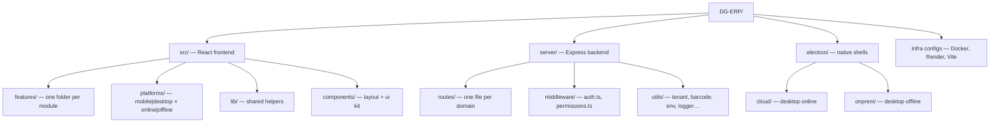
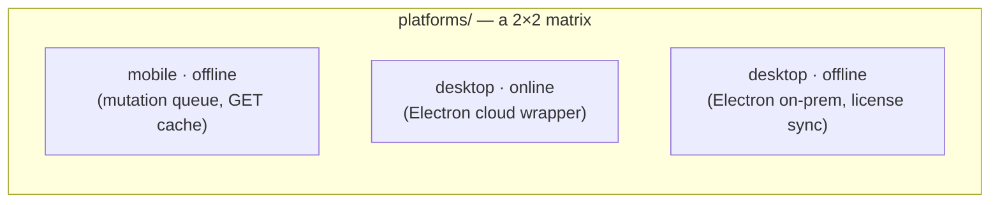

# Folder Structure

This is the map you keep open in a second tab for your first month. Every folder below is real (verified against the repository at the time of writing) — no invented directories.

:::tip How to use this page
When you're dropped into an unfamiliar task ("fix the E-Way Bill JSON" or "the mobile app won't sync"), start here to find *which folder* owns the problem before you go searching blindly.
:::

## Top-level layout

```
DG-ERP/
├── src/                    # React frontend (all 4 client surfaces share this)
├── server/                 # Express backend — the one API every surface talks to
├── electron/               # Native Electron main-process code (cloud + on-prem)
├── public/                 # Static assets served as-is (icons, manifest fallbacks)
├── docs/                   # Product-level docs shipped in the repo
├── tests/                  # Python E2E suite + manual test case markdown
├── test-data/              # Fixtures for tests
├── dist/ dist-mobile/      # Build output (gitignored, regenerated)
├── node_modules/           # (gitignored)
├── package.json            # npm name: splendor-erp
├── vite.config.ts          # Frontend build + dev proxy config
├── vitest.config.ts        # Test runner config
├── tsconfig*.json          # 3 tsconfig variants (app, electron, base)
├── capacitor.config.ts     # Mobile app shell config
├── electron-cloud.config.cjs / electron-onprem.config.cjs   # electron-builder configs
├── Dockerfile / docker-compose.yml / render.yaml             # Deployment configs
├── README.md / DEVELOPER.md / LICENSE
└── .env.example / .env.mobile.example                        # Secrets templates (never commit real values)
```



## `src/` — the frontend, shared by all four surfaces

```
src/
├── App.tsx                 # Manual routing + top-level shell (NOT React Router — see design-decisions.md)
├── api.ts                   # Hand-written typed API client (~1150 lines), wraps fetch
├── main.tsx                 # Entry point, mounts <App/>
├── types.ts                 # Shared TS types (Tab, etc.)
├── index.css                 # Tailwind entrypoint + global styles
├── vite-env.d.ts
│
├── components/
│   ├── layout/               # LandingPage, LoginScreen, DownloadPage, ChatWidget, PrivacyPolicy…
│   └── ui/                   # Design-system primitives: ToastProvider, LoadingSpinner, CommandPalette, ErrorBoundary
│
├── features/                 # ⭐ One folder per business module — this is where most work happens
│   ├── dashboard/  sales/  inventory/  distribution/  purchases/
│   ├── quotations/  orders/  warranty/  replacements/  rewards/
│   ├── finance/  accounts/  invoices/  payroll/  masters/
│   ├── settings/  verification/  analytics/  super-admin/
│
├── platforms/                # ⭐ Client code split by WHERE it runs + HOW it talks to the server
│   ├── shared/                # apiBase — API origin resolution for every client
│   ├── mobile/
│   └── desktop/
│       ├── online/             # (thin — Electron cloud just loads the hosted URL)
│       └── offline/            # OnlineStatus — on-prem license/settings sync UI
│
├── lib/                      # Shared, framework-agnostic helpers
│   ├── session.ts             # localStorage wrapper, slug-scoped keys
│   ├── businessTypeConfig.ts  # Per-business-type labels & feature flags (frontend)
│   ├── billTemplates.ts       # PDF/HTML bill templates (sales, distribution, invoice, quotation)
│   ├── apiBase.ts             # Resolves API origin per platform
│   ├── hsnRates.ts            # HSN code → GST rate lookup table
│   ├── utils.ts                # cn(), bizTypeLabel(), misc helpers
│   ├── useEscapeKey.ts
│
├── hooks/                    # useConfirm, useDebounce
└── i18n/                     # English, Hindi, Gujarati, Marathi JSON dictionaries + index.tsx
```

### Why `features/` is organized per-module, not per-layer

A layered structure (`components/`, `hooks/`, `services/` at the top level, cross-cutting through every feature) is the more "textbook" React layout. Dhandho instead uses **vertical slices**: everything about Distribution lives in `features/distribution/`. This matters because:

- **AI-assisted development works better with vertical slices.** An agent (or a new engineer) can be handed "add a field to Distribution" and open exactly one folder, rather than hunting across `components/`, `hooks/`, and `services/` for distribution-specific fragments.
- **Business types hide/show whole features.** Since a Service tenant never sees Distribution at all, keeping it self-contained means it's trivially excludable — it's just an unused lazy import.
- **Blast radius is contained.** A bug in Rewards cannot easily leak into Warranty because there's no shared "hooks" folder they're both quietly depending on.

The trade-off — some duplication of small patterns across feature folders — is a conscious one; see [AI Origin Assumptions](./ai-origin-assumptions.md).

### Why `platforms/` is a *second*, orthogonal axis to `features/`

This is the folder most people misunderstand on day one. `features/` answers **"what does it do?"** (Sales, Inventory, Warranty…). `platforms/` answers **"where does it run, and does it trust the network?"** — a fully independent 2×2 matrix:



Feature screens (`src/features/*`) are **shared across every cell of this matrix** — the same `DistributionView` component renders inside a browser tab, or an Electron window. `platforms/` only supplies the plumbing each shell needs (how to reach the API, whether to queue mutations offline, how to detect connectivity) — never business logic.

:::warning Common mistake
Putting business logic (e.g., "if this is mobile, show fewer columns") inside `platforms/` instead of `features/`. `platforms/` should only ever answer *connectivity and environment* questions. If you catch yourself importing a feature-specific type into `platforms/desktop/`, that's a sign the logic belongs in the feature folder with a platform-detection helper instead.
:::

## `server/` — the one Express API every surface calls

```
server/
├── index.ts                  # Entry point: loads .env, validates env, inits DB, listens
├── app.ts                    # createApp() — builds the Express app (used by index.ts AND supertest)
├── pg-db.ts                   # Pool + initSchema() (idempotent DDL) + seedPlatformData()
│
├── routes/                    # ⭐ One file per domain, ~30 files, all mounted in app.ts
│   ├── auth.ts  admin.ts  super-admin.ts  onprem.ts  mobile.ts
│   ├── products.ts  purchases.ts  distribution.ts  sales.ts
│   ├── warranties.ts  replacements.ts  rewards.ts
│   ├── invoices.ts  invoice-finance.ts  finance.ts  accounts.ts
│   ├── quotations.ts  orders.ts  price-lists.ts
│   ├── customers.ts  vendors.ts  banks.ts  masters.ts  mapping.ts
│   ├── payroll.ts  expenses.ts  gst-api.ts  reports.ts
│   ├── dashboard.ts  search.ts  audit.ts  chatbot.ts  bill-settings.ts
│
├── middleware/
│   ├── auth.ts                 # JWT verify, generateToken, requireRole, blockVendors, vendor-scope guards
│   └── permissions.ts           # Module-level access control (hidden/view/print/full) per role
│
├── services/
│   └── nic-api.ts                # Government GST NIC API client (mockable in dev)
│
└── utils/
    ├── tenant.ts                  # provisionTenant, deleteTenant, getTenantStats
    ├── barcode.ts                  # Barcode generation logic
    ├── env.ts                       # assertCriticalEnv — fail-fast startup validation
    ├── logger.ts                    # Structured logging (Logtail in prod)
    ├── authCache.ts                  # Short-lived in-memory auth row cache
    ├── pagination.ts                  # Shared pagination helpers
    ├── pii.ts                          # PII redaction helpers for logs
    ├── planLimits.ts                    # Server-side plan/feature gating
    └── secret-crypto.ts                  # Encrypt/decrypt stored secrets (e.g. GST API creds)
```

Why **flat `routes/` per domain** instead of nested route folders? Every route file is mounted directly in `app.ts` (`app.use(productsRouter)` etc.) with its own internal path prefixes. This keeps the mounting list in `app.ts` as a single, greppable manifest of "every API surface this server exposes" — see [Request Lifecycle](/architecture/request-lifecycle) for how a request actually threads through this list.

## `electron/` — native shell code, not shipped to the browser

```
electron/
├── cloud/
│   ├── main.ts                  # Opens the hosted dhandho.app URL in a BrowserWindow
│   └── preload.ts                # Exposes openExternal() for mailto/tel links
├── onprem/
│   ├── main.ts                    # Wizard → embedded Postgres → local Express → app window → heartbeat
│   ├── pg-manager.ts               # Starts/stops the embedded PostgreSQL process
│   ├── license-store.ts             # AES-256-GCM encrypted license.dat, keyed off machine ID
│   ├── preload.ts
│   └── wizard/index.html             # First-run license activation UI
├── shared/
│   ├── constants.ts                   # CLOUD_API, HEARTBEAT_INTERVAL_MS
│   └── find-port.ts                    # findFreePort() for the embedded Postgres/Express
└── package.json                          # Electron-specific dependency manifest
```

This code **never** runs in a browser tab or a Capacitor WebView — it's Node.js with full filesystem/OS access, which is exactly why it's kept out of `src/` (which is bundled by Vite for browser-safe environments). See [Four Surfaces](/architecture/four-surfaces).

## `android/`, `ios/` — Capacitor native shells

Committed Capacitor projects for **Service Mobile** (`in.dhandho.service`). Prefer `npm run cap:sync` / `ci:android` / `ci:ios` over hand-editing; `Package.swift` is Capacitor-managed. Offline Android + iOS debug CI: **GitLab** (`.gitlab-ci.yml`); Online APK + public evergreen APK URL: GitHub Actions (see [Service Mobile](/deployment/service-mobile)).


## `public/`

Static assets served as-is by both Vite (dev) and Express's static file middleware (prod): PWA icons (`icon-192.svg`, `icon-512.svg`), favicon, and any manifest fallbacks not generated dynamically by the `/manifest.json` route in `app.ts`. Nothing here is templated or built — if it needs per-tenant customization (like a company logo), it lives in the database (`bill_settings.logo_base64`) instead.

## `docs/` (product-level, inside `DG-ERP/`) vs. this academy

Don't confuse `DG-ERP/docs/` (a handful of product-facing files shipped in the actual product repository) with the Dhandho Engineering Academy you're reading right now (a separate `engineering-academy/` repository). The product repo's `docs/` is a lean reference for contributors already working in the code; this academy is the deep, from-scratch onboarding path for someone taking ownership.

## `tests/`

```
tests/
├── e2e_by_type.py            # 453 Python E2E tests across 4 business types (full API surface)
└── cases/                     # Manual test-case markdown, one file per feature area (e.g. super-admin.md)
```

`test-data/` sits alongside it with CSV/fixture files used by import/export tests. See [Testing → E2E](/testing/e2e) for how these run and what they cover that Vitest doesn't.

## Quick reference: "where do I look for…"

| Task | Start here |
|---|---|
| A UI bug in a specific tab | `src/features/<module>/` |
| An API 403/401 | `server/middleware/auth.ts`, `server/middleware/permissions.ts` |
| A new database column | `server/pg-db.ts` (`initSchema()`) |
| Barcode/label generation | `server/utils/barcode.ts` |
| GST/E-Invoice logic | `server/routes/distribution.ts`, `server/routes/gst-api.ts`, `server/services/nic-api.ts` |
| On-prem license/sync issues | `electron/onprem/main.ts`, `electron/onprem/license-store.ts` |
| Bundle size regression | `vite.config.ts` (`manualChunks`) |

## Key concepts

- **Two independent axes in `src/`**: `features/` (what) and `platforms/` (where/how). Never mix their concerns.
- **`server/routes/` is a flat manifest** — every route file is individually mounted in `app.ts`; there's no nested router-of-routers indirection to trace through.
- **`electron/` is genuinely native Node code** — different security and capability model than `src/`.
- **The product repo's `docs/` and this academy are two different things**, aimed at two different audiences.

## Common mistakes

1. Adding platform-specific business logic inside `platforms/` instead of a feature folder.
2. Hand-editing generated files under `android/`/`ios/` and losing the change on the next `cap sync`.
3. Creating a new top-level folder for "shared utils" when `src/lib/` or `server/utils/` already exists — check both before adding a third bucket.
4. Assuming route file names map 1:1 to URL prefixes — some (like `inventory`) are folded into `products.ts`; check `app.ts` for the authoritative mount list.
5. Putting a per-tenant customizable asset (like a logo) in `public/` instead of the database — `public/` is one fixed set of files for every tenant.

## Interview question

> **Q: You need to add a new feature that behaves differently on mobile vs. desktop. Where does the platform-specific code go, and where does the shared logic go?**
>
> Expected answer: feature UI/logic lives in `src/features/<name>/`, shared across web and Electron. Connectivity/environment pieces belong in `src/platforms/shared/` or `src/platforms/desktop/`.

## Related

- [Tech Stack](./tech-stack.md)
- [Component Tree](/architecture/component-tree)
- [Dependency Graph](/architecture/dependency-graph)
- [Four Surfaces](/architecture/four-surfaces)
