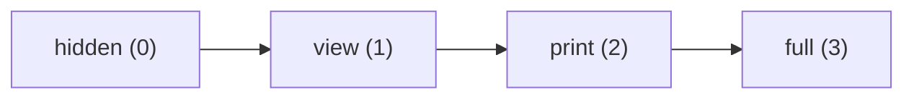
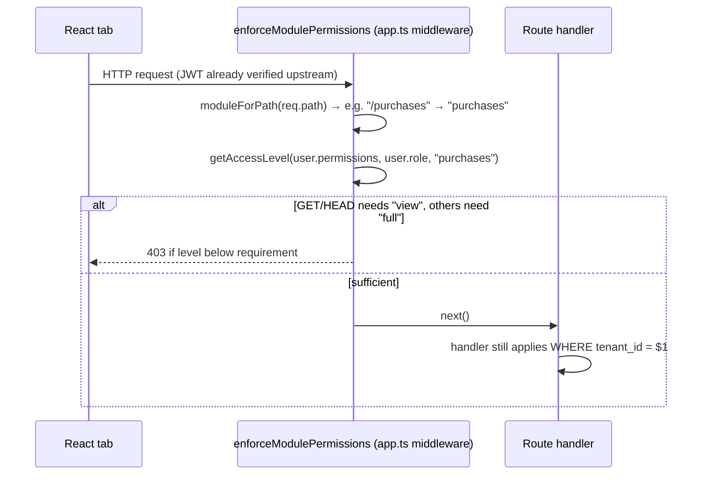

# Personas & Roles

Dhandho has two completely separate authority hierarchies: **tenant-level roles** (people who work for or with one business) and a **platform-level role** (Super Admin, who runs Dhandho itself). Confusing the two is the single most common authorization bug in a codebase like this — this page draws the line precisely, with the real permission matrix from `server/middleware/permissions.ts`.

:::danger Don't confuse tenant roles with the platform role
A tenant's `Admin` (the business owner using Dhandho) has **zero** special access to any other tenant's data or to the Super Admin panel. `Super Admin` is a completely separate account type (`super_admins` table, no `tenant_id`), issued a differently-shaped JWT. See [Multi-tenancy](/architecture/multi-tenancy) for exactly how these are kept apart.
:::

## The six personas

| Persona | Scope | Typical user | JWT `role` value |
|---|---|---|---|
| **Admin** | One tenant, full access | Business owner / office manager | `Admin` |
| **Manager** | One tenant, full access except Settings (view-only) | Senior staff who runs day-to-day ops | `Manager` |
| **Staff** | One tenant, view-only everywhere | Front-desk / data-entry employee | `Staff` |
| **Warehouse** | One tenant, narrow physical-goods scope | Stock handler, dispatch team | `Warehouse` |
| **Vendor** | One tenant, scoped to their own vendor record | External distributor/dealer with portal access | `Vendor` |
| **Super Admin** | The whole platform, every tenant | Dhandho's own operations team | `super_admin` / `owner` / `support` |

## The permission matrix (verbatim from the code)

Every module (`dashboard`, `sales`, `distribution`, `inventory`, `purchases`, `quotations`, `orders`, `finance`, `accounts`, `warranty`, `replacements`, `rewards`, `settings`) gets one of four access levels: `hidden` < `view` < `print` < `full`. This is defined once, server-side, in `ROLE_PRESETS` (`server/middleware/permissions.ts`) — the frontend never invents its own copy of this table.

| Module | Admin | Manager | Staff | Warehouse | Vendor |
|---|---|---|---|---|---|
| dashboard | full | full | view | view | view |
| sales | full | full | view | hidden | hidden |
| distribution | full | full | view | **print** | view |
| inventory | full | full | view | view | hidden |
| purchases | full | full | view | hidden | hidden |
| quotations | full | full | view | hidden | hidden |
| orders | full | full | view | hidden | hidden |
| finance | full | full | view | hidden | **view** |
| accounts | full | full | view | hidden | hidden |
| warranty | full | full | view | hidden | hidden |
| replacements | full | full | view | hidden | hidden |
| rewards | full | full | view | hidden | hidden |
| settings | full | **view** | view | hidden | hidden |

("Super Admin" as a tenant-level role string is a legacy alias that also gets full access everywhere — see the warning below.)

:::tip Analogy
Think of this table like **building floor access on a keycard system**. Admin/Manager have the master key. Staff can walk into every room but can't touch anything (view-only). Warehouse only has a key to the loading dock and can *print a shipping label* there (`print` level on `distribution`) but can't see the accounts office at all. Vendor's keycard only opens the door to their own storefront and a peek at their outstanding balance (`view` on `finance`).
:::

## How the matrix is actually enforced

Enforcement happens in two coordinated places, both server-side — never trust the frontend to hide a button as the only guard:

1. **`enforceModulePermissions`** (global middleware, mounted `app.use('/api/', enforceModulePermissions)` in `app.ts`) maps the request path to a module via `moduleForPath()` (a prefix table — `/vendor-finance` and `/invoice-finance` both map to `finance`, `/reports`/`/gst`/`/payroll` all map to `accounts`, etc.) and checks the caller's access level against the HTTP method (`GET`/`HEAD` needs `view`; everything else needs `full`).
2. **Per-user overrides**: a tenant can grant a specific user *custom* permissions (stored as JSONB on `users.permissions`) that override their role preset entirely — `normalizePermissions()` handles both the object form and a legacy array-of-module-names form.
3. **Vendor-specific guards** (`server/middleware/auth.ts`): `blockVendors` rejects any mutation from a `Vendor` role outright regardless of the module table, and `assertVendorAccess(req, vendorId)` prevents a Vendor JWT from reading *another* vendor's records even within a module they're allowed to `view`.

:::warning Common mistake — role name string literals
Role checks in older code paths sometimes compare `role === 'Super Admin'` (a tenant-level string, distinct from the platform-level `super_admin`). `server/pg-db.ts` even runs a one-time cleanup migration: `UPDATE users SET role = 'Admin' WHERE role = 'Super Admin' AND tenant_id IS NOT NULL` — because a tenant user should never have literally been assigned that legacy role name. If you see `'Super Admin'` (capitalized, with a space) in a tenant context, treat it as a data-cleanup target, not a role to design new features around.
:::

## Persona deep dive

### Admin
The tenant's business owner or top administrator. Full access to every module including Settings (bill customization, GST API credentials, user management). Created automatically when Super Admin provisions a tenant (`provisionTenant()` in `server/utils/tenant.ts` inserts the first user with `role: 'Admin'`).

### Manager
Everything Admin can do *except* Settings, which is `view`-only. Designed for a trusted senior employee who shouldn't be able to change GST API credentials, rotate the admin password, or edit bill templates, but needs full operational control otherwise.

### Staff
`view` on every module. Can look up anything (check stock, see a customer's warranty, view outstanding balances) but cannot create/edit/delete anywhere. Appropriate default for a general front-desk hire before you decide they need more.

### Warehouse
The narrowest *internal* role. Can see the dashboard and inventory (`view`), and can **print** — but not edit — distribution documents (dispatch challans, labels). Everything money-related (`finance`, `accounts`, `purchases`) and everything customer-facing (`sales`, `quotations`) is `hidden`. This models a stock handler who packs and ships boxes but should never see pricing or customer contact data.

### Vendor
The only role that is **not an employee of the tenant** — it's an external business partner (a distributor, dealer, or retailer downstream of the tenant) given portal access. Vendor accounts are linked via `users.vendor_id` to a row in the `vendors` table, and every Vendor request is additionally scoped by `vendorScopeId(req)` / `assertVendorAccess()` so a Vendor can only ever see *their own* distribution batches and outstanding balance — never another vendor's, and never the tenant's full customer list. `blockVendors` middleware additionally strips all mutation rights regardless of the module matrix (Vendors can view their finance ledger but never record a payment themselves).

:::info Why Vendor exists as a role instead of a separate login system
Rather than build a whole separate "vendor portal" application, Vendor is just another row in the same `users` table with a restrictive `ROLE_PRESETS` entry and a `vendor_id` foreign key. This reuses 100% of the auth/session/JWT machinery — the only new code required was the scoping guards in `auth.ts`. See [Design Decisions](/architecture/design-decisions) for the general pattern of "reuse the existing primitive with a narrower policy" that recurs throughout this codebase.
:::

### Super Admin
Platform operator — not a tenant role at all. Lives in the `super_admins` table (`id`, `email`, `password_hash`, `role` of `owner`/`support`), authenticated via a **separate** JWT flow (`superAdminMiddleware` in `auth.ts`, checking `role !== 'super_admin' && role !== 'owner' && role !== 'support'`). Super Admin can:
- Provision/suspend/delete tenants (`server/routes/super-admin.ts`)
- Issue on-prem license keys and push settings to installed on-prem clients
- Issue mobile invite codes, force-sync mobile devices, set version policy
- View cross-tenant analytics (revenue, growth, plan distribution) — the *only* code path in the system allowed to query across `tenant_id` boundaries, and it does so deliberately via aggregate queries, never row-level tenant data browsing.

## Key concepts

- **Four access levels**, one shared enum: `hidden < view < print < full`.
- **One permission table, two enforcement points**: the module-level gate (`enforceModulePermissions`) and role-specific guards (`blockVendors`, `assertVendorAccess`) layer on top of each other.
- **Per-user override capability** — a role preset is a default, not a hard limit; `users.permissions` JSONB can customize any individual user.
- **Vendor is an external persona reusing the internal auth system**, not a separate app.
- **Super Admin is architecturally isolated** from tenant roles — different table, different JWT shape, different middleware.

## Common mistakes

1. Checking `role === 'Admin'` in new frontend code to decide what to *render*, instead of relying on the module permission the backend already returned — leads to UI/API permission drift.
2. Forgetting that `print` is a distinct level from `view` and `full` — a Warehouse user calling a GET-labeled-as-full route (e.g., something that technically mutates state via GET, which shouldn't exist, but watch for it) can get an unexpected 403.
3. Granting a custom `users.permissions` override and forgetting it silently shadows the role preset — a Manager with a stale custom-permissions blob won't get newly-added module defaults automatically.
4. Testing authorization logic only as Admin — most real bugs live in the Warehouse/Vendor edge cases because those are exercised far less in manual QA.

## Interview question

> **Q: A Vendor user reports they can see another vendor's outstanding balance in the Finance tab. Where would you look first, and what's the likely root cause class?**
>
> Expected answer: this is not a `ROLE_PRESETS` bug (the Vendor role correctly has `view` on `finance`) — it's a **scoping** bug. Look at the `finance.ts` route handler for whether it calls `assertVendorAccess(req, vendorId)` / `vendorScopeId(req)` before returning rows, or whether it relies solely on `enforceModulePermissions`, which only checks the *module* level, not *row ownership within that module*. This is the same class of bug as cross-tenant leakage in [Multi-tenancy](/architecture/multi-tenancy), just one level down: cross-*vendor* leakage within a single tenant.

## Related

- [Multi-tenancy](/architecture/multi-tenancy)
- [Business Goals](./business-goals.md)
- [Security → Authorization](/security/authorization)
- [Design Decisions](/architecture/design-decisions)
