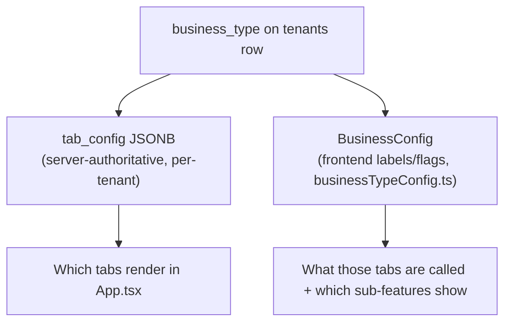
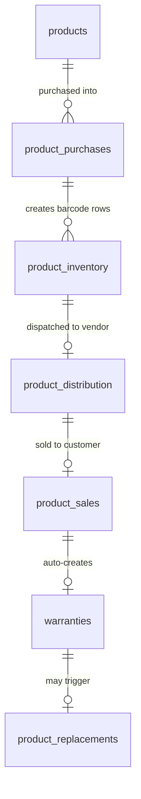

# Product Domain

If [Business Goals](./business-goals.md) told you *why* Dhandho exists, this page tells you *what it actually does* — module by module, with the real tables and routes behind each one. Bookmark this page; it's the map you'll come back to when you're dropped into an unfamiliar feature folder.

:::info Ground truth
Everything below is read directly from `src/lib/businessTypeConfig.ts`, `server/routes/super-admin.ts` (`PRESETS`), and `server/pg-db.ts` (`initSchema`). If this page ever disagrees with the code, the code wins — file an update.
:::

## The five business types

Every tenant is provisioned with exactly one `business_type` (column on `tenants`, default `'manufacturer'`). The type drives two independent things:

1. **Tab visibility & labels** — `tenants.tab_config` (JSONB), set at creation time from the `PRESETS` map in `server/routes/super-admin.ts`, editable per-tenant afterwards by Super Admin.
2. **Frontend copy & feature flags** — `src/lib/businessTypeConfig.ts` exports a `getBusinessConfig()` that reads `businessType` off the cached session user and returns labels like "Vendors" vs "Customers" vs "Clients."

:::warning Two sources of truth, on purpose
`tab_config` (backend, per-tenant, mutable by Super Admin) and `BusinessConfig` (frontend, keyed only by `businessType`) are **not the same object** and can drift. `tab_config` decides *whether a tab exists at all*; `BusinessConfig` decides *how it's labeled and which sub-features inside it are visible*. A Custom tenant can have a `tab_config` that doesn't match any of the four `BusinessConfig` presets — the frontend then falls back to the `manufacturer` config. This is a deliberate simplification, not a bug — but it is exactly the kind of "two configs that can disagree" trap covered in [AI Origin Assumptions](./ai-origin-assumptions.md).
:::

### 1. Manufacturer

The richest preset — full inventory lifecycle from raw barcode to warranty.

| Aspect | Value |
|---|---|
| Vendor label | "Vendors" |
| Distribution label | "Dispatch" |
| Finance label | "Vendor Payments" |
| Feature flags | inventory ✅, distribution ✅, barcodes ✅, warranty ✅, rewards ✅, customerTracking ✅, eWayBill ✅, gstSplit ✅ |
| Finance view | `vendor` (batch-level distribution payments) |

**Example customer**: a fan/appliance factory. Product is manufactured, barcoded, distributed to vendors, sold at the vendor's counter, and carries a warranty back to the original factory barcode.

### 2. Dealer / Wholesaler

Same inventory backbone as Manufacturer, but the "vendor" is renamed "Customer" and warranty/rewards are switched off — dealers move volume, not consumer relationships.

| Aspect | Value |
|---|---|
| Vendor label | "Customers" |
| Distribution label | "Sales" |
| Finance label | "Dealer Payments" |
| Feature flags | warranty ❌, rewards ❌, customerTracking ❌; eWayBill ✅, gstSplit ✅ |

**Example customer**: an FMCG or hardware wholesale distributor. They care about slab pricing (see [Price list resolve](/architecture/business-workflows#workflow-6-price-list-resolve--bulk-import)) and E-Way Bills for high-value shipments, not warranty tracking.

### 3. Retail Shop

POS-style, single-location selling. Inventory still tracked but "distribution" is relabeled "Purchase" (goods flow *into* the shop from suppliers, and the shop itself sells to end customers — no `product_distribution` step to another vendor tier).

| Aspect | Value |
|---|---|
| Vendor label | "Customers" |
| Distribution label | "Purchase" |
| Finance label | "Supplier Payments" |
| Feature flags | eWayBill ❌ (retail sales rarely need one), warranty ❌, rewards ❌ |

### 4. Service / Consulting

The odd one out — **no physical inventory at all**. `features.inventory = false`, `features.distribution = false`, `features.barcodes = false`. The whole module set pivots to `standalone_invoices` and `invoice_payments` instead of `product_sales`/`product_distribution`.

| Aspect | Value |
|---|---|
| Vendor label | "Clients" |
| Finance label | "Invoice Finance" |
| Finance view | `invoice` (per-invoice partial payments, not batch-level vendor payments) |
| Accounts tabs hidden | `sales`, `distribution`, `stock` |

**Example customer**: a repair shop, an agency, a consultant — anyone billing for labor/service rather than shipping barcoded goods.

### 5. Custom

Not a `BusinessConfig` preset at all — it's the escape hatch. Super Admin builds a bespoke `tab_config` per tenant (`customPreset` in `server/routes/super-admin.ts`) and the tenant is displayed as **`Custom (CompanyName)`** via `bizTypeLabel(type, companyName)` in `src/lib/utils.ts`. Multiple Custom tenants each render their own company name — there is no single generic "Custom" label.

:::tip Analogy
Business types are like **trim levels on a car** (Base / Sport / Luxury) built on one chassis (the Express + Postgres core). Custom is the "special order from the factory" — same chassis, but the options list was hand-picked rather than chosen from a catalog.
:::

## Module catalog

Every module below is a `src/features/<name>/` folder on the frontend and one or more `server/routes/<name>.ts` files on the backend. This is the canonical list — cross-reference with [Component Tree](/architecture/component-tree) for the frontend view and [Dependency Graph](/architecture/dependency-graph) for backend wiring.

| Module | Feature folder | Route file(s) | Core tables | What it does |
|---|---|---|---|---|
| **Inventory** | `features/inventory` | `products.ts` | `products`, `product_inventory`, `categories` | Product master, auto-barcode generation, box/piece pack tracking, CSV import/export, HSN auto-suggest, per-product GST inclusive/exclusive |
| **Purchases** | `features/purchases` | `purchases.ts` | `suppliers`, `product_purchases`, `supplier_payments` | Supplier master, purchase batches that create barcoded stock, cost tracking, GSTR-2B invoice-number matching |
| **Distribution** | `features/distribution` | `distribution.ts` | `product_distribution` | Dispatch stock to vendors, batch-level payment tracking, custom pricing, E-Invoice/E-Way Bill JSON, CSV import |
| **Sales** | `features/sales` | `sales.ts` | `product_sales`, `warranties` | POS-style sale entry by barcode scan, auto-creates a `warranties` row from `product.warranty_months` |
| **Standalone Invoices** | `features/invoices` | `invoices.ts` | `standalone_invoices` | Non-inventory billing (services/jobs); optional `party_type`/`party_id` link to vendor or customer; catalog lines from products + price list; Draft→Sent→Paid |
| **Invoice Finance** | `features/finance` | `invoice-finance.ts` | `invoice_payments` | Client cards grouped by stable `partyKey` (`vendor:ID` / `customer:ID` / legacy `name:…`); partial payments; service UX can open New Invoice with party prefills |
| **Quotes & Orders** | `features/quotations`, `features/orders` | `quotations.ts`, `orders.ts` | `quotations`, `orders` | Draft quotes → WhatsApp share → convert to a distribution batch (see [Business Workflows](/architecture/business-workflows)) |
| **Finance (vendor)** | `features/finance` | `finance.ts` | `vendor_payments` | Vendor receivables, batch-level payments, age-wise outstanding, bulk WhatsApp reminders |
| **Accounts** | `features/accounts` | `accounts.ts` | derived from sales/purchases/expenses | P&L, Balance Sheet, Cash Flow, Ledger, Day Book, Credit/Debit Notes |
| **Payroll** | `features/payroll` | `payroll.ts` | `staff_members`, `staff_payments` | Staff directory, salary/advance/bonus, WhatsApp notification, CSV import |
| **Expenses** | (in Accounts) | `expenses.ts` | `expenses` | 12 categories, feeds P&L, ITC-eligible flag |
| **Price Lists** | `features/masters` | `price-lists.ts` | `price_lists` | Vendor-specific or general quantity slabs; resolve at distribution + invoice create; CSV bulk import/export + branded PDF/print |
| **Reports** | (in Accounts) | `reports.ts` | cross-table aggregates | Sales/distribution registers, outstanding, GSTR-2B/3B exports |
| **Rewards** | `features/rewards` | `rewards.ts` | `rewards`, `reward_rules`, `redemption_settings` | Customer reward points, earn on sale, redeem via QR |
| **Warranty** | `features/warranty` | `warranties.ts` | `warranties` | Serial/barcode-linked warranty with expiry alerts |
| **Verification** | `features/verification` | `search.ts` | cross-table lookup | Barcode scan → product + warranty + customer history in one screen |
| **Replacements** | `features/replacements` | `replacements.ts` | `product_replacements` | Old barcode → new barcode swap under warranty, preserves warranty chain |
| **Analytics** | `features/analytics` | `dashboard.ts` | cross-table aggregates | Revenue, collections, distribution, expenses, vendor balances, date-filtered |
| **Bank Statements** | `features/settings` | `banks.ts`, `mapping.ts` | `banks` | Upload ICICI/HDFC/SBI XLS/XLSX, auto-parse, match UPI IDs to vendors |

## Data model at a glance

The physical-goods lifecycle for a Manufacturer/Dealer/Retail tenant runs through five tables in sequence:

Service tenants skip the entire left half of this diagram and go straight to `standalone_invoices` → `invoice_payments`. Invoice Finance groups those invoices by **party link** when present (`party_type` + `party_id`), so renaming a client on a later invoice does not split their ledger — see [Business Workflows → Service invoice ledger](/architecture/business-workflows#workflow-5-service-invoice--party-linked-ledger).

## Key concepts

- **`business_type`** — one column, drives both backend (`tab_config`) and frontend (`BusinessConfig`) presentation.
- **Feature flag, not code branch** — most modules exist in every tenant's database regardless of type; the *type* only controls visibility, not data model. A Dealer tenant still has a `warranties` table, just no UI for it.
- **Preset vs. Custom** — presets are convenience defaults; Custom tenants have hand-edited configs with no code-level "custom business logic."

## Common mistakes

1. Writing a feature that assumes `distribution` always means "dispatch to vendor" — for Retail it means "purchase from supplier."
2. Forgetting that Service tenants have `inventory: false` and will crash/mis-render if a component unconditionally calls an inventory endpoint.
3. Adding a new module without updating `PRESETS` in `super-admin.ts` — new tenants provisioned after your change get a stale tab config until presets are updated.
4. Confusing the backend `tab_config` (what tabs exist) with the frontend `BusinessConfig` (what they're called) — they must be reasoned about separately.

## Interview question

> **Q: A customer says "we're a wholesale dealer but we also want warranty tracking, which the Dealer preset hides." How do you handle this without forking the codebase?**
>
> Expected answer: warranty is a feature *flag*, not a removed capability — the `warranties` table and route already exist for every tenant. The fix is either (a) Super Admin sets this tenant's `business_type` to `custom` and hand-enables the `warranty` tab in `tab_config`, or (b) a lighter-weight change to `businessTypeConfig.ts` if this is common enough to warrant a new named preset (e.g., `dealer-warranty`). Forking the codebase is explicitly the wrong answer — that's the exact multi-product trap the preset system exists to avoid.

## Related

- [Business Goals](./business-goals.md)
- [Personas & Roles](./personas-and-roles.md)
- [Business Workflows](/architecture/business-workflows)
- [Component Tree](/architecture/component-tree)
