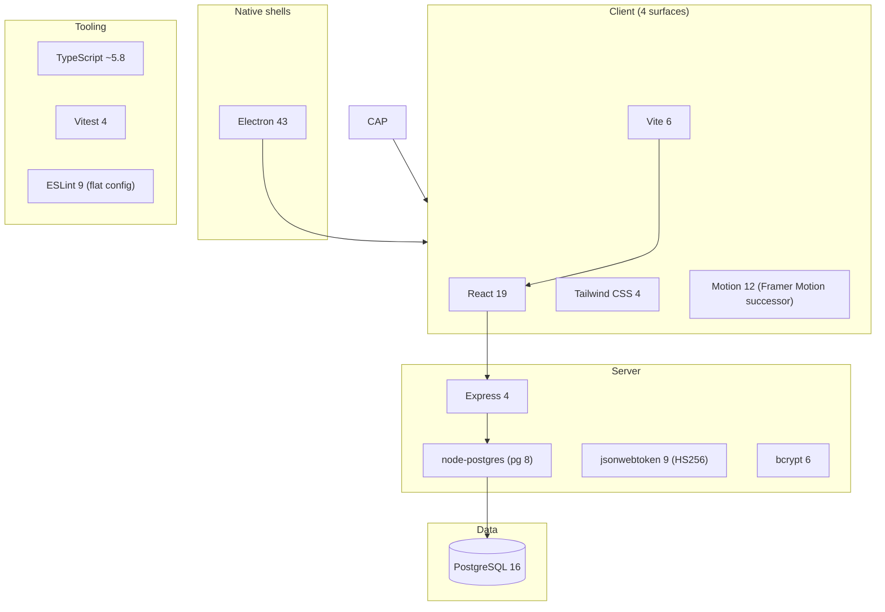

# Technology Stack

A stack is a series of bets. This page lists every major bet in Dhandho, the version actually pinned in `package.json`, and — more importantly — **why**, because the "why" is what you need before you propose swapping any of them.

:::info Source of truth
Versions below are read directly from `/Users/apple/personal/DG-ERP/package.json` at the time this page was written. Run `npm ls <package>` if you suspect drift. Package name in `package.json` is `splendor-erp` — a legacy name predating the Dhandho rebrand.
:::

## The stack at a glance

## Frontend

| Package | Version | Why |
|---|---|---|
| **React** | `^19.0.0` | Latest stable; used with plain hooks + `lazy()` code-splitting, no external state library (see [Design Decisions](/architecture/design-decisions)). |
| **Vite** | `^6.2.0` | Fast dev server + HMR, native ESM, first-class TypeScript, trivial multi-mode builds (`web` vs `mobile` — see `vite.config.ts`). |
| **@vitejs/plugin-react** | `^5.0.4` | Fast Refresh + JSX transform for Vite. |
| **Tailwind CSS** | `^4.3.3` via `@tailwindcss/vite` `^4.1.14` | Utility-first CSS with zero runtime cost; Tailwind 4's Vite plugin removes the PostCSS config file entirely. |
| **Motion** (`motion` package) | `^12.23.24` | The rebranded, framework-agnostic successor to Framer Motion — used for page transitions, the app shutter intro, and toast animations. Split into its own `vendor-motion` bundle chunk (see `vite.config.ts` `manualChunks`) because it's large and only needed on animated screens. |
| **lucide-react** | `^1.24.0` | Icon set — tree-shakeable, one import per icon, chunked separately (`vendor-icons`). |
| **clsx** + **tailwind-merge** | `^2.1.1` / `^3.6.0` | Conditional className composition (`cn()` helper in `src/lib/utils.ts`) without class-order conflicts. |
| **html5-qrcode** | `^2.3.8` | Barcode/QR scanning in the browser (verification, reward redemption). Chunked as `vendor-scanner`. |
| **jsbarcode** | `^3.12.3` | Generates barcode images for print labels. Also in `vendor-scanner` chunk. |
| **xlsx** | `^0.18.5` | Bank statement (ICICI/HDFC/SBI) `.xls`/`.xlsx` parsing and CSV/Excel export. Chunked as `vendor-xlsx` (large, rarely used). |

:::warning `xlsx` has a known unpatched vulnerability
The `xlsx` (SheetJS) package on npm has open CVEs with no fix released to the npm registry (the maintainers publish fixes only via their own CDN). This is a **documented, accepted risk** — see [Design Decisions](/architecture/design-decisions) and [Accepted Risks](/security/accepted-risks). Do not "fix" this by silently swapping libraries without reading that page; there are reasons (input surface, feature parity) it hasn't been replaced yet.
:::

## Backend

| Package | Version | Why |
|---|---|---|
| **Express** | `^4.21.2` | Boring, stable, huge middleware ecosystem, minimal magic. Deliberately **not** Express 5 (still in early adoption) and deliberately **not** Fastify/Koa/Hono — see [Design Decisions](/architecture/design-decisions) for the "why not" table. |
| **pg** (node-postgres) | `^8.22.0` | Direct SQL via `Pool`, no ORM layer — see the "no ORM" decision in [Design Decisions](/architecture/design-decisions). |
| **jsonwebtoken** | `^9.0.3` | Stateless auth tokens, HS256, 24h expiry. Single shared secret (`JWT_SECRET`), not RS256/JWKS — appropriate because there's one API, not a distributed set of services validating tokens independently. |
| **bcrypt** | `^6.0.0` | Password hashing, cost factor 12 (`bcrypt.hash(pw, 12)`), industry standard over faster-but-weaker alternatives. |
| **helmet** | `^8.2.0` | Security headers: CSP, HSTS, `X-Frame-Options: DENY`, `noSniff`, etc. — configured explicitly in `server/app.ts`, not left at defaults. |
| **express-rate-limit** | `^8.5.2` | Per-route rate limiting: global API (300 req/min), login (5/min), password reset (3/hr) — see [Request Lifecycle](/architecture/request-lifecycle). |
| **compression** | `^1.8.1` | gzip/deflate response compression. |
| **embedded-postgres** | `^18.4.0-beta.17` | Ships a real PostgreSQL binary *inside* the Electron on-prem build — no separate Postgres install required by the customer. See [Four Surfaces](/architecture/four-surfaces). |
| **@logtail/node** | `^0.5.8` | Structured log shipping (used by `server/utils/logger.ts` in production). |
| **tsx** | `^4.23.1` | Runs TypeScript directly (`tsx server/index.ts`) in dev/prod without a separate `tsc` build step for the server. |

## Database

**PostgreSQL 16.** Chosen for:
- **JSONB** columns (used extensively: `tab_config`, `permissions`, `quotations.items`, `plans.features`) — flexible per-tenant/per-role config without a migration for every tweak.
- **Row Level Security (RLS)** — a genuine Postgres feature used as the second layer of tenant isolation. See [Multi-tenancy](/architecture/multi-tenancy).
- **Native `ON DELETE CASCADE`** — tenant deletion cascades cleanly through foreign keys (though `deleteTenant()` still does explicit ordered deletes for tables without FKs — see `server/utils/tenant.ts`).
- Runs identically as a hosted Render/Neon instance (cloud) or as `embedded-postgres` on a customer's laptop (on-prem) — one dialect, no cross-database compatibility layer needed.

## Auth

**JWT (HS256, 24h expiry)**, hand-rolled with `jsonwebtoken`, no third-party auth provider (no Auth0/Clerk/Supabase Auth). The payload carries `userId`, `tenantId`, `role`, `email`, `name`, optional `vendorId`, and optional `permissions`. See [Multi-tenancy](/architecture/multi-tenancy) for how `tenantId` flows through every request, and [Design Decisions](/architecture/design-decisions) for why the token is accepted in `localStorage` (a documented, accepted XSS-adjacent risk) rather than an httpOnly cookie.

## Native shells

| Package | Version | Why |
|---|---|---|
| **Electron** | `^43.1.1` | Two builds from one codebase: a thin **cloud wrapper** (~20 MB, no local DB) and a full **on-prem** build (~180 MB, embedded Postgres). See [Four Surfaces](/architecture/four-surfaces). |
| **electron-builder** | `^26.15.3` | Produces `.exe`/`.dmg` installers for both Electron variants (`electron-cloud.config.cjs`, `electron-onprem.config.cjs`). |

## Tooling

| Package | Version | Why |
|---|---|---|
| **TypeScript** | `~5.8.2` | Strict-ish typing across `src/` and `server/` — `tsc --noEmit` is the `lint` script's typecheck step. |
| **Vitest** | `^4.1.9` + `@vitest/coverage-v8` `^4.1.10` | Unit + API integration tests (via `supertest`), Vite-native so no separate Jest config/transform pipeline. |
| **supertest** | `^7.2.2` | HTTP-level assertions against `createApp()` (the exported, listener-less Express app) without spinning up a real server or Postgres per test where mockable. |
| **ESLint 9** (flat config) + **typescript-eslint 8** | — | `eslint.config.js`, includes `eslint-plugin-react-hooks` and `eslint-plugin-react-refresh` for Fast-Refresh-safety linting. |
| **Prettier 3** + **Husky 9** + **lint-staged 16** | — | Format-on-commit via a pre-commit hook (`.husky/`). |
| **rollup-plugin-visualizer** | `^6.0.5` | Bundle size analysis (`npm run analyze` → `dist/stats.html`) — dynamically imported only when `mode === 'analyze'` so it never has to ship in production installs. |

## Why not an ORM, a state library, or a migrations framework?

These three "missing" pieces are the most common questions from engineers new to this codebase, and each has a dedicated rationale in [Design Decisions](/architecture/design-decisions). The one-line summary:

- **No ORM (Prisma/Drizzle/TypeORM)** — raw SQL gives full control over GST-sensitive aggregate queries and avoids an abstraction tax on a schema that's still evolving via `ALTER TABLE ... ADD COLUMN IF NOT EXISTS`.
- **No global state library (Redux/Zustand/Jotai)** — each feature view fetches its own data on mount; session state lives in `localStorage` via `src/lib/session.ts`. Simpler mental model for a large team of AI-assisted, feature-siloed development.
- **No migrations framework (Knex/Flyway/Prisma Migrate)** — `initSchema()` in `server/pg-db.ts` runs idempotent `CREATE TABLE IF NOT EXISTS` / `ALTER TABLE ... ADD COLUMN IF NOT EXISTS` statements on every boot. Fast to iterate solo; the trade-off is no rollback story and no migration history table.

## Version upgrade policy — how to think about bumping a major

There's no formally written upgrade policy in the repo, but the pattern across the stack is consistent enough to state as one:

1. **Bump one major dependency at a time**, not the whole stack together — React 19 → 20 and Vite 6 → 7 in the same PR makes a regression impossible to attribute.
2. **Run `npm run typecheck`, `npm run lint`, and `npm test` before and after** — TypeScript and ESLint surface most breaking API changes in React/Express typings immediately.
3. **Test all four surfaces**, not just the web build — an Electron-breaking change (e.g., a Vite config option that behaves differently under `base: './'`) can hide behind a clean web build.
4. **Re-read the relevant [Design Decisions](/architecture/design-decisions) entry** before upgrading something that was deliberately pinned for a reason beyond "it's the current version" (e.g., Express 4 vs. 5).
5. **Check Postgres-version-sensitive behavior** (a JSONB operator, an RLS nuance) against *both* the hosted cloud database *and* whatever `embedded-postgres` ships for on-prem — they must stay compatible.

:::tip Analogy
Upgrading dependencies in a four-surface codebase is like replacing **one engine part at a time on a plane that has four different fuselages sharing it.** You don't swap the engine and repaint the plane in the same afternoon — you swap the part, run it on the ground, then fly each fuselage variant separately before calling it done.
:::

## Dependency audit checklist for anything new

When adding a *new* dependency (not upgrading an existing one), walk this list — it mirrors the reasoning already applied to every entry in the tables above:

- Does it need to run inside an Electron renderer, not just a normal browser? (Rules out anything requiring Node.js-only APIs in client code.)
- Is it large enough to need its own `manualChunks` entry in `vite.config.ts`? (Anything sizeable, used on fewer than half of all tabs — see `vendor-motion`, `vendor-scanner`, `vendor-xlsx` as precedent.)
- Does it have known CVEs, and if so, is there a feature-complete alternative? (See the `xlsx` precedent in [Design Decisions](/architecture/design-decisions) for how an accepted risk should be documented, not silently ignored.)
- Does it assume network access at runtime? (Breaks the on-prem offline story if so — needs a documented fallback.)
- Is there already a dependency in the stack doing something equivalent? (Don't add a second library solving a problem an existing one already covers.)

## Key concepts

- **Pinned major versions, not "latest"** — React 19, Vite 6, Express 4, Tailwind 4 are all deliberate choices at a point in time, not auto-upgraded; check `package.json` before assuming a newer major is safe.
- **Bundle-aware dependency placement** — large/rarely-used libraries (`motion`, `xlsx`, scanner libs) are explicitly chunked in `vite.config.ts` so the initial bundle stays small. See [Performance → Bundle](/performance/bundle).
- **One codebase, three client shells** — the same `src/` and `server/` ship inside a browser tab and Electron (cloud + on-prem).

## Common mistakes

1. Adding a heavy new dependency (charting library, rich text editor) without adding a `manualChunks` entry in `vite.config.ts` — it will bloat the main bundle.
2. Assuming Express 5 semantics (e.g. changed error-handling for async route handlers) — this app is on Express 4.
3. Reaching for Redux/Zustand out of habit — check [Design Decisions](/architecture/design-decisions) first; the existing pattern is per-view `fetch` on mount.
5. Upgrading multiple majors in one PR and losing the ability to bisect a regression across four client surfaces.

## Interview question

> **Q: Why PostgreSQL specifically, and why is the same schema code (`initSchema()`) able to run both on a hosted Render/Neon database and on an embedded Postgres binary inside a customer's Electron app?**
>
> Expected answer: PostgreSQL was chosen for native JSONB (flexible per-tenant config without constant migrations) and native Row Level Security (a real second layer of tenant isolation, not an application-only convention). Because `initSchema()` uses only idempotent, standard-SQL `CREATE TABLE IF NOT EXISTS` / `ALTER TABLE ADD COLUMN IF NOT EXISTS` statements with no reliance on managed-Postgres-only extensions, the identical function can run against `embedded-postgres` locally — this is what makes the on-prem Electron build possible without a second database technology or a second schema-management system.

## Related

- [Design Decisions](/architecture/design-decisions)
- [Four Surfaces](/architecture/four-surfaces)
- [Folder Structure](./folder-structure.md)
- [Performance → Bundle](/performance/bundle)
