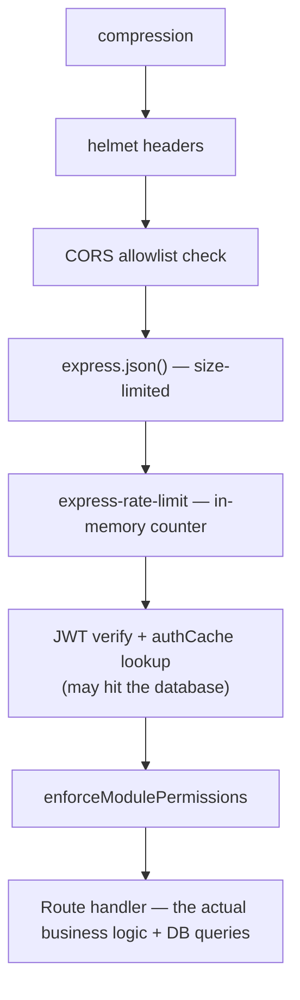

# Backend Performance

The backend is a single Express process per deployment (no worker clustering by default) — performance here is mostly about **not doing unnecessary work per request** and **not letting one request starve others**, rather than horizontal scaling tricks. This document covers the concrete mechanisms; [Bottlenecks](./bottlenecks.md) covers where this still shows strain.

## Connection pooling — bounded, not unlimited

```55:65:server/pg-db.ts
export const pool = new Pool({
  connectionString: process.env.DATABASE_URL,
  max: process.env.DATABASE_POOL_SIZE
    ? parseInt(process.env.DATABASE_POOL_SIZE, 10)
    : process.env.NODE_ENV === 'production' ? 10 : 20,
  idleTimeoutMillis: 30000,
  connectionTimeoutMillis: 10000,
  ...(useSsl ? { ssl: { rejectUnauthorized } } : {}),
});
```

| Setting | Value | Why |
|---|---|---|
| `max` (production) | 10 | Deliberately conservative — most managed Postgres offerings (and the on-prem SQLite-adjacent... actually Postgres-everywhere deployments this app targets) have their *own* connection ceilings, and a single Dhandho tenant's traffic volume doesn't come close to needing more than 10 concurrent DB connections at once. Keeping this low avoids one Dhandho deployment exhausting a shared database server's total connection budget, especially relevant for smaller hosting tiers. |
| `max` (development) | 20 | Slightly more headroom for local development/testing, where multiple concurrent test runs or manual testing sessions might otherwise contend for a too-small pool and produce confusing `connectionTimeoutMillis` errors unrelated to the actual code being tested. |
| `idleTimeoutMillis` | 30000 | A connection that's sat idle in the pool for 30 seconds is closed — releases resources back to the database server during quiet periods rather than holding 10 connections open 24/7 regardless of actual traffic. |
| `connectionTimeoutMillis` | 10000 | If the pool can't hand out a connection within 10 seconds (all `max` connections busy, database under heavy load), the request fails fast with a clear timeout error rather than hanging indefinitely — a slow, backed-up database becomes a visible error, not a silent, ever-growing queue of stuck requests. |

`DATABASE_POOL_SIZE` is exposed as an env override specifically so an operator running a larger deployment (many tenants, higher concurrent traffic) can raise this ceiling without a code change — see `.env.example`'s `# DATABASE_POOL_SIZE=10` comment referenced in [../security/secrets.md](./../security/secrets.md).

> [!CAUTION]
> **A pool of 10 connections is a real constraint under load, and it's supposed to be.** If ten requests are simultaneously running slow queries (an unindexed report, a large export), an eleventh request waits — and if it waits past `connectionTimeoutMillis`, it fails. This is the mechanism that turns "one slow query" into "one slow query plus a queue of timeouts" if left unaddressed — which is exactly why [Database](./database.md)'s indexing discipline matters so much: every query held open longer than necessary directly reduces how many *other* requests can be served concurrently, given this fixed pool ceiling.

## Response compression

```92:92:server/app.ts
app.use(compression());
```

Gzip/Brotli compression (via the `compression` middleware, negotiated per-request based on the client's `Accept-Encoding` header) is applied globally, before route handlers. For a mobile client on a slow connection, compressing a JSON response with a few hundred inventory rows can meaningfully cut payload size — this is a low-cost, high-value default that costs a small amount of CPU per request in exchange for materially less time-on-wire, which matters more for Dhandho's target users (patchy mobile data) than the CPU cost matters for a modestly-loaded single Express process.

## Pagination defaults — bounding response size and query cost

```13:24:server/utils/pagination.ts
export function parsePagination(query, opts = {}) {
  const defaultLimit = opts.defaultLimit ?? 500;
  const maxLimit = opts.maxLimit ?? 1000;
  // ...
  const limit = Math.min(maxLimit, Math.max(1, ...));
  return { page, limit, offset: (page - 1) * limit };
}
```

Two numbers matter here: a **default** limit of 500 rows (generous enough that most SME tenants' entire customer/product list fits in a single "page" without the frontend needing to paginate through screens of data for a routine view), and a **hard ceiling** of 1000 rows regardless of what a client requests. The ceiling exists specifically so a malicious or buggy client can't request `?limit=1000000` and force the database (and the Express process serializing the JSON response) to do disproportionate work on a single request — a lightweight, deliberate DoS mitigation that doubles as a performance guardrail, since an unbounded result set is both a memory/serialization cost on the server and a large-payload cost over the (often mobile) network to the client.

## Middleware ordering — cheap checks before expensive ones

The order middleware is mounted in `server/app.ts` isn't arbitrary — it's structured so that **cheap, fast-failing checks run before expensive ones**:



Rate limiting, for instance, runs on an in-memory counter and can reject a request (`429`) before the request ever reaches the JWT-verification step that might involve a database round-trip (on an authCache miss). A request that's going to be rejected outright is rejected as cheaply as possible, rather than paying the cost of authentication/authorization logic first.

## Quiz

1. Why is the production connection pool capped at 10 rather than left unbounded or set much higher?
2. What specific failure mode does `connectionTimeoutMillis: 10000` convert into something more diagnosable?
3. Why does the hard ceiling on `parsePagination`'s `limit` matter for performance, not just for abuse prevention?

<details>
<summary>Answers</summary>

1. Because a single Dhandho tenant's realistic traffic volume doesn't require more than 10 concurrent database connections, and keeping the pool conservative avoids one deployment exhausting a shared or modestly-sized database server's total connection budget — especially relevant since many deployments run on smaller-tier managed Postgres instances shared across other constraints.
2. Without it, a request waiting for a connection from an exhausted pool (e.g., during a spike of slow queries) would hang indefinitely with no clear error, making it hard to distinguish "the database is genuinely down" from "the pool is just temporarily saturated." With the timeout, that scenario surfaces as a clear, bounded-time error instead of an indefinite hang.
3. An unbounded `limit` would let a single request force the database to fetch, and the Express process to serialize and transmit, an arbitrarily large result set — directly consuming more memory, more CPU for JSON serialization, and more time holding open a pooled database connection (reducing availability for other concurrent requests) than a legitimate request would ever need.

</details>

## Related reading

- [Database Performance](./database.md) — indexing strategy that keeps queries fast enough to not exhaust the pool.
- [Caching](./caching.md) — the authCache layer that reduces how often the pool is even touched per request.
- [Bottlenecks](./bottlenecks.md) — known scenarios where this pool sizing shows real strain.
