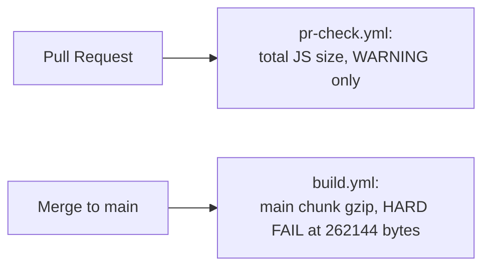

# Bundle Size

## Manual chunks — splitting by "how often is this actually needed"

```32:56:vite.config.ts
rollupOptions: {
  output: {
    manualChunks(id) {
      if (id.includes('node_modules/react/') || id.includes('node_modules/react-dom/')) {
        return 'vendor-react';
      }
      if (id.includes('node_modules/motion') || id.includes('node_modules/framer-motion')) {
        return 'vendor-motion';
      }
      if (id.includes('html5-qrcode') || id.includes('jsbarcode')) {
        return 'vendor-scanner';
      }
      if (id.includes('xlsx')) {
        return 'vendor-xlsx';
      }
      if (id.includes('node_modules/lucide-react') || id.includes('node_modules/@lucide')) {
        return 'vendor-icons';
      }
    },
  },
},
```

Rollup's `manualChunks` function is called once per module during the build, and whatever string it returns becomes that module's chunk name — modules returning the same string get bundled together; modules where the function returns `undefined` fall into Vite's default chunking heuristics (typically ending up in the main entry chunk or split automatically based on the dynamic-import graph from lazy-loaded feature views).

| Chunk | Contents | Why it's split out |
|---|---|---|
| `vendor-react` | `react`, `react-dom` | Needed on literally every page — but isolating it means the browser can cache it independently from application code that changes far more often between deploys. A user who's already downloaded `vendor-react` from a previous session doesn't re-download it just because `app.tsx` changed. |
| `vendor-motion` | `motion`/`framer-motion` | A comparatively large animation library, needed by *some* UI (Toasts, dropdowns) but not by every page. Isolating it means a first paint of, say, the Inventory table doesn't have to wait on downloading animation code it may never invoke this session. |
| `vendor-scanner` | `html5-qrcode`, `jsbarcode` | Camera-based barcode scanning and barcode-label generation are needed only on Inventory/Sales/label-printing screens — most sessions (someone just checking today's dashboard numbers) never touch this code at all. |
| `vendor-xlsx` | `xlsx` (SheetJS) | Used only for spreadsheet import/export on specific screens (e.g., bank statement upload) — see [../security/accepted-risks.md](../security/accepted-risks.md) for the security angle on this same dependency. A large parsing library with a narrow, occasional use case is exactly the profile that benefits most from isolation. |
| `vendor-icons` | `lucide-react` | Icon components are used everywhere in small doses, but as a single vendor chunk they benefit from the same long-term browser caching argument as `vendor-react` — icons rarely change between deploys even when application logic does. |

> [!NOTE]
> **Why manual chunks instead of trusting Vite/Rollup's automatic heuristics entirely?** Automatic chunking optimizes for generically reasonable splits, but doesn't know which dependencies are "needed on first paint for everyone" (React itself) versus "needed by a specific, occasionally-visited feature" (a barcode scanner). The five rules above encode business-specific knowledge about *usage patterns* — which the build tool has no way to infer on its own — directly into the chunking strategy.

## The CI gate — 256KB gzip on the main chunk

```62:72:.github/workflows/build.yml
- name: Check build output + bundle size
  run: |
    if [ ! -d "dist" ]; then echo "Build failed — no dist"; exit 1; fi
    MAIN=$(ls dist/assets/index-*.js 2>/dev/null | head -1)
    if [ -n "$MAIN" ]; then
      SIZE=$(gzip -c "$MAIN" | wc -c)
      echo "Main chunk gzip: ${SIZE} bytes (limit: 262144)"
      [ "$SIZE" -gt 262144 ] && echo "Main chunk too large" && exit 1
      echo "Bundle size OK"
    fi
```

`262144` bytes is exactly 256 KiB (\(256 \times 1024\)) — the gzip-compressed size of just the **main entry chunk** (`index-*.js`), not the sum of every chunk in the build. This is a deliberate, narrow measurement: the main chunk is what every single visitor downloads and executes before *anything* renders, regardless of which feature tab they eventually navigate to — it's the one number that directly gates first-paint speed for 100% of sessions. The lazily-loaded feature chunks (Payroll, GSTR reconciliation, etc.) are explicitly **not** counted against this limit, because a user who never opens those tabs never pays for them; capping *their* size wouldn't protect the metric this gate actually cares about (time to first interactive render).

A second, looser check exists in the PR-check workflow:

```76:82:.github/workflows/pr-check.yml
- name: Bundle size check
  run: |
    SIZE=$(du -sk dist/assets/*.js | awk '{sum+=$1} END {print sum}')
    echo "Total JS bundle: ${SIZE}KB"
    if [ "$SIZE" -gt 2000 ]; then
      echo "WARNING: Bundle exceeds 2MB ($SIZE KB)"
    fi
```

Note this second check is a **warning only** (no `exit 1`) and measures the **entire** `dist/assets/*.js` total (uncompressed `du` size, not gzip) — a much coarser, informational signal about total shipped JS across every chunk, useful for noticing "we just added a huge new dependency somewhere" without being strict enough to block a PR over a large-but-legitimately-lazy-loaded new feature module.



> [!WARNING]
> **A regression here is a hard build failure, by design.** Unlike the PR-level warning, `build.yml`'s check runs on `main` (and on PRs targeting it) and will actually **block a merge** if the main chunk crosses 256 KB gzip. This is the sharpest, most automated performance guardrail in the entire codebase — everything else in this Performance section relies on code-review discipline or architectural defaults chosen once; this one is enforced by CI on every single change.

## Practical implication for contributors

Adding a new dependency that gets imported *eagerly* (from `App.tsx` or any module reachable without going through a `lazy()` boundary) risks pushing the main chunk over the gate. The playbook when this happens: (1) check whether the new code can be deferred behind an existing or new `lazy()` boundary, (2) check whether it belongs in one of the five `manualChunks` vendor buckets (or warrants a new one), before reaching for (3) asking whether the CI limit itself needs raising — which should be a deliberate, discussed decision, not a reflexive response to a failing build.

## Quiz

1. Why does the CI gate measure only the main entry chunk's gzip size, rather than the sum of all JS chunks in the build?
2. A contributor adds a new charting library, imported directly at the top of `App.tsx`. What's likely to happen to the CI build, and what's the first thing they should try before raising the size limit?
3. What's the practical difference in enforcement strength between `pr-check.yml`'s bundle check and `build.yml`'s bundle check?

<details>
<summary>Answers</summary>

1. Because the main entry chunk is downloaded and executed by every single visitor before anything renders, regardless of which feature tabs they ever open — it's the one number that directly determines first-paint/time-to-interactive for 100% of sessions. Lazily-loaded feature chunks are only downloaded by users who actually navigate to that feature, so including them in the same budget would penalize legitimate, appropriately-deferred code that doesn't affect most users' experience at all.
2. An eagerly-imported charting library would likely push the main chunk's gzip size past 262144 bytes, failing the `build.yml` CI check and blocking the merge. Before raising the limit, the contributor should try wrapping the charting feature behind a `lazy()` boundary (deferring it to only load when the relevant tab/view is opened) or adding it as a new `manualChunks` vendor bucket so it's isolated from — and not counted as part of — the main chunk.
3. `pr-check.yml`'s check is a warning-only, informational signal (measures total uncompressed JS across all chunks, doesn't fail the build) meant to flag "something got a lot bigger" for a human to notice. `build.yml`'s check is a hard, blocking gate (measures gzip size of just the main chunk, calls `exit 1` on failure) that actually prevents a regression from being merged — the real enforcement mechanism.

</details>

## Related reading

- [Frontend Performance](./frontend.md) — the lazy-loading strategy that keeps the main chunk small in the first place.
- [Caching](./caching.md) — how vendor chunk isolation interacts with long-term browser caching.
- [../security/accepted-risks.md](../security/accepted-risks.md) — the `xlsx` dependency isolated into `vendor-xlsx` also carries a security note.
