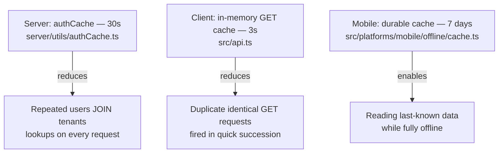

# Caching

Dhandho has **three caching layers**, each solving a different problem, each with a deliberately different TTL, and each living in a different part of the stack. A common mistake when reasoning about caching is to look for "the caching strategy" as if there should be one — this document is partly about explaining why there are three, and why unifying them would actually make things worse.



## Layer 1 — server-side `authCache` (30 seconds)

Every authenticated request re-derives the caller's **current** role, permissions, and tenant status from the database — not from the JWT payload, which could be stale the moment a role changes. Re-running that `users JOIN tenants` query on literally every request, for every user, is real, avoidable database load. `authCache.ts` caches the result for 30 seconds, keyed by `userId:tenantId:iat`:

```17:26:server/utils/authCache.ts
const TTL_MS = 30_000;
const MAX_ENTRIES = 5_000;

function cacheKey(userId: string, tenantId: string, iat: number | undefined): string {
  return `${userId}:${tenantId}:${iat ?? 0}`;
}
```

Two details in this key design matter:

1. **Including `iat` (the JWT's issued-at timestamp) in the cache key** means a cached row is inherently scoped to *that specific token*. If a user logs out and back in (getting a new `iat`), the old cache entry simply becomes unreachable — there's no need to explicitly invalidate it on login, it's just a different key now.
2. **`MAX_ENTRIES = 5_000` with a two-stage eviction strategy** (first sweep for TTL-expired entries; if still full, evict the oldest `Map` insertion-order key) bounds memory use without needing a full LRU implementation — a pragmatic "good enough" bound given that even a large deployment's concurrently-active user count is unlikely to approach 5,000 within a 30-second window.

> [!IMPORTANT]
> **Why 30 seconds, specifically?** It's the balance point between two costs: too short, and the cache barely reduces database load at all (defeating its purpose); too long, and a genuinely important, security-relevant change — a demoted role, a suspended tenant, a subscription that just expired — takes up to that long to actually take effect for requests hitting a warm cache entry. Thirty seconds was judged short enough that "wait a few seconds and try again" is an acceptable answer for an admin who just changed a permission and wants to verify it took effect, while still meaningfully cutting redundant query volume for a user clicking around the app in quick succession.

A **separate, explicit invalidation path** exists for the one case where waiting even 30 seconds is unacceptable: `invalidateAuthCache(userId, tenantId)`, called immediately after a password change, deletes that user's cached rows outright — but note this doesn't need to defend against the *token* still being used, since `authMiddlewareStrict`'s `password_changed_at` vs. `iat` check (see [../security/authentication.md](../security/authentication.md)) independently invalidates the *token itself*, regardless of cache state.

## Layer 2 — client-side in-memory GET cache (3 seconds)

`src/api.ts`'s `fetchApi` wrapper keeps a `Map` of in-flight/recent GET responses, keyed by URL, with a **3-second** TTL:

```199:222:src/api.ts (see ../frontend/api-client.md for full context)
const cache = new Map<string, { data: unknown; expiry: number }>();
const CACHE_TTL_MS = 3_000; // M6 fix — was 15s, caused stale-data complaints
```

This cache is **not** trying to reduce server load over minutes or hours the way a CDN or Redis cache would — 3 seconds is barely enough to matter for that. Its actual job is narrower: **de-duplicating near-simultaneous, identical requests** caused by React's rendering behavior — e.g., two sibling components both requesting the same customer list on mount, or a user rapidly switching between two tabs and back, re-triggering the same data fetch each time. Without this layer, each of those would be a fresh round-trip; with it, the second request within the 3-second window is served from memory instantly.

> [!WARNING]
> **The `M6 fix` comment in the code is a real lesson worth internalizing:** this TTL used to be 15 seconds, and it caused genuine stale-data complaints — a user would edit a customer's phone number, immediately navigate back to the customer list, and see the *old* number because the list GET was still being served from a 15-second-old cache entry. The fix wasn't to remove caching (it still meaningfully de-duplicates rapid-fire requests at 3 seconds), it was to shrink the window until staleness became imperceptible in normal usage while keeping the de-duplication benefit for the genuinely-simultaneous-request case it targets.

Any non-GET request (`POST`/`PUT`/`DELETE`) proactively invalidates cache entries matching that API path segment — see [../frontend/api-client.md](../frontend/api-client.md) for the exact invalidation logic — so a mutation is never followed by a stale read within the same 3-second window, closing off exactly the class of bug the `M6 fix` addressed.

## Layer 3 — mobile durable cache (7 days)

Unrelated in purpose to either layer above: `src/platforms/mobile/offline/cache.ts` persists specific, curated GET responses (`CACHEABLE_GET` — things like the product catalog and customer list, not, say, a live dashboard revenue figure) to `localStorage` with a **7-day** expiry, specifically so a mobile user with **no network connection at all** can still open the app and see recent data rather than a blank error screen.

This cache answers a completely different question than Layers 1 and 2: not "how do we avoid redundant requests," but "what do we show when there's no request to make at all." Seven days is long enough to cover a realistic gap in connectivity (a multi-day trip to a low-signal area) while still being bounded — data doesn't accumulate and go stale indefinitely, and a 7-day-old cached product list is still far more useful to a warehouse worker mid-shift than an empty screen. Full mechanics — including how it interacts with the offline mutation queue — are covered in [../frontend/platforms.md](../frontend/platforms.md).

## Why three separate layers, not one unified cache

| | authCache | GET cache | Mobile durable cache |
|---|---|---|---|
| Lives where | Server memory | Browser/WebView memory | `localStorage` (persisted) |
| TTL | 30s | 3s | 7 days |
| Problem solved | Redundant per-request DB lookups | Redundant near-simultaneous identical requests | Zero-connectivity data availability |
| Survives a page reload? | N/A (server-side) | No | Yes (by design) |
| Wrong answer if misapplied | Stale permission checks | Stale UI data after a quick edit | N/A — it's explicitly a last-resort fallback |

Each layer's TTL is a direct reflection of the cost of being wrong in that specific context. Being wrong for 30 seconds about a user's role (Layer 1) is a minor, self-correcting inconvenience. Being wrong for 3 seconds about a list's contents (Layer 2) is barely perceptible and self-heals on the next natural fetch. Being wrong for up to 7 days about a mobile user's product catalog (Layer 3) is an accepted trade-off *only* because the alternative — no data at all while offline — is strictly worse, and the cache is always clearly presented as "last known" data via [`OfflineBanner`](../frontend/platforms.md), not silently mixed with live data.

## Quiz

1. Why is the client-side GET cache's TTL an order of magnitude shorter than the server's authCache TTL?
2. A tenant admin demotes a Staff user to a lower permission level. What's the realistic worst-case delay before that takes effect, and which cache layer is responsible for that delay?
3. Why doesn't the 7-day mobile durable cache need the same "shrink the TTL to avoid stale data" treatment that the GET cache got in the `M6 fix`?

<details>
<summary>Answers</summary>

1. Because they solve different problems at different timescales. The GET cache's job is de-duplicating requests that happen within milliseconds to a couple of seconds of each other (simultaneous component mounts, rapid tab-switching) — anything longer risks showing visibly stale data after a user's own edit, as the `M6 fix` demonstrated. The authCache's job is reducing repeated identical database lookups across a user's ongoing session, where a slightly longer window (30s) has a much smaller perceptible downside (a permission change taking a few extra seconds to apply) and a much bigger upside (meaningfully less DB load across a full session's worth of requests).
2. Up to 30 seconds, caused by the server-side `authCache` — a request hitting a still-warm cache entry for that user will continue to see their old role/permissions until the entry expires (or until 30 seconds pass and it's refetched fresh from the database). This is a known, accepted trade-off documented in this file.
3. Because its purpose is fundamentally different: the GET cache exists to avoid *redundant* requests when a fresh request is readily available — staleness there is a pure downside with no offsetting benefit. The mobile durable cache exists specifically for when a fresh request is *not* available at all (no connectivity) — in that scenario, 7-day-old data is strictly better than no data, so shrinking its TTL wouldn't reduce a real staleness problem, it would just mean the app has *less* to show a user during a longer offline stretch.

</details>

## Related reading

- [../frontend/api-client.md](../frontend/api-client.md) — the GET cache and offline queue in full detail.
- [../frontend/platforms.md](../frontend/platforms.md) — the mobile durable cache and its interaction with the offline write queue.
- [../security/authentication.md](../security/authentication.md) — why the authCache key includes `iat`, and how password-change invalidation interacts with it.
- [Bottlenecks](./bottlenecks.md) — what happens when these caches are cold (cache-miss cost).
