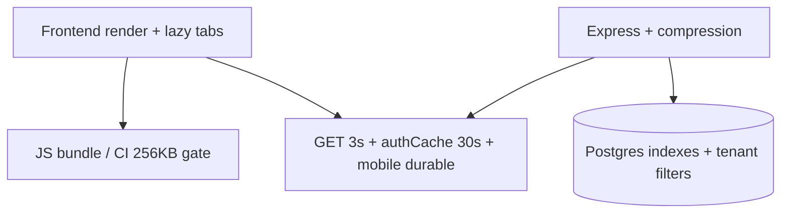

# Performance Overview

:::tip Philosophy
Optimize what a shop owner feels on a mid-range Android phone and patchy data — not synthetic RPS on a quiet laptop.
:::

## Four surfaces

| Surface | Academy page |
|---|---|
| Frontend | [performance/frontend](/performance/frontend) |
| Backend | [performance/backend](/performance/backend) |
| Database | [performance/database](/performance/database) |
| Bundle | [performance/bundle](/performance/bundle) |
| Caching | [performance/caching](/performance/caching) |
| Bottlenecks | [performance/bottlenecks](/performance/bottlenecks) |

## Numbers that matter here

| Gate / mechanism | Value |
|---|---|
| Main chunk gzip CI | &lt; 256KB |
| Global API rate limit | 300/min/IP |
| Auth hydrate cache | 30s |
| Client GET memory cache | 3s |
| Bulk SQL chunks | ~5000 rows |

## Priority order when something feels slow

1. **Network + bundle** on mobile (code-split, cache)  
2. **Missing `tenant_id` leading index** / unbounded list  
3. **N+1** in a feature view  
4. **Event-loop block** (huge sync `xlsx` parse)  
5. Micro-optimizations in React  

## Key concepts

- Perceived latency ≠ server p50  
- Multi-instance `authCache` is eventually consistent (≤30s)  
- CI size gate is a product feature, not vanity  

## Common mistakes

1. Adding Redux “for performance” without measuring  
2. `SELECT *` then filter in JS  
3. Disabling the gzip gate to land a PR  

## Interview question

*Why a 3-second GET cache instead of React Query with longer staleTime?*

:::info Answer sketch
Keeps the dependency surface tiny for a tab-isolated SPA; 3s only dedupes bursty remounts. Longer caches need explicit invalidation discipline the team hasn't standardized yet.
:::

## Related

- [Bundle](/performance/bundle)  
- [Caching](/performance/caching)  
- [Frontend patterns](/frontend/patterns)  
