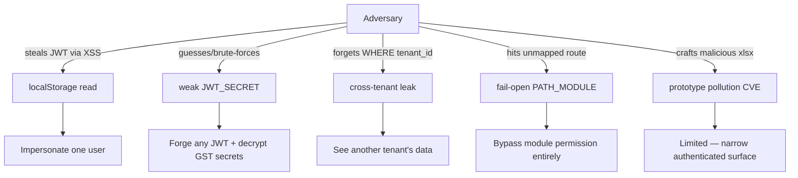

# Quiz: Security

Prerequisite reading: [Authorization](/security/authorization), [Tenant Isolation](/security/tenant-isolation), [OWASP Top 10](/security/owasp), [Accepted Risks](/security/accepted-risks), [Secrets](/security/secrets).

## Questions

1. What are the three "locks" that enforce tenant isolation, in order of what actually matters most day-to-day?
2. Why does the global auth middleware in `app.ts` re-query the database for a user's role on every request instead of trusting the JWT's embedded role claim?
3. What does `moduleForPath()` return for an unregistered route prefix, and what does `enforceModulePermissions` do with that return value? Is this fail-open or fail-closed?
4. Why does `getAccessLevel()` give `Admin`/`Super Admin` an unconditional escape hatch to `full` access, bypassing the stored `permissions` JSON entirely?
5. A Vendor-role user has `view` access to the `finance` module. What additional check must a route make to prevent them from seeing another vendor's balance?
6. Why is RLS enabled on ~30 tables but does not actually protect the application's own queries?
7. What specifically was tried and reverted regarding `FORCE ROW LEVEL SECURITY`, and why?
8. Why does `JWT_SECRET` need to be at least 32 characters in production, and why is this only a warning (not fatal) in development?
9. What two things does a leaked `JWT_SECRET` compromise, given how `secret-crypto.ts` derives its encryption key?
10. Why does `POST /api/auth/forgot-password` always return `200`, regardless of whether the email exists?
11. What field on the `users` table invalidates all previously-issued JWTs after a password change, and how does the auth middleware check it?
12. Name the one accepted, documented CVE in this codebase's dependencies, and the compensating control that makes it tolerable.
13. Why is `xlsx`'s ECB-adjacent risk profile different from `nic-api.ts`'s deliberate use of AES-256-**ECB** for the NIC handshake — is the NIC choice a security bug?
14. What's the difference in risk profile between JWT-in-localStorage and JWT-in-HttpOnly-cookie, and which specific attack does each remain vulnerable to?
15. Why does a cross-tenant resource lookup in this codebase naturally return `404` rather than `403`?

Answers

1. Lock 1: JWT-derived tenant ID (server-side, never trusts client headers). Lock 2: explicit `WHERE tenant_id` in every query — this is the one doing the real work daily. Lock 3: Postgres RLS, a backstop, not the primary mechanism.
2. Because a role or permission change (or a subscription/suspension status change) must take effect quickly without waiting for the user's JWT to expire and be reissued — the JWT's own claims are a snapshot from login time, not live truth. (A 30-second cache softens the DB cost of this.)
3. It returns `null`; `enforceModulePermissions` calls `next()` unconditionally, meaning the route is **ungated** by module permissions. This is fail-**open**, a deliberate trade-off favoring developer velocity over safety-by-default — flagged explicitly as a maintenance burden.
4. So an admin can never lock themselves out of their own tenant by misconfiguring their own `permissions` JSON — the `role` column, not the JSON, is the actual root of trust.
5. `assertVendorAccess(req, vendorId)` / `vendorScopeId(req)` — module-level `view` access says nothing about row-level ownership within that module.
6. Because the application connects to Postgres as the table owner, and Postgres table owners bypass RLS by default regardless of `ENABLE ROW LEVEL SECURITY`.
7. `FORCE ROW LEVEL SECURITY` was tried and reverted because `pool.query()` calls can land on different physical connections, meaning `SET app.tenant_id` on one connection doesn't apply to a later query on another — with FORCE active, this silently returns zero rows instead of the real data, a worse failure mode (silent data loss) than the current one.
8. A short secret is brute-forceable; production refuses to boot with one, but a dev/local `.env.example` placeholder shouldn't block iteration, so it's a warning there instead.
9. It compromises both the ability to forge valid JWTs for any user/tenant **and** the ability to decrypt every tenant's stored GST API credentials, since the AES key is deterministically derived from the same `JWT_SECRET`.
10. To prevent user enumeration — an attacker probing arbitrary emails can't distinguish "exists, reset sent" from "doesn't exist" by response shape.
11. `password_changed_at`; the auth middleware compares it against the JWT's `iat` (issued-at) and rejects the token with a 401 if the password was changed after the token was issued.
12. `xlsx@0.18.5`'s known CVE (bank-statement parsing); mitigated by narrow, authenticated-only exposure and no dynamic/executable use of the parsed output.
13. No — it's a protocol-mandated choice, not a discretionary one. NIC's own integration spec requires `AES/ECB/PKCS5Padding`; interoperating with a fixed external government protocol means matching its exact cipher mode, unlike `secret-crypto.ts` where Dhandho does control the algorithm and chose GCM.
14. `localStorage` is readable by any successful XSS but not vulnerable to CSRF (no automatic credential attachment); an `HttpOnly` cookie is unreadable by XSS but requires separate CSRF protection since browsers auto-attach cookies to cross-origin requests.
15. Because the standard "find by ID" query pattern (`WHERE id = $1 AND tenant_id = $2`) naturally returns zero rows for a cross-tenant ID, indistinguishable from the ID simply not existing — avoiding a minor information leak (confirming an ID is valid but belongs to someone else) without any special-case code.

## Threat map, for a quick self-check before you start

If you can label each arrow's mitigating control from memory before opening the answers below, you're in good shape.

## Hands-on exercise

1. For question 3 (fail-open `PATH_MODULE`), find one actual route file whose path prefix is **not** present in the `PATH_MODULE` mapping in `server/middleware/permissions.ts` (if any exist today) — or, if all current paths are mapped, add a new dummy route temporarily and confirm it's reachable by every authenticated role regardless of module permissions.
2. For question 9, trace exactly how `secret-crypto.ts` derives its AES key from `JWT_SECRET`, and write out — in your own words — the two-sentence "blast radius" of a leaked `JWT_SECRET" in production.
3. For question 15, find one route handler in this codebase and confirm its "find by ID" query includes `AND tenant_id = $n` — then imagine (don't actually do it) removing that clause and describe exactly what a `curl` request from another tenant's user would return.

## Related

- [Quizzes Index](/quizzes)
- [Quiz: Architecture](/quizzes/quiz-architecture)
- [Security → Tenant Isolation](/security/tenant-isolation)
- [Threat Model](/security/threat-model)
- [Lab: Tenant Isolation](/labs/lab-tenant-isolation)
- [Lab: Debug 403](/labs/lab-debug-403)
