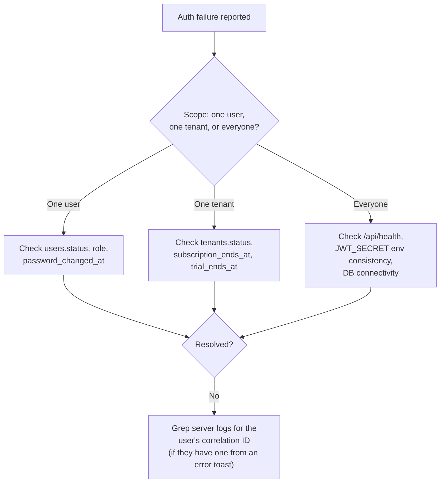

# Runbook: Auth Failures

## Symptom → likely cause, ranked by frequency

| Symptom | Most likely cause | Check |
|---|---|---|
| One user can't log in, others in the same tenant are fine | Wrong password, or account role/status issue | `SELECT status, role FROM users WHERE email=$1 AND tenant_id=$2` |
| Everyone in one tenant is logged out simultaneously | Tenant suspended, or subscription expired | `SELECT status, subscription_ends_at, trial_ends_at FROM tenants WHERE id=$1` — see [Tenant Suspended](/runbooks/tenant-suspended) |
| One user is logged out mid-session, others fine | Their password was changed/reset (by them, an admin, or support) | `SELECT password_changed_at FROM users WHERE id=$1` — compare against their session's `iat` |
| Login works but every subsequent API call 401s | Clock skew between client and server, or `JWT_SECRET` mismatch (post-rotation, multi-instance deploy inconsistency) | Check server logs for `Invalid or expired token` volume; check `JWT_SECRET` is identical across all running instances |
| Everyone, across every tenant, can't log in | `JWT_SECRET` missing/rotated without redeploying all instances, or DB unreachable | See [DB Down](/runbooks/db-down); verify env vars on the actual running service |
| Login attempts return 429 | Rate limit hit (5/min/IP) | Legitimate lockout after failed attempts, or a shared-IP office where many users share one login rate-limit bucket |

## Diagnostic sequence

## Fix playbook

- **Wrong password / locked out**: direct them to `/{slug}` → forgot password, or an Admin can reset via `PUT /api/admin/users/:id` (sets a temp password, does **not** require the old one).
- **Suspicious mass logout**: check `audit_log` for a recent password change, role change, or tenant status change around the reported time — `SELECT * FROM audit_log WHERE tenant_id=$1 ORDER BY created_at DESC LIMIT 20`.
- **Rate-limited legitimately**: wait out the window (1 minute for login) — there is no manual unlock; the limiter is in-memory and resets on its own.
- **`JWT_SECRET` mismatch across instances**: this is a deploy configuration bug, not a data problem — verify the exact same `JWT_SECRET` value is set on every running instance (Render's env var propagation, or a stale cached env in a container that didn't restart).

## What NOT to do

- Don't manually edit `password_hash` directly in the database as a "quick fix" — always go through `bcrypt.hash()` (e.g. via the admin reset endpoint) so the format matches what `bcrypt.compare()` expects on next login.
- Don't extend the login rate limiter's window/max in production to "unblock" a legitimate user faster — that's a global security parameter, not a per-incident dial; wait the minute out instead.

## Related

- [Auth API](/api/auth)
- [Backend → Auth Middleware](/backend/auth-middleware)
- [Tenant Suspended](/runbooks/tenant-suspended)
- [Security → Accepted Risks](/security/accepted-risks)
