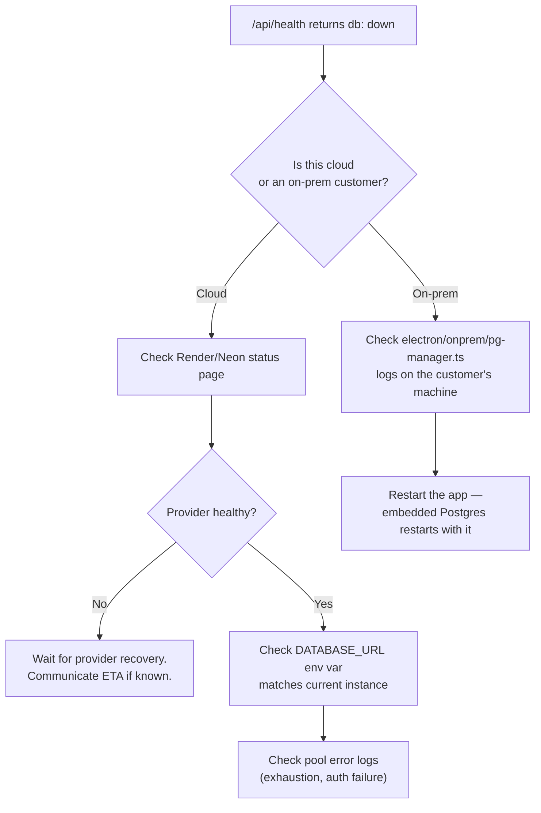

# Runbook: Database Unreachable

## First command, always

```bash
curl https://dhandho.app/api/health
# Healthy:   {"ok": true, "db": "up", "message": "API is running"}
# Unhealthy: {"ok": false, "db": "down", "message": "Database unavailable"}
```

This endpoint (`GET /api/health` in `app.ts`) does a real `SELECT 1` against the pool — it's not a static "the process is alive" check. A `503` here means the **process is up but Postgres isn't reachable from it**, which narrows the problem significantly before you touch anything else.

## Likely causes, ranked

| Cause | How to confirm |
|---|---|
| Managed Postgres provider outage (Render/Neon) | Check the provider's own status page first — this is the single most common cause and requires no action on Dhandho's side beyond waiting |
| Connection pool exhausted (`max` connections all in use) | Server logs show `Unexpected pool error` or connection timeout errors around the incident start time |
| `DATABASE_URL` env var wrong/rotated | Check the exact deployed value matches the current DB instance — common after a DB credential rotation that wasn't propagated everywhere |
| TLS/cert issue (`DATABASE_SSL_REJECT_UNAUTHORIZED`) | Error mentions certificate validation; check nothing changed in `useSsl` logic or the provider's cert |
| On-prem: embedded Postgres process crashed | Check `electron/onprem/pg-manager.ts` logs for the local Postgres process exit code — this is a *local machine* issue, not a cloud incident |

## Diagnostic sequence



## Connection pool exhaustion — the one you can actually fix quickly

`pool` in `pg-db.ts` caps at 10 connections in production (see [pg-db.ts](/backend/pg-db) for why smaller in prod than dev). If every connection is checked out and none are being released — usually a bug where a route acquires a client (`pool.connect()`) for a transaction and doesn't call `.release()` in a `finally` block on an error path — new requests queue up and eventually time out, looking exactly like "the database is down" from the outside even though Postgres itself is fine.

```sql
-- Run directly against the DB to see active connections/queries
SELECT pid, state, query, now() - query_start AS duration
FROM pg_stat_activity
WHERE datname = current_database()
ORDER BY duration DESC;
```

A pile of long-running or idle-in-transaction connections here, especially many from the same query text, points at a specific route missing a `client.release()` — see [Backend Patterns](/backend/patterns) Pattern 2 for the correct shape.

## Fix playbook

- **Provider outage**: nothing to fix on Dhandho's side; monitor and communicate status.
- **Pool exhaustion from a leak**: identify the offending route from `pg_stat_activity`'s query text, deploy a fix ensuring `client.release()` runs in `finally`, and consider a temporary pool-size bump as a stopgap (env var `DATABASE_POOL_SIZE`) while the real fix ships.
- **Wrong `DATABASE_URL`**: correct the env var, redeploy — this is a config error, not a data issue, and needs no database-side remediation.
- **On-prem embedded Postgres crash**: restart the Electron app; if it recurs, check disk space on the customer's machine (`pg-manager.ts` needs local disk for the embedded instance's data directory).

## Follow-up

Every DB-down incident should get one concrete follow-up: either a pool-leak fix, a documented provider dependency risk accepted, or (for on-prem) a disk-space/health-check recommendation sent to the affected customer.

## Related

- [Backend → pg-db.ts](/backend/pg-db)
- [Backend → Patterns](/backend/patterns)
- [Deployment → Render](/deployment/render)
- [SRE → Failure Scenarios](/sre/failure-scenarios)
