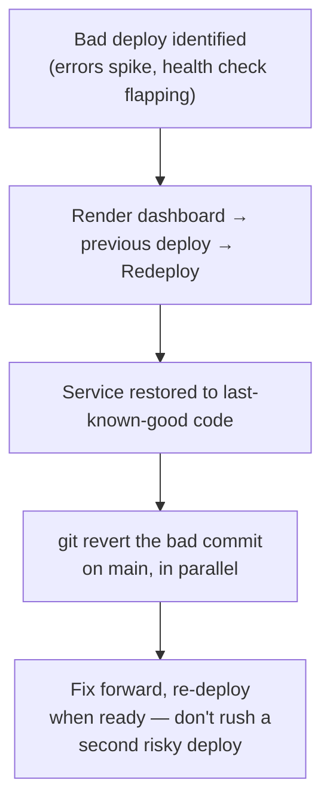
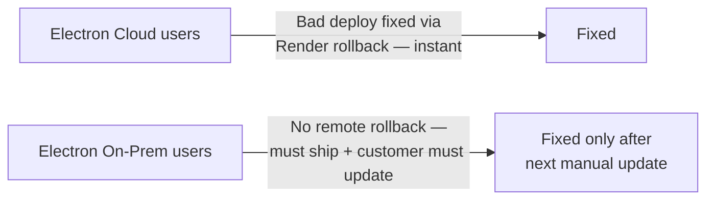

# Runbook: Deploy Rollback

## Cloud (Render) — the fast path

Render keeps previous successful deploys available for one-click rollback in its dashboard: **Render dashboard → dg-erp service → Deploys → select a previous healthy deploy → "Redeploy this version."** This re-runs that exact prior build/commit — no `git revert` required to restore service immediately.

:::warning Rolling back code does not roll back the database
`initSchema()` runs on every boot and only ever *adds* — rolling back to an older code version does **not** undo a schema change the bad deploy might have introduced (a new column, a new table). If the bad deploy included a schema change, the "old" code now runs against a database that has *extra* columns/tables it doesn't know about — usually harmless (extra columns are just ignored), but verify this assumption for any deploy involving a schema change specifically, rather than assuming rollback is a clean full undo. See [Migrations Strategy](/database/migrations-strategy).
:::

## What to check before declaring the rollback successful

1. `GET /api/health` returns `{ ok: true }`.
2. Spot-check the specific feature the bad deploy touched — health check passing doesn't mean the feature that was actually broken is now fixed for the previous version either (if the bug existed before this deploy too).
3. Check server logs for a drop in 5xx rate back to baseline.

## Electron / on-prem — a fundamentally different problem

**There is no rollback for a shipped Electron build already installed on a customer's machine.** Once `electron-builder` produces an installer and a customer downloads/runs it, "rolling back" means:

1. Ship a new patch release with the fix, as fast as possible.
2. If the bug is severe (data corruption risk), proactively reach out to affected on-prem customers rather than waiting for them to notice — there's no forced-update mechanism that can reach an already-running on-prem install faster than the customer choosing to update.
3. For Electron Cloud specifically (the thin wrapper that loads the live cloud URL) — a cloud-side rollback via Render **is** effectively instant for these users too, since they're not running bundled app code, just a window pointed at the live site. This is one of the real operational benefits of [ADR-006](/architecture/design-decisions)'s "thin cloud wrapper" choice.

## Fix playbook summary

| Surface | Rollback speed | Mechanism |
|---|---|---|
| Web / Electron Cloud | Minutes | Render dashboard redeploy of previous version |
| On-prem Electron | None — forward-fix only | Ship a patch, notify affected customers |

## Related

- [Deployment Overview](/deployment/overview)
- [Deployment → Render](/deployment/render)
- [Deployment → CI/CD](/deployment/cicd)
- [Migrations Strategy](/database/migrations-strategy)
- [Four Surfaces](/architecture/four-surfaces)
