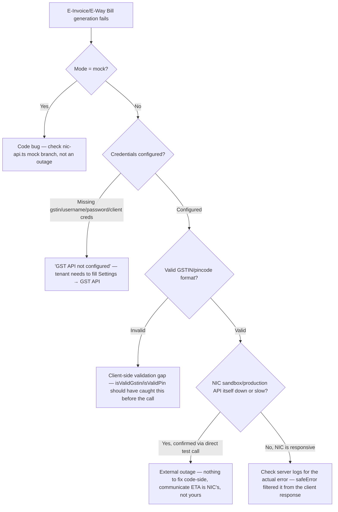

# Runbook — GST API Failures

## Symptoms

- A tenant reports they can't generate an E-Invoice (IRN) or E-Way Bill for a distribution batch.
- The error shown is generic (`Internal server error` or a short GST-specific message) — this is [by design](/sre/logging), so you'll need server-side logs to see the real cause.

## First question: what mode is this tenant in?

```sql
SELECT gst_api_mode, gst_api_gstin, gst_api_client_id FROM bill_settings WHERE tenant_id = $1;
```

| Mode | Behavior | Can this runbook even apply? |
|---|---|---|
| `mock` (default) | Never calls the real NIC API — always "succeeds" with synthetic IRN/EWB numbers | **No** — a failure in mock mode is a code bug, not an external API issue; treat it as a regular bug report, check `server/services/nic-api.ts`'s mock branch |
| `sandbox` | Calls NIC's sandbox/test environment | Yes — this runbook applies |
| `production` | Calls NIC's live production environment | Yes — this runbook applies, and is the highest-stakes case (real compliance documents) |

## Diagnosis flow



## Understanding the client-safe error filter

```ts
// server/routes/gst-api.ts
function safeError(err: unknown): string {
  const msg = err instanceof Error ? err.message : 'Internal server error';
  if (/^(GST API|IRN|EWB|E-way bill|not configured|already has|Batch not|required|Invalid|credentials|crypto|pincode|GSTIN|B2B)/i.test(msg)
      && msg.length < 160
      && !/[\\/]\w+\.\w+/.test(msg)
      && !/select\s|insert\s|update\s|relation\s/i.test(msg)) {
    return msg;
  }
  return 'Internal server error';
}
```

**What this means for you as the responder:** if the tenant sees a specific, readable error (e.g. "Valid 6-digit seller pincode required"), that's an *allowed* passthrough message — read it literally, it's accurate and was deliberately let through the filter. If they see the generic `Internal server error`, the real error was filtered out (likely because it looked like it might contain a file path, a SQL fragment, or wasn't recognized as one of the expected message shapes) — **you must check server-side logs** to see what actually happened; the client-visible message tells you nothing in this case.

## Common root causes, most to least frequent

1. **Missing/incomplete GST API credentials** — `gst_api_gstin`, `gst_api_username`, `gst_api_password`, `gst_api_client_id`, `gst_api_client_secret`, `gst_api_seller_pin` on `bill_settings` are all tenant-configured via Settings; any missing field for `sandbox`/`production` mode produces a "not configured" style error. Fix: have the tenant complete GST API settings.
2. **Invalid GSTIN or pincode format** — validated by `isValidGstin`/`isValidPin` (`server/utils/helpers.ts`, `server/services/nic-api.ts`) before any network call is made. If a tenant's own GSTIN or the buyer's pincode is malformed, this fails fast and cheaply — good, this is the validation working as intended, not a bug.
3. **NIC sandbox/production API outage or degraded latency** — genuinely outside your control. Confirm via a minimal direct test call (using the credentials, outside the app) if you suspect this, before spending time debugging application code for a problem that isn't there.
4. **Expired/rotated NIC credentials** — GST API credentials can expire or be revoked on NIC's side independent of anything in this codebase; if a previously-working tenant suddenly fails, ask when they last rotated their GSP/NIC credentials.
5. **`encryptSecret`/credential storage issue** — `server/utils/secret-crypto.ts` encrypts stored GST credentials at rest; a corrupted or improperly migrated encrypted value would surface as a decryption failure, which `safeError`'s regex would likely **not** pass through (since it doesn't match the allowed message prefixes) — meaning a generic `Internal server error` from this specific cause requires a log check to distinguish from every other filtered-out cause.

## What NOT to do

- **Don't switch a tenant to `mock` mode "to unblock them"** without their explicit understanding — mock mode produces synthetic IRN/EWB numbers that are **not valid for real compliance filing**. A tenant unknowingly issuing invoices with mock E-Invoice numbers thinking they're real is a compliance problem you'd be creating, not solving.
- **Don't log or echo the tenant's GST API password/credentials** anywhere, even for debugging — `redactPii`'s `PASSWORD_ASSIGN_RE` should catch obvious cases, but don't rely on it; never manually print credential fields.

## Related pages

- [File Walkthrough: server/services (nic-api.ts)](/files/server/services)
- [Logging](/sre/logging)
- [Failure Scenarios → Scenario 5](/sre/failure-scenarios)
- [Glossary → India GST Terms](/glossary/india-gst-terms)
