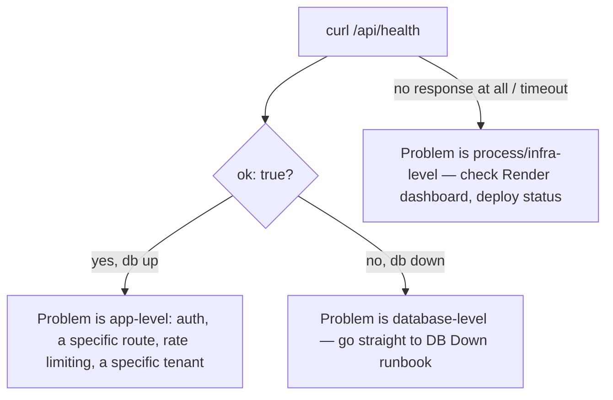
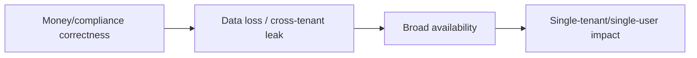

# Runbooks — When Something Is Actually on Fire

:::danger Read this page's structure once, calmly, before you ever need it under pressure
The whole point of a runbook is that you don't have to think clearly during an incident — you follow steps you already trust. Skim all the runbook titles below **right now**, so that during a real incident you can jump straight to the right one instead of searching.
:::

## 1. The universal first move

Regardless of symptom, run this first:

```bash
curl https://dhandho.app/api/health
```

This single endpoint (`GET /api/health` in `server/app.ts`) does a real `SELECT 1` against Postgres — not just "is the process alive." Its response immediately splits the incident into two very different investigation paths:



## 2. The full runbook catalog

| Runbook | Use when | Severity |
|---|---|---|
| [DB Down](/runbooks/db-down) | `/api/health` returns `db: false`, or every request 503s | Critical — whole fleet affected |
| [Auth Failures](/runbooks/auth-failures) | Logins failing broadly, or "session expired" reports spiking | Critical if broad, minor if one user |
| [Deploy Rollback](/runbooks/deploy-rollback) | A fresh deploy is misbehaving and you need to revert fast | Critical — time-sensitive |
| [Tenant Suspended](/runbooks/tenant-suspended) | A specific customer reports sudden lockout | Minor — single tenant |
| [Cloud Tenant Create 500](/runbooks/cloud-tenant-create-500) | Super Admin Create Cloud Tenant returns Internal server error | Moderate — blocks onboarding |
| [GST API Failures](/runbooks/gst-api-failures) | E-invoicing/e-way-bill generation failing for one or more tenants | Moderate — compliance-impacting but usually tenant-scoped |
| [Mobile Sync](/runbooks/mobile-sync) | Field/dealer staff report the mobile app "isn't updating" or "lost changes" | Moderate — usually resolves once connectivity returns, but data-loss claims need care |
| [On-Prem License](/runbooks/onprem-license) | An on-prem customer's install won't activate or has stopped heartbeating | Moderate — single customer, but potentially business-critical for them |

## 3. Triage priorities — what actually matters most



A wrong GST amount on an issued invoice, or a suspected cross-tenant data leak, outranks a full platform outage in urgency of *response* (even if the outage affects more users) — because the former can create legal/compliance exposure for a customer's own business, which is a category of harm you can't simply "wait out" the way you can wait out a Render infrastructure blip.

:::danger Any suspected cross-tenant data leak is a Sev-1, always
If you see even a hint that one tenant's data reached another tenant, stop what you're doing and treat it with the urgency of [Multi-tenancy](/architecture/multi-tenancy)'s "highest-severity class of bug" framing — this is not a "log it and move on" situation.
:::

## 4. What every runbook assumes you already know

Before your first on-call rotation, you should be comfortable with:

- [Request Lifecycle](/architecture/request-lifecycle) — so you know where in the pipeline something can fail
- [Multi-tenancy](/architecture/multi-tenancy) — so you recognize a cross-tenant leak the instant you see one
- [SRE Overview](/sre/overview) — for how logging/correlation IDs work in this codebase
- Where to find Render's dashboard/logs, and how to reach a database directly via `psql`

## 5. After the fire is out

Every incident, however small, deserves a short retro answering:

1. What was the first signal (customer report? monitoring? nothing until support noticed)? Could it have been caught earlier, and by what, specifically?
2. Which runbook (if any) matched, and did following it actually help, or did the real fix require deviating from it?
3. Is there a missing check in [Threat Model](/security/threat-model)'s accepted-risks table that this incident just re-validated or invalidated?

## Hands-on exercise

1. Without looking at any runbook content yet, write down from memory which runbook you'd reach for given only the symptom "customers report they can't log in, starting about 10 minutes ago." Then open [Auth Failures](/runbooks/auth-failures) and compare your instinct against the actual first diagnostic steps.
2. Pick one runbook and identify the exact log message or database query it tells you to check first. Try running that exact check against your local dev environment (even with nothing wrong) just to know what "healthy" output looks like before you ever need to compare it against "broken."

## Quiz

1. What's the single first command to run for almost any incident, regardless of symptom?
2. Why does a suspected cross-tenant leak outrank a full outage in response urgency, even though fewer users might be immediately affected?
3. What's the point of running a runbook's "healthy" diagnostic command before an incident ever happens?

<details>
<summary>Answers</summary>

1. `curl https://dhandho.app/api/health` (or the equivalent for your environment) — it immediately splits the investigation into database-level, app-level, or process/infra-level.
2. Because it represents a potential legal/compliance/trust failure for a customer's own business (their competitor seeing their data), a category of harm that can't simply be "waited out" the way an infrastructure outage can — the urgency is about the *type* of harm, not the number of users affected.
3. So you know what normal, healthy output looks like ahead of time — during a real incident, comparing broken output against a remembered baseline is much faster than trying to interpret it cold under pressure.

</details>

## Related pages

- [DB Down](/runbooks/db-down)
- [Auth Failures](/runbooks/auth-failures)
- [Deploy Rollback](/runbooks/deploy-rollback)
- [SRE Overview](/sre/overview)
- [SLIs & SLOs](/sre/slis-slos)
- [Threat Model](/security/threat-model)
