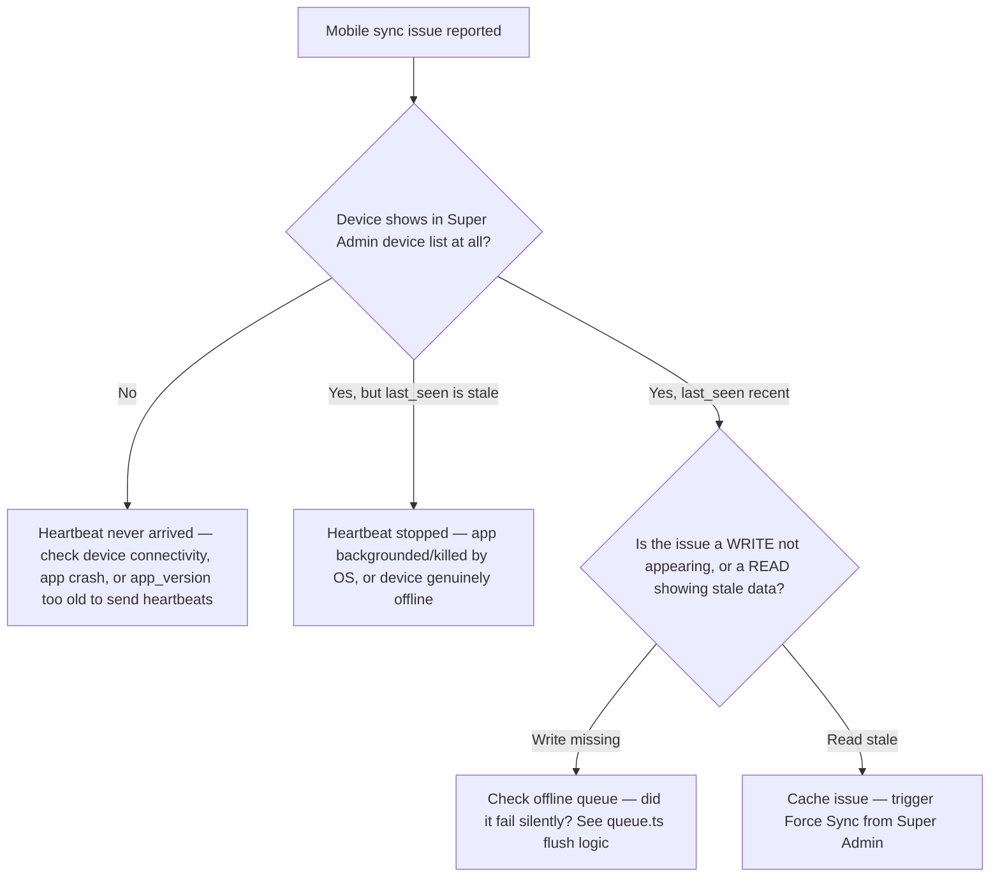

# Runbook — Mobile Sync Issues

## Symptoms

- A field user reports the mobile app shows stale/outdated data.
- A write made on mobile (e.g. recording a sale) doesn't appear on the web dashboard.
- Super Admin's device list (`MobileTenantPanel`) doesn't show a device that should be active.

## Understand the two totally different "sync" mechanisms first

This is the most important distinction to get right before diagnosing anything:

| Mechanism | What it does | Where |
|---|---|---|
| **Heartbeat** | Liveness ping every 60s — registers/updates a device row, has *nothing to do with data sync* | `src/platforms/mobile/online/mobileSync.ts` → `POST /api/mobile/heartbeat` |
| **Offline mutation queue** | Buffers *failed writes* made while offline, replays them when connectivity returns | `src/platforms/mobile/offline/queue.ts` → `flushOfflineQueue()` |
| **Force sync** | A Super-Admin-triggered command that clears the device's **read cache** and reloads | `src/platforms/mobile/offline/cache.ts` + `.../mobile-force-sync` API, client detects and calls `location.reload()` |

A "stale data" report is almost always about the **read cache**, not the offline queue — mobile always talks to the live cloud API for writes; it does not maintain a local database. The cache exists specifically to make a handful of `GET` endpoints (`CACHEABLE_GET` in `src/api.ts`: products, vendors, tenant-by-slug) feel instant and tolerate brief connectivity gaps, not to be a long-lived offline datastore.

## Diagnosis flow

## "A write I made on mobile never showed up"

1. Ask the user: were they definitely online (full bars/wifi) at the moment of the write, or possibly in a dead zone?
2. If offline at write time: `enqueueOfflineMutation()` (`src/platforms/mobile/offline/queue.ts`) should have queued it — check whether the app was later reopened with connectivity (the queue only flushes when the app actively attempts it, there's no background sync service running while the app is closed).
3. **Known limitation, not a bug**: `flushOfflineQueue()` stops (`break`) on the **first** network-level failure (`catch` block) — it doesn't try subsequent queued items after one fails on a connectivity error. If item #1 of 5 fails because connectivity dropped again mid-flush, items #2-5 are never attempted in that pass, even though they might have succeeded. This is a real, documented trade-off (avoids re-ordering writes incorrectly) — see [Lab: Offline Queue](/labs/lab-offline-queue) for a hands-on look.
4. **Also check**: permanent client errors (`4xx` except `401`/`429`) cause `removeOfflineMutation(item.id)` — the item is silently dropped from the queue rather than retried forever. If the original write had a validation error (e.g. a stale reference to a since-deleted product), it will not reappear, and the user has no in-app indication it was dropped versus successfully synced. This is the single biggest UX gap in the offline story — flag it if you're asked to improve mobile reliability.
5. **Auth headers are never persisted** in the queue (`sanitizeHeaders` strips `Authorization`/`x-tenant-id` before storing) — on flush, a *fresh* session's headers are attached. If the user's session expired while offline, the flush will fail with `401` for every queued item, and per the "stop on first network failure" logic above... actually a `401` is explicitly **not** in the "drop permanently" list (`res.status !== 401`), so `401`s are retried indefinitely rather than dropped — meaning a queue full of `401`s will sit there until the user re-authenticates and reopens the app, at which point a fresh flush attempt (with valid headers) should succeed.

## "Data looks stale on mobile"

1. In Super Admin → Tenants → Mobile panel, find the tenant, use **Force Sync**.
2. This sets `mobile_force_sync_at` on the tenant; the client's next heartbeat/poll detects this flag, calls `cacheInvalidateForApiPath` equivalent logic (clearing `cache.ts`'s stored entries), and reloads.
3. If Force Sync doesn't resolve it: ask the user to fully close and reopen the app (not just background/foreground) — a stuck WebView state can outlast a soft reload in rare cases.

## "Offline invoice/payment won't queue" (service tenant)

1. Confirm `business_type = service` — only service seats unlock the stronger offline queue (`isOfflineEntitled()` in `src/api.ts`).
2. Super Admin → Mobile panel → seat for this phone should be **active**, not suspended/revoked, and `device_id` should match the phone.
3. Ask the user to open the app online once — heartbeat must return `seatValid: true` / `offlineEnabled: true`. Stale `localStorage` is cleared on onboarding / skip and re-enabled only after a good heartbeat (or fresh activate).
4. If they transferred phones: SA must **clear device** (or rotate key) before the new phone can activate.
5. Architecture deep-dive: [Service Mobile Offline Seats](/architecture/mobile-service-seats).

## "Device never appears in the list at all"

1. Confirm the tenant actually issued a valid, non-expired invite (`mobile_invite_code`, `mobile_invite_expires_at`) if this is a brand-new device — an expired invite fails `POST /api/mobile/redeem-invite` outright, and the device never gets far enough to register.
2. Confirm the device's `VITE_API_ORIGIN` (baked in at build time — see [Mobile deployment](/deployment/mobile)) actually points at the correct cloud API — a misconfigured build pointing at a different environment (e.g. staging) would heartbeat somewhere you're not looking.
3. Check `mobile_min_version` — if the app's version is below the enforced minimum, confirm whether `forceUpdate` blocking behavior might be preventing the app from reaching the point where it would heartbeat at all (verify this in the actual client code path, since a `forceUpdate` UI could theoretically block before or after the heartbeat call depending on implementation order).

## Related pages

- [Mobile deployment](/deployment/mobile)
- [Service Mobile Offline Seats](/architecture/mobile-service-seats)
- [Lab: Offline Queue](/labs/lab-offline-queue)
- [Animations → Mobile Offline](/animations/mobile-offline)
- [File Walkthrough: server/routes (mobile.ts)](/files/server/routes)
