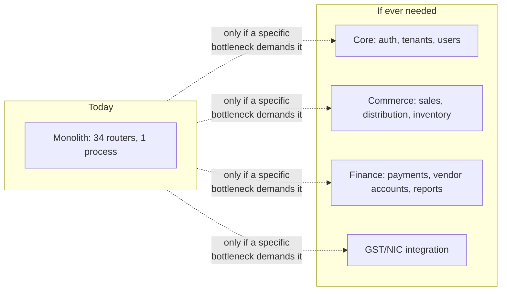

# Redesign Options

This page is speculative by design — a way of thinking through "what would we actually change if we had to," so that if a scaling problem does show up, you're not starting the conversation from zero.

:::caution Read this first
None of these are recommended *right now*. The monolith described in [Backend Overview](/backend/overview) is not currently bottlenecked in a way that justifies its own replacement cost. This page exists so the option space is understood *before* a crisis forces a rushed decision, not to suggest any of this is due.
:::

## Option 1 — Vertical scaling (do this first, do it for a long time)

Postgres and a single Express process can go surprisingly far. Before considering anything below, exhaust the cheap options: bigger Render instance, connection pool tuning, targeted indexes, and read replicas for reporting-heavy queries. Given the current traffic profile, this is likely sufficient for years, not months.

## Option 2 — Split the monolith by domain, not by "microservices" reflex

**Trade-off**: real microservices buy independent deployability and scaling, but cost cross-service transactions (the `finance` and `commerce` domains share transactions constantly today — see [Business Workflows](/architecture/business-workflows)), duplicated auth/tenant-context propagation, and a distributed-systems debugging tax that this team has not needed to pay yet. Only justified if one specific domain (e.g. GST/NIC calls under load) genuinely needs independent scaling from the rest.

## Option 3 — Read replicas + explicit read/write routing

If reporting queries (GSTR exports, analytics) start contending with transactional traffic, adding a Postgres read replica and routing read-heavy routes to it is far cheaper than a service split. Requires accepting slightly stale reads for reports, which is almost always fine for this use case (nobody needs a GSTR export to reflect the last 200ms of activity).

## Option 4 — Move RLS from backstop to primary mechanism

Currently the pool owner bypasses RLS (see [RLS](/database/rls)), so `WHERE tenant_id` in application code is the real enforcement. If a future requirement (e.g. a compliance certification, or a lower-trust internal tooling story) demanded database-enforced isolation regardless of application bugs, the path would be: create a non-owner, RLS-subject role for the app's connection pool, set `app.tenant_id` per-request via a **single, transaction-scoped connection** (not the ad hoc pool model used today), and re-verify every query still returns correct results. This is a meaningfully large migration, not a config flag.

## Option 5 — Introduce a real migration framework

If the team grows enough that concurrent schema changes across branches become a frequent merge-conflict/coordination problem, adopting something like `node-pg-migrate` alongside (not instead of) `initSchema()` for genuinely destructive/complex changes would add safety at the cost of the operational simplicity described in [Migrations Strategy](/database/migrations-strategy). This is a "when pain shows up," not "by default," decision.

## What would actually trigger each option

| Signal observed | Most likely fix |
|---|---|
| Postgres CPU/connections maxed, app CPU low | Read replica (Option 3), connection pool tuning (Option 1) |
| One domain's traffic (e.g. NIC calls) needs independent rate limits/scaling from the rest | Domain split (Option 2), scoped to that one domain only |
| A compliance/audit requirement mandates DB-level isolation | RLS-as-primary (Option 4) |
| Frequent schema-change merge conflicts across parallel feature branches | Migration framework (Option 5) |

:::tip Interview question
"A customer reports the app is slow during month-end GST filing season. Walk through how you'd figure out whether this needs Option 1, 3, or something else entirely." — the expected answer is a diagnosis process (check `pg_stat_activity`, slow query logs, connection pool exhaustion) *before* jumping to any architectural change, not a redesign pitch.
:::

## Related

- [Tech Debt Register](/scaling/tech-debt-register)
- [Database → RLS](/database/rls)
- [Database → Migrations Strategy](/database/migrations-strategy)
- [Runbooks → DB Down](/runbooks/db-down)
