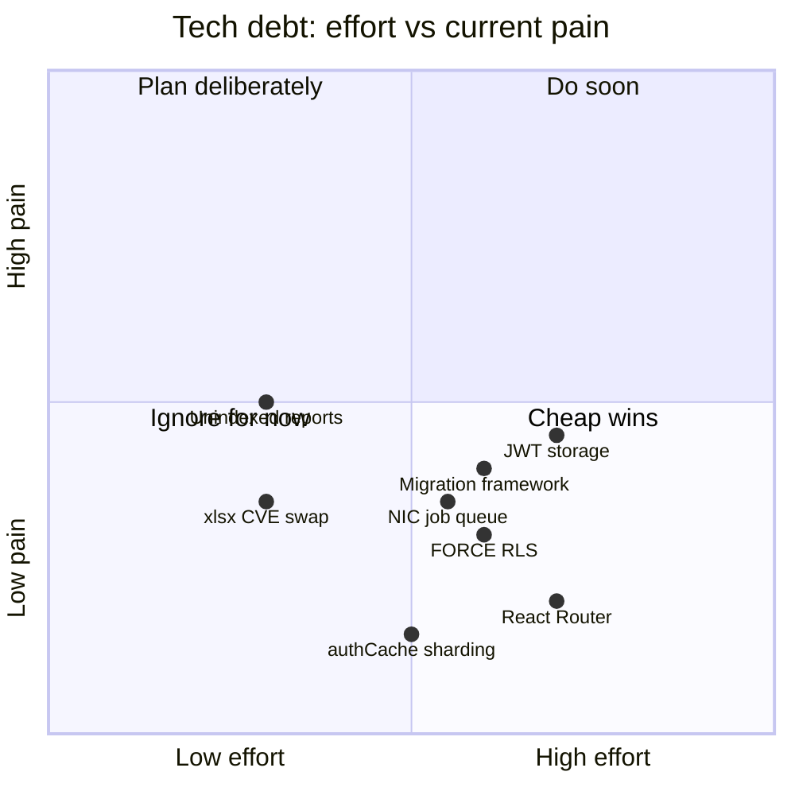

# Tech Debt Register — Known Trade-offs and When to Revisit Them

:::tip This is not a bug list
Everything on this page was a **deliberate, reasonable choice at the time** — not an oversight. The point of tracking it here is so nobody has to rediscover the trade-off from scratch, and so "revisit this" has a concrete trigger instead of vague unease.
:::

## How to read this register

| Column | Meaning |
|---|---|
| **Item** | The specific shortcut or simplification |
| **Cost today** | What it actually costs the team/product right now, concretely |
| **Trigger to revisit** | The measurable signal that means "now it's worth fixing" |
| **Fix sketch** | What the fix would roughly look like, so it's not a total unknown when the trigger fires |

## Register

### 1. No formal migration framework

| | |
|---|---|
| **Cost today** | No rollback path for a bad schema change; destructive changes (drop column, change type, rename) aren't well-served by `initSchema()`'s `IF NOT EXISTS` pattern; no per-environment migration history to audit "what schema state is prod actually in." |
| **Trigger to revisit** | The first time a genuinely destructive schema change is needed in production (not just additive), or the team grows past ~3-4 engineers regularly touching schema concurrently. |
| **Fix sketch** | Introduce a real migration tool (`node-pg-migrate`, Knex migrations, or similar) that runs *alongside* `initSchema()` initially — new changes go through migrations, `initSchema()` stays as the baseline for fresh installs (especially on-prem, which needs a from-scratch bootstrap). |

### 2. `authCache` assumes a single server instance

| | |
|---|---|
| **Cost today** | The 30-second in-memory role/permission cache is per-process. Nothing is broken with today's single-instance deployment, but it would silently under-invalidate (stale reads for up to 30s longer than expected) if the app were horizontally scaled behind a load balancer without a shared cache. |
| **Trigger to revisit** | The moment horizontal scaling (multiple app instances) is actually planned for cloud deployment — not before, since building shared-cache infrastructure for a single-instance deployment is pure speculative cost. |
| **Fix sketch** | Move `authCache` to Redis (or equivalent shared store) with the same TTL semantics, or reduce TTL further if latency budget allows, accepting more DB load in exchange for correctness under multi-instance deployment. |

### 3. `xlsx@0.18.5`'s known CVE (prototype pollution)

| | |
|---|---|
| **Cost today** | Low, because the library is only reachable via an authenticated, single-purpose upload flow (bank statement import) — not attacker-controlled input from an anonymous surface. Still a CVE that shows up in every dependency scan. |
| **Trigger to revisit** | A maintained, drop-in replacement library reaches feature parity for the specific `.xlsx` parsing this codebase needs, or the CVE severity/exploitability changes materially. |
| **Fix sketch** | Swap to `exceljs` or a similarly maintained alternative behind the same call site (`server/routes/banks.ts` or wherever the parse happens), re-test the exact statement formats currently supported. |

### 4. Hand-rolled tab routing, no React Router

| | |
|---|---|
| **Cost today** | No deep-linkable URLs for individual records/screens within a feature (e.g. can't bookmark "Sales → Invoice #4021"); no built-in nested route/loader/error-boundary machinery — each feature reimplements its own internal navigation state if it needs sub-views. |
| **Trigger to revisit** | A genuine product need for shareable/bookmarkable deep links into specific records (e.g. "email a customer a direct link to their invoice"), or the number of features with hand-rolled internal sub-navigation grows enough that the duplicated logic becomes its own maintenance burden. |
| **Fix sketch** | Introduce React Router incrementally, starting with the routes that most need deep-linking, rather than a big-bang rewrite of `App.tsx`'s tab state — the two can coexist during a transition. |

### 5. `FORCE ROW LEVEL SECURITY` cannot be enabled

| | |
|---|---|
| **Cost today** | RLS exists as a backstop but does not protect the application's own queries (pool owner bypasses it) — `WHERE tenant_id` in application code remains the sole real defense against a tenant-scoping bug. |
| **Trigger to revisit** | If the connection pooling strategy changes such that a single logical request reliably uses one physical connection throughout (removing the `SET app.tenant_id` cross-connection problem described in [Multi-tenancy](/architecture/multi-tenancy)), or if a session-pinning proxy (e.g. PgBouncer in session mode with careful configuration) is introduced. |
| **Fix sketch** | Re-evaluate connection-pinning behavior, add integration tests that would catch the "silently returns zero rows" failure mode before re-enabling FORCE, and only then flip it on with a monitored rollout. |

### 6. JWT stored in `localStorage`, not an `HttpOnly` cookie

| | |
|---|---|
| **Cost today** | Vulnerable to token theft via XSS (any successful script injection can read and exfiltrate the token); not vulnerable to CSRF, which is the trade-off's upside. |
| **Trigger to revisit** | A documented XSS finding in this app (even a low-severity one) that demonstrates real exploitability, or a compliance requirement that specifically mandates `HttpOnly` cookie-based sessions. |
| **Fix sketch** | Move to `HttpOnly` + `SameSite=Strict` cookies for web, add CSRF token verification on state-changing routes, and separately solve token storage for the Electron/Capacitor shells (which don't have the same cookie-jar semantics as a browser tab). |

### 7. Unindexed filters on high-cardinality report queries

| | |
|---|---|
| **Cost today** | Acceptable at current tenant/data volume; would become a real DB CPU/latency problem as individual tenants' transaction history grows into the hundreds of thousands of rows. |
| **Trigger to revisit** | `pg_stat_statements` (or equivalent) shows specific report/dashboard queries consistently in the slow-query tail, or a customer complains about report load times. |
| **Fix sketch** | Add targeted composite indexes matching the actual `WHERE`/`ORDER BY` clauses of the slow queries (measure first, don't guess), and consider a read-replica for reporting once OLTP write load starts contending with report read load. |

### 8. GST/NIC API calls run synchronously inline with the request

| | |
|---|---|
| **Cost today** | A slow or flaky NIC API response directly delays the user-facing request (invoice creation, e-way bill generation) — no background job queue insulates the UI from third-party latency. |
| **Trigger to revisit** | Measured NIC API latency/error rate becomes a meaningful contributor to user-facing latency complaints or timeout errors. |
| **Fix sketch** | Introduce a job queue (even a simple Postgres-backed one, consistent with the "no new infra unless earned" philosophy) for IRN/EWB generation, with the UI polling or receiving a webhook/notification on completion instead of blocking the original request. |

## Prioritization, roughly

:::info This chart is illustrative, not measured
Treat the positions as a discussion starting point, not a precise output of profiling — re-plot it with real numbers (query timings, incident counts, dependency scan severity) before using it to justify a roadmap decision.
:::

## Hands-on exercise

1. Pick one item from this register and write the smallest possible experiment that would tell you whether its "trigger to revisit" has actually fired yet (e.g. for unindexed reports, what specific `EXPLAIN ANALYZE` or `pg_stat_statements` query would you run?).
2. For the migration-framework item, sketch (in a scratch file, not committed) what the *first* real migration file would look like if you introduced `node-pg-migrate` today, migrating one existing table's most recent `ALTER TABLE` change out of `initSchema()`.
3. Add a ninth item to this register for something you've noticed yourself while reading the codebase that isn't listed here — follow the same four-column format.

## Quiz

1. What distinguishes an item on this register from a plain bug?
2. Why is "the team scales past 3-4 engineers touching schema concurrently" a reasonable trigger for adopting a migration framework, rather than adopting one immediately?
3. Why would enabling `FORCE ROW LEVEL SECURITY` today make tenant isolation *worse*, not better, despite RLS sounding like a stronger security posture?

Answers

1. It's a deliberate, reasoned trade-off made under real constraints (time, team size, risk tolerance) — not an oversight or defect; each item has a legitimate reason it was accepted at the time.
2. Building migration tooling before it's needed is speculative cost — `initSchema()`'s simplicity is a genuine advantage for a small team with low concurrent schema-change volume; the fix's value only exceeds its cost once change volume/team size grows enough to create real coordination pain.
3. Because of the connection-pooling mismatch: `SET app.tenant_id` on one physical connection doesn't apply to a different connection used later in the same logical request, so FORCE would cause those later queries to silently return zero rows instead of correct data — a silent data-loss-shaped failure that's worse than the current, well-understood reliance on `WHERE tenant_id`.

## Related pages

- [Design Decisions](/architecture/design-decisions)
- [Multi-tenancy](/architecture/multi-tenancy)
- [Threat Model](/security/threat-model)
- [SLIs & SLOs](/sre/slis-slos)
- [Learning: Interview Bank](/learning/interview-bank)
