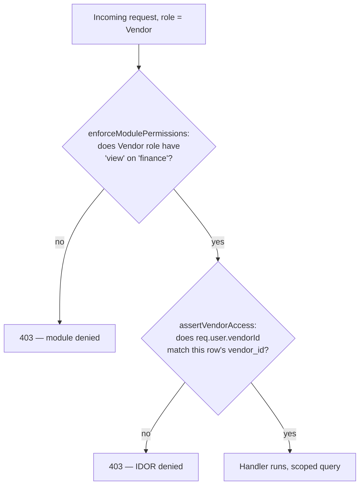

# Authorization

Authentication answers "who are you?" — this document is about "what are you allowed to do?" Dhandho implements a **role-based access control (RBAC)** system with a per-module, four-level permission grid, enforced by a **single global middleware** that every `/api/*` request passes through, plus a **separate, narrower guard family** specifically for the vendor portal's IDOR (Insecure Direct Object Reference) surface.

## The permission model

```1:26:server/middleware/permissions.ts
export type AccessLevel = 'hidden' | 'view' | 'print' | 'full';

const ALL_MODULES = [
  'dashboard', 'sales', 'distribution', 'inventory', 'purchases', 'quotations',
  'orders', 'finance', 'accounts', 'warranty', 'replacements', 'rewards', 'settings',
] as const;

const ROLE_PRESETS: Record<string, Record<string, AccessLevel>> = {
  Admin: Object.fromEntries(ALL_MODULES.map((m) => [m, 'full'])),
  'Super Admin': Object.fromEntries(ALL_MODULES.map((m) => [m, 'full'])),
  Manager: Object.fromEntries(ALL_MODULES.map((m) => [m, m === 'settings' ? 'view' : 'full'])),
  Staff: Object.fromEntries(ALL_MODULES.map((m) => [m, 'view'])),
  Warehouse: { dashboard: 'view', sales: 'hidden', distribution: 'print', inventory: 'view', /* ... */ },
  Vendor: { dashboard: 'view', sales: 'hidden', distribution: 'view', /* ... */ finance: 'view', /* ... */ },
};
```

Four access levels, ranked (`hidden < view < print < full`), apply to thirteen business modules. Five roles ship with sensible presets — but crucially, **`permissions` can also be a tenant-customized per-user JSON object** stored on the `users` row, overriding the role preset entirely for that one user. This is why `getAccessLevel` checks the actual `permissions` object first and only falls back to the role preset when it's empty or missing a key.

> [!NOTE]
> **Why four levels, and why is `print` its own level between `view` and `full`?** This is a direct reflection of how small Indian retail/distribution businesses actually operate: a Warehouse-role staff member should be able to *view* inventory and *print* distribution slips/labels for physical handling, but should never be able to *edit* a distribution record's price or discount — that's a Manager/Admin concern. Modeling `print` as its own rung, rather than lumping it into `full`, lets the business express "this person handles the physical/paper side of this module, not the financial side" without inventing a whole new module.

### The path → module mapping

Permissions are granted per **business module** (`sales`, `inventory`, `accounts`, ...), but requests arrive as API **paths** (`/api/customers/123`, `/api/gstr2b/summary`). `moduleForPath` bridges the two with an ordered prefix table:

```30:71:server/middleware/permissions.ts
const PATH_MODULE: [string, string][] = [
  ['/vendor-finance', 'finance'], ['/invoice-finance', 'finance'],
  ['/accounts', 'accounts'], ['/reports', 'accounts'], ['/gst', 'accounts'], /* ... */
  ['/customers', 'sales'], ['/mapping', 'sales'], ['/vendors', 'distribution'],
  /* ~30 more prefixes */
];
```

Notice `/customers` maps to the `sales` module and `/vendors` maps to `distribution` — these mappings encode real business semantics (a customer record is a sales concern; a vendor record is a distribution concern) that don't match the literal route file names one-to-one. **Any path not matched by this table is not gated by module permissions at all** (`moduleForPath` returns `null`, and `enforceModulePermissions` calls `next()` immediately) — which means adding a new feature module requires *remembering* to add its path prefixes here, or it silently runs ungated for module-permission purposes (still subject to `requireAdmin`/`requireRole` on that route if present, and always subject to authentication + tenant scoping).

### The global enforcement gate

```110:127:server/middleware/permissions.ts
export function enforceModulePermissions(req: AuthRequest, res: Response, next: NextFunction) {
  const user = req.user;
  if (!user?.userId) return next();
  const mod = moduleForPath(req.path);
  if (!mod) return next();
  const level = getAccessLevel(user.permissions, user.role, mod);
  const need: AccessLevel = req.method === 'GET' || req.method === 'HEAD' ? 'view' : 'full';
  if (RANK[level] < RANK[need]) {
    return res.status(403).json({ error: `Access denied for module "${mod}" (need ${need}, have ${level}).` });
  }
  next();
}
```

The rule that matters here: **`GET`/`HEAD` requires only `view`; every other verb (`POST`/`PUT`/`PATCH`/`DELETE`) requires `full`.** There is no separate `print`-level route gating at this layer — `print` access is a UI-level signal (show the print button, hide the edit button) that individual route handlers may additionally check, but the blanket module gate only distinguishes "can read" from "can write." This is mounted once in `server/app.ts`, after the JWT verification middleware, so it runs on **every** authenticated request regardless of which route file eventually handles it — a route author cannot forget to "add permission checking," because it already ran before their handler was reached.

> [!IMPORTANT]
> **Defense in depth, not defense in one place.** `enforceModulePermissions` stops most unauthorized module access, but several routes *also* call `requireAdmin`/`requireRole(...)` directly for actions that should be gated by *role* regardless of a tenant admin's custom permission JSON (e.g., deleting a tenant's own backup, managing other users). A tenant admin cannot grant a Staff user `full` access to `settings` and thereby let them create new Admin accounts — role checks for genuinely dangerous operations are hardcoded, not customizable via the permission grid.

### The client-side mirror — and why it's UI-only

`App.tsx`'s `getAccess()` (documented in [../frontend/app-shell.md](../frontend/app-shell.md)) implements the *same* rank logic purely to decide what to render — hide a sidebar link, disable a button, skip a lazy `import()`. It intentionally defaults an unrecognized role to `'hidden'` (the `H10` fix — an earlier version defaulted to `'full'`, a real privilege-escalation bug that shipped and was later closed). But this client logic is a UX convenience, not a security boundary: **`enforceModulePermissions` is what actually protects data**, and it would reject the request even if a user tampered with their local JS state to unhide a sidebar link.

## RBAC vs. IDOR — two different problems

RBAC (above) answers "does this *role* have access to this *module*?" It does **not** answer "does this *specific user* have access to *this specific row*?" That second question — classic IDOR — matters most in exactly one place in this codebase: the **vendor portal**, where multiple independent, mutually-distrusting vendor companies share the same tenant and the same `Vendor` role, and must be prevented from reading or modifying each other's records.



### The three vendor guards

```146:165:server/middleware/auth.ts
export function vendorScopeId(req: AuthRequest): string | null {
  if (req.user?.role !== 'Vendor') return null;
  return req.user.vendorId ?? null;
}

export function assertVendorLinked(req: AuthRequest): string | null {
  if (req.user?.role !== 'Vendor') return null;
  if (!req.user.vendorId) return 'Vendor account is not linked to a vendor profile.';
  return null;
}

export function assertVendorAccess(req: AuthRequest, vendorId: string): string | null {
  if (req.user?.role !== 'Vendor') return null;
  if (!req.user.vendorId) return 'Vendor account is not linked to a vendor profile.';
  if (req.user.vendorId !== vendorId) return 'Access denied for this vendor.';
  return null;
}
```

All three are no-ops for non-Vendor roles (an Admin calling the same route isn't scoped at all — RBAC already governs Admins). For a `Vendor`-role user, each serves a distinct purpose:

| Guard | Question it answers | Used when |
|---|---|---|
| `vendorScopeId(req)` | "What vendor is this JWT allowed to see, if any?" — returns the ID or `null` | Building a `WHERE vendor_id = $N` clause to **scope a list query** so a vendor only ever sees their own rows, silently — no error, just fewer results |
| `assertVendorLinked(req)` | "Is this Vendor-role account actually linked to a vendor profile at all?" | Guarding **list/search endpoints** up front — an unlinked Vendor account (a provisioning bug or in-progress setup) gets a clear `403` instead of silently seeing zero rows or, worse, unscoped rows |
| `assertVendorAccess(req, vendorId)` | "Is the vendor ID on *this specific record* the same vendor ID in the JWT?" | Guarding a **single-record read/write by ID** — e.g., `GET /api/finance/vendors/:vendorId` — the classic IDOR check: does path param `:vendorId` match `req.user.vendorId`? |

Real call sites make the pattern concrete:

```262:263:server/routes/sales.ts
const denied = assertVendorAccess(req, (sale.vendor_id as string) || '');
if (denied) return res.status(403).json({ error: denied });
```

```90:92:server/routes/finance.ts
const denied = assertVendorAccess(req, vendorId);
if (denied) return res.status(403).json({ error: denied });
```

```17:20:server/routes/vendors.ts
const jwtVendorId = vendorScopeId(req);
let sql = jwtVendorId
  ? 'SELECT * FROM vendors WHERE tenant_id = $1 AND id = $2'
  : 'SELECT * FROM vendors WHERE tenant_id = $1';
```

And a route that decided vendors should have **no access at all**, defensively, even though nothing currently routes them there:

```13:16:server/routes/invoices.ts
// Vendors have no standalone-invoice access (sales module is hidden; block IDOR if called)
if (vendorScopeId(req) || req.user?.role === 'Vendor') {
  return res.status(403).json({ error: 'Access denied.' });
}
```

> [!TIP]
> **Why not just rely on RBAC's `finance: 'view'` for vendors and call it done?** Because RBAC operates at the *module* granularity — it can say "Vendor role can view the finance module," but a tenant's finance module contains records for **every** vendor, not just the one calling the API. Without `assertVendorAccess`, Vendor A could call `GET /api/finance/vendors/<Vendor B's UUID>` and read Vendor B's outstanding balance and payment history — a textbook IDOR. The guard closes exactly that gap by comparing the JWT's `vendorId` against the record being requested, on top of (not instead of) the module-level RBAC check.

### Two IDOR failure modes covered, deliberately

1. **Unlinked vendor account** (`vendorId` is `null` on the JWT) — handled by `assertVendorLinked`, returning a clear error rather than accidentally falling through to an unscoped query.
2. **Cross-vendor access attempt** (`vendorId` mismatch) — handled by `assertVendorAccess`, returning `403` rather than a `404` (a `404` here would leak whether the target record exists at all — worth noting as a minor information-disclosure nuance, though this codebase does use `403` consistently for vendor-mismatch cases, which is arguably *more* revealing than a `404` would be; this is a deliberate trade-off toward clearer error messages over minimal information leakage, appropriate here because vendor IDs aren't secret and enumerating them isn't the realistic attack).

## Quiz

1. A tenant admin sets a Staff user's custom `permissions` JSON to grant `full` access to every module including `settings`. Can that Staff user now create a new Admin account? Why or why not?
2. What's the difference between what `vendorScopeId` and `assertVendorAccess` each protect against, given that both take a `req` and both check `req.user.vendorId`?
3. A new `/api/loyalty-cards` route is added but nobody adds it to `PATH_MODULE`. What happens when a Staff user (whose role preset gives `view`-only on every module) sends a `DELETE` to that route?

<details>
<summary>Answers</summary>

1. Not necessarily — genuinely dangerous account-management operations (like creating new Admin users) are gated by hardcoded `requireAdmin`/role checks in the relevant route handlers, independent of the customizable `permissions` JSON. The per-module permission grid controls access to *business modules*, not platform-level user/role management, specifically so a tenant can't accidentally (or a compromised Staff account can't maliciously) self-escalate by exploiting a permission grant.
2. `vendorScopeId` is a *query-scoping* helper used when building list/search queries — it returns the vendor's own ID (or `null`) so a `WHERE vendor_id = $N` filter can be applied, silently narrowing results. `assertVendorAccess` is a *gate* used when a specific record is being accessed by ID — it actively rejects the request with a `403` if the record's `vendor_id` doesn't match the caller's `vendorId`. One shapes a query; the other blocks a request.
3. `moduleForPath('/loyalty-cards')` returns `null` since no prefix matches, so `enforceModulePermissions` calls `next()` immediately — the module-permission gate does not block the `DELETE` at all. The request proceeds to the route handler, where it would only be blocked if that specific handler independently calls `requireAdmin`/`requireRole`. This is exactly the "forgot to register the path" gap called out above.

</details>

## Related reading

- [Threat Model](./threat-model.md) — Elevation of Privilege scenarios.
- [Authentication](./authentication.md) — how `req.user` gets populated in the first place.
- [Tenant Isolation](./tenant-isolation.md) — the *other* axis of access control (tenant vs. tenant, not role vs. role).
- [../frontend/app-shell.md](../frontend/app-shell.md) — the client-side `getAccess()` mirror and its UI-only caveat.
