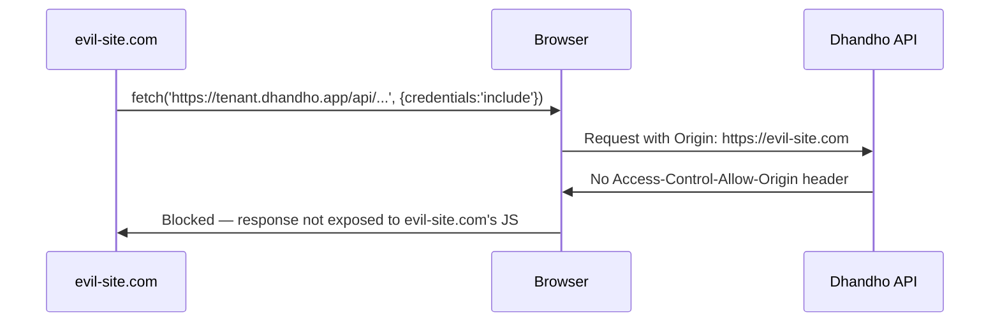

# Security Headers & CSP

Every response from the Express server carries a set of security headers configured once, globally, near the very top of `server/app.ts` — before route handlers, before body parsing, before rate limiting. Headers are cheap insurance: they cost nothing per-request to apply and close off entire categories of browser-side attacks (clickjacking, MIME-sniffing, mixed content) without touching a single route handler.

## The `helmet` configuration

```93:113:server/app.ts
app.use(helmet({
  contentSecurityPolicy: {
    directives: {
      defaultSrc: ["'self'"],
      scriptSrc: isProduction ? ["'self'"] : ["'self'", "'unsafe-inline'"],
      styleSrc: ["'self'", "'unsafe-inline'", "https://fonts.googleapis.com"],
      fontSrc: ["'self'", "https://fonts.gstatic.com"],
      imgSrc: ["'self'", "data:", "https:"],
      connectSrc: ["'self'", "https://wa.me", "https://mail.google.com"],
      objectSrc: ["'none'"],
      baseUri: ["'self'"],
      frameAncestors: ["'none'"],
    },
  },
  crossOriginEmbedderPolicy: false,
  // Capacitor/Electron call the JSON API cross-origin — default CORP same-origin would block them
  crossOriginResourcePolicy: { policy: 'cross-origin' },
  frameguard: { action: 'deny' },
  hsts: { maxAge: 31536000, includeSubDomains: true, preload: true },
  noSniff: true,
  referrerPolicy: { policy: 'strict-origin-when-cross-origin' },
}));
```

### Directive-by-directive rationale

| Directive | Value | Why |
|---|---|---|
| `default-src` | `'self'` | The baseline fallback for any resource type not explicitly listed below — deny everything except same-origin by default, then open up only what's actually needed. |
| `script-src` | `'self'` (prod) / `'self' 'unsafe-inline'` (dev) | **Production allows zero inline scripts.** This is the single most important line against XSS: even if an attacker manages to inject `<script>alert(1)</script>` into a page (say, through a stored-XSS bug somewhere), the browser refuses to execute it because it isn't loaded from a `'self'`-origin `<script src>`. Dev mode relaxes this because Vite's dev server injects inline HMR bootstrap scripts — a `'self'`-only CSP would make hot-reload development broken/unusable. |
| `style-src` | `'self' 'unsafe-inline' https://fonts.googleapis.com` | Tailwind's utility classes and any inline `style=` attributes generated by JS animation libraries (`motion`) require `'unsafe-inline'` for styles — this is a common, accepted trade-off since CSS injection is a much lower-severity risk than script injection. Google Fonts' stylesheet host is explicitly allowlisted. |
| `font-src` | `'self' https://fonts.gstatic.com` | Matches the Google Fonts stylesheet allowance — `gstatic.com` is where the actual font *files* referenced by that stylesheet are hosted. |
| `img-src` | `'self' data: https:` | `data:` allows inline base64 images (barcodes, generated QR codes, print previews rendered client-side); a broad `https:` allowance permits any HTTPS image host — a deliberately looser directive since product images/logos may be hosted on arbitrary customer-supplied URLs (a tenant's own CDN, a supplier's product photo URL, etc.) that can't be enumerated in advance. |
| `connect-src` | `'self' https://wa.me https://mail.google.com` | Restricts `fetch`/`XHR`/`WebSocket` targets. `wa.me` supports "share bill via WhatsApp" links; `mail.google.com` supports a Gmail-compose deep link for emailing documents. Everything else (a would-be data-exfiltration `fetch()` to an attacker's server, injected by XSS) is blocked at the browser level even if it makes it into executed JS. |
| `object-src` | `'none'` | Blocks `<object>`/`<embed>`/`<applet>` entirely — legacy plugin content with no legitimate use in this app and a historical source of sandbox-escape vulnerabilities. |
| `base-uri` | `'self'` | Prevents an injected `<base href="https://evil.com/">` tag from rewriting all relative URLs on the page to resolve against an attacker's domain. |
| `frame-ancestors` | `'none'` | The modern, CSP-based replacement for `X-Frame-Options` — no site, including Dhandho's own other pages, may embed this app in an `<iframe>`. Combined with `frameguard: { action: 'deny' }` below (belt-and-suspenders: older browsers honor `X-Frame-Options`, newer ones honor `frame-ancestors`). |

### Non-CSP helmet options

- **`crossOriginEmbedderPolicy: false`** — explicitly *disabled*. The default `COEP` header can break cross-origin resource loading (fonts, images from third-party CDNs) unless every one of those resources also opts in with `Cross-Origin-Resource-Policy` — which this app's dependencies (Google Fonts, WhatsApp links) don't necessarily set. Disabling it is a pragmatic call: the isolation benefits of COEP (mainly relevant for `SharedArrayBuffer`-using apps) don't apply here, and leaving it on would risk silently broken fonts/images in production.
- **`crossOriginResourcePolicy: { policy: 'cross-origin' }`** — Helmet's default `same-origin` CORP would block Capacitor WebViews (`https://localhost` / `capacitor://localhost`) and Electron from reading `/api/*` JSON even when CORS allows them. The API is intentionally readable cross-origin by those app shells.
- **`hsts: { maxAge: 31536000, includeSubDomains: true, preload: true }`** — a full one-year `Strict-Transport-Security` header with subdomain inclusion and preload-list eligibility. Once a browser sees this header once, it refuses to ever connect to this domain (or any subdomain) over plain HTTP again for a year, even if a user explicitly types `http://` — closing off SSL-stripping downgrade attacks. `preload: true` is an aggressive setting — submitting the domain to the browser vendors' HSTS preload list means *even a user's very first visit* is HTTPS-only, with the caveat that reverting is slow (removal from the preload list can take months to propagate).
- **`noSniff: true`** — sends `X-Content-Type-Options: nosniff`, preventing browsers from trying to guess ("sniff") a resource's type from its content rather than trusting the server's declared `Content-Type`. Blocks a specific old attack where a file uploaded/served as `.txt` but containing HTML/JS could be sniffed and executed as a script by a permissive browser.
- **`referrerPolicy: { policy: 'strict-origin-when-cross-origin' }`** — when a user clicks a link that leaves Dhandho (or a page makes a cross-origin request), the browser sends only the origin (`https://tenant.dhandho.app`), not the full path/query string, to the destination — preventing a leaked URL from revealing, say, a tenant slug embedded deep in a path to an unrelated third party.

> [!NOTE]
> **Why is `script-src` the one directive that changes between dev and prod, and nothing else?** Because it's the one directive where the dev-mode requirement (`'unsafe-inline'` for Vite's HMR client) and the prod-mode security goal (zero inline script execution, full XSS mitigation) are in direct, irreconcilable conflict. Every other directive (fonts, images, styles, connect targets) has the same real-world requirements in both environments, so there was no reason to loosen them for dev.

## CORS — hand-rolled, not the `cors` npm package

```115:138:server/app.ts
const allowedOrigins = (process.env.ALLOWED_ORIGINS?.split(',') || (isProduction
  ? [] // production must set ALLOWED_ORIGINS (assertCriticalEnv)
  : ['http://localhost:3000', 'http://localhost:3001', 'http://localhost:3002']))
  .map((o) => o.trim()).filter(Boolean);

const capacitorOrigins = new Set(['capacitor://localhost', 'ionic://localhost', 'http://localhost', 'https://localhost']);

app.use((req, res, next) => {
  const origin = req.headers.origin;
  if (origin && (allowedOrigins.includes(origin) || capacitorOrigins.has(origin))) {
    res.header('Access-Control-Allow-Origin', origin);
  }
  // Never reflect * — unlisted origins get no Allow-Origin header
  res.header('Access-Control-Allow-Methods', 'GET, POST, PUT, DELETE, OPTIONS');
  res.header('Access-Control-Allow-Headers', 'Content-Type, Authorization, X-Tenant-ID, X-Correlation-ID');
  res.header('Access-Control-Allow-Credentials', 'true');
  if (req.method === 'OPTIONS') return res.sendStatus(200);
  next();
});
```

This is roughly 15 lines of hand-written middleware instead of `app.use(cors({...}))`. The reasoning mirrors the "why hand-roll routing" decision in [../frontend/routing.md](../frontend/routing.md) — the actual requirement (an **explicit allowlist**, for browser and Electron origins) is simple enough that a well-understood 15-line middleware is easier to audit line-by-line than to configure correctly through a third-party library's options object, and it removes one more dependency from the security-critical path.

### Why an explicit allowlist matters here specifically

```
// Never reflect * — unlisted origins get no Allow-Origin header
```

The comment states the actual security property directly: **an unrecognized `Origin` header gets no `Access-Control-Allow-Origin` header at all**, not a wildcard `*` and not a reflected copy of whatever the request claimed. Combined with `Access-Control-Allow-Credentials: true` (required so the browser will actually send the `Authorization` header cross-origin from the SPA's own domain to the API's), reflecting `*` would be a critical CORS misconfiguration — browsers refuse to honor `Access-Control-Allow-Credentials: true` alongside a literal `*`, but a *reflected* origin combined with credentials would effectively let **any website on the internet** make authenticated, credentialed requests against a logged-in user's Dhandho session. The allowlist closes this off entirely: only origins the operator has explicitly configured via `ALLOWED_ORIGINS`  ever get a matching `Allow-Origin` response.



> [!IMPORTANT]
> **Production has no fallback allowlist.** In development, an empty `ALLOWED_ORIGINS` env var falls back to `localhost:3000-3002`. In production, it falls back to an **empty array** — `assertCriticalEnv` is relied upon to have already refused to boot the server if `ALLOWED_ORIGINS` isn't set in a production `NODE_ENV`. This fail-closed design means a misconfigured production deploy either doesn't start at all, or starts with CORS that rejects literally every browser-originated cross-origin request — never a silently-permissive one.

## Quiz

1. Why does `script-src` differ between development and production, while `img-src` and `connect-src` do not?
2. What specific attack does the `frame-ancestors: 'none'` directive prevent, and what's the older, non-CSP header that provides a similar (if less flexible) protection?
3. Why is reflecting the request's `Origin` header back as `Access-Control-Allow-Origin` for *every* origin dangerous specifically when combined with `Access-Control-Allow-Credentials: true`?

<details>
<summary>Answers</summary>

1. `script-src` has genuinely conflicting requirements between environments: Vite's development server injects inline `<script>` tags for its hot-module-reload client, requiring `'unsafe-inline'` to function at all in dev, while production serves a fully bundled app with zero inline scripts and can therefore enforce the much stricter `'self'`-only policy that meaningfully blocks XSS. `img-src` and `connect-src` have the same real-world needs (loading images from arbitrary HTTPS hosts, connecting to WhatsApp/Gmail) in both environments, so there's no reason to loosen them for dev.
2. `frame-ancestors: 'none'` prevents clickjacking — an attacker embedding the app in a hidden/disguised `<iframe>` on their own malicious page to trick a logged-in user into clicking UI elements they can't clearly see are Dhandho's. The older equivalent is the `X-Frame-Options: DENY` header, which this app also sets via `frameguard: { action: 'deny' }` for browsers that don't yet honor CSP's `frame-ancestors`.
3. Because `Access-Control-Allow-Credentials: true` tells the browser it's safe to expose a cross-origin response to the requesting page's JavaScript *even when the request included cookies/auth headers* — if the server also reflected back whatever `Origin` header the request sent (effectively "allow every origin"), then literally any malicious website could make an authenticated, credentialed request to the API on behalf of a user who simply has the Dhandho tab logged in elsewhere, and read the response. An explicit allowlist ensures only origins the operator trusts can ever receive that credentialed-response exposure.

</details>

## Related reading

- [Threat Model](./threat-model.md) — Spoofing and Information Disclosure sections.
- [OWASP Top 10 Mapping](./owasp.md) — A05 Security Misconfiguration.
- [../frontend/routing.md](../frontend/routing.md) — the parallel "hand-roll a simple thing rather than pull in a library" decision for routing.
