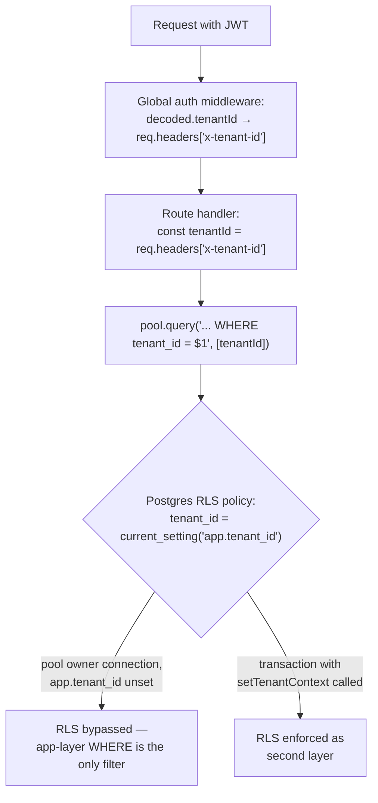

# Tenant Isolation

Dhandho is a single shared PostgreSQL database serving many independent tenants (businesses). The single most important security property of the entire system is: **Tenant A must never be able to read or write Tenant B's data.** This document explains the two layers that enforce that property, and — importantly — an explicit, documented decision *not* to add a third layer that seems obviously "more secure" on paper.



## Layer 1 (primary): application-layer `WHERE tenant_id = $N`

Every multi-tenant table has a `tenant_id` column, and the *entire application* is written under a strict convention: **every query against a tenant table includes `tenant_id` in its `WHERE` clause**, sourced from `req.headers['x-tenant-id']` — which itself is set exactly once per request, in the global auth middleware, from the **verified JWT's** `tenantId` claim (not from anything a client can set directly; if the middleware overwrites `req.headers['x-tenant-id']` after successful token verification, so any client-supplied value for that header is discarded and replaced).

```189:191:server/app.ts
if (decoded.tenantId && decoded.userId) {
  req.headers['x-tenant-id'] = decoded.tenantId;
```

This is the layer that does essentially all of the real work in this system. It's simple, it's visible in every route file (`const tenantId = req.headers['x-tenant-id'] as string;` appears dozens of times across `server/routes/*.ts`), and it's easy to code-review — a missing `tenant_id` filter in a new query is exactly the kind of thing a reviewer scanning a diff can and should catch.

> [!IMPORTANT]
> **This is a convention, not a compiler-enforced guarantee.** Nothing in TypeScript's type system prevents a new route handler from writing `SELECT * FROM customers WHERE id = $1` (forgetting `AND tenant_id = $2`) — it would compile fine and even work correctly for a single-tenant deployment. This is *exactly* the class of mistake Layer 2 exists to catch.

## Layer 2 (safety net): Postgres Row-Level Security

```888:938:server/pg-db.ts
// Row Level Security (RLS) — DB-level tenant isolation safety net
// RLS policies enforce tenant_id filtering at the DB level.
// Table owner (our pool user) bypasses RLS — this is intentional.
// RLS protects against: direct DB access, SQL injection, developer mistakes.
// To enforce RLS on owner too: ALTER TABLE ... FORCE ROW LEVEL SECURITY
const rlsTables = ['users', 'vendors', 'customers', 'products', /* ...31 tables total... */];
for (const table of rlsTables) {
  await client.query(`ALTER TABLE ${table} ENABLE ROW LEVEL SECURITY`);
  await client.query(`
    DO $$ BEGIN
      IF NOT EXISTS (SELECT 1 FROM pg_policies WHERE tablename = '${table}' AND policyname = '${table}_tenant_isolation') THEN
        CREATE POLICY ${table}_tenant_isolation ON ${table}
          USING (tenant_id = current_setting('app.tenant_id', true))
          WITH CHECK (tenant_id = current_setting('app.tenant_id', true));
      END IF;
    END $$
  `);
}
```

Every one of the 31 tenant-scoped tables gets an identical policy: rows are only visible/writable if `tenant_id` matches a session-local Postgres setting, `app.tenant_id`. That setting is populated via:

```7:11:server/pg-db.ts
export async function setTenantContext(client: import('pg').PoolClient, tenantId: string) {
  await client.query("SELECT set_config('app.tenant_id', $1, true)", [tenantId]);
}
```

`set_config(..., true)` — the third argument makes the setting **transaction-local**: it resets automatically at `COMMIT`/`ROLLBACK`, so it can never leak from one request's transaction into a pooled connection's next, unrelated use. This is invoked inside `withTenantClient` (a transaction helper used by specific routes that need RLS enforcement within an explicit transaction, most notably code paths dealing with sensitive per-barcode inventory operations) and inside `runInTenantTransaction`-style helpers.

## The deliberate decision: `ENABLE`, not `FORCE`

This is the single most important trade-off documented in this codebase's security posture, and it's spelled out directly in the source comments:

```939:943:server/pg-db.ts
// RLS policies are enabled (not forced) — the pool owner bypasses them,
// but the explicit WHERE tenant_id = $1 in every handler is the primary isolation.
// FORCE ROW LEVEL SECURITY was removed: without per-request SET LOCAL inside the
// same transaction, handlers use pool.query() on different connections where
// app.tenant_id is unset → FORCE RLS returns empty rows (silent data loss).
```

Here's the mechanics behind that comment, spelled out:

1. Postgres RLS has two modes: `ENABLE ROW LEVEL SECURITY` (policies apply to everyone **except** the table owner) and `FORCE ROW LEVEL SECURITY` (policies apply to **everyone, including the table owner**).
2. Dhandho's application connects to Postgres as the table owner (the same role that ran the migrations) — a common, simple setup for a small-to-medium application that doesn't run a separate, lower-privileged runtime DB role.
3. Most route handlers call `pool.query(...)` directly — a connection **pulled from a shared pool**, used once, and returned. `app.tenant_id` is a *per-connection* (well, per-transaction-with-`SET LOCAL`) setting; a bare `pool.query()` call has no transaction wrapper and therefore never calls `setTenantContext`.
4. **If `FORCE RLS` had been applied**, every one of those un-scoped `pool.query()` calls would suddenly be subject to the RLS policy — and since `app.tenant_id` was never set on that connection, `current_setting('app.tenant_id', true)` evaluates to `NULL`, which matches **no** `tenant_id` value. The query wouldn't error — it would silently return **zero rows**, indistinguishable from "this tenant genuinely has no data." That's a **worse** failure mode than what RLS is meant to prevent: not a security breach, but a silent, hard-to-diagnose data-loss bug affecting every single request in production.
5. So the team made an explicit, documented choice: **RLS is a safety net specifically against attack vectors that bypass the application layer entirely** — a raw SQL injection that manages to execute a query without going through the app's `WHERE tenant_id` convention, or a future engineer who connects to the database directly with a low-privilege, non-owner credential (e.g., a read-only analytics role) and forgets to filter by tenant. It is **not** a safety net against "the app's own `pool.query()` forgot the `WHERE` clause" — for that specific, most-likely failure mode, RLS with the current connection architecture would make things worse, not better.

> [!CAUTION]
> **The practical consequence: if you write a new route handler, `WHERE tenant_id = $N` is not optional, and RLS will not save you.** Because the connection pool doesn't set `app.tenant_id` per-request by default, and the app connects as the RLS-bypassing table owner, a handler that forgets the tenant filter will happily return (or modify) **every tenant's rows**, not zero rows and not an error. This is the actual, current, load-bearing security control — everything else in this document is context for *why* that's true and what would need to change to make it not true.

### What would it take to safely `FORCE` RLS?

The comment implies the fix, if this were ever revisited: every single request would need its own transaction (or at minimum, its own `SET LOCAL app.tenant_id` at the top of every request, tied to connection checkout) rather than ad-hoc `pool.query()` calls scattered across handlers — a much larger architectural change (effectively moving from "connection pool + occasional transactions" to "always wrap requests in a transaction with tenant context set first") that wasn't judged worth the engineering cost and behavioral risk for the isolation improvement it would buy, given that the primary application-layer control is already comprehensive.

## Quiz

1. A new engineer writes `SELECT * FROM warranties WHERE id = $1` (forgetting `tenant_id`) in a new route. What actually happens when a user from Tenant A requests a warranty ID that belongs to Tenant B, given the current RLS configuration?
2. Why would switching to `FORCE ROW LEVEL SECURITY` today, without any other changes, likely make the system *less* reliable rather than more secure?
3. What specific class of attack does `ENABLE` (non-forced) RLS actually protect against, given that it doesn't protect against the app's own missing `WHERE` clauses?

<details>
<summary>Answers</summary>

1. The query executes as the table-owner Postgres role, which `ENABLE ROW LEVEL SECURITY` (not `FORCE`) exempts from the policy entirely — so the query returns Tenant B's warranty row, unfiltered, to Tenant A's user. RLS provides no protection here because the connection is the RLS-bypassing owner role and there was no `tenant_id` filter in the query itself.
2. Because most route handlers use `pool.query()` directly without wrapping every request in a transaction that calls `setTenantContext`/`set_config('app.tenant_id', ...)` first. Under `FORCE RLS`, any query on such an unscoped connection would evaluate `current_setting('app.tenant_id', true)` as `NULL`, matching no policy rows, and silently return zero rows instead of the correct data — a silent data-loss bug affecting nearly every request, which is worse than the security gap it would attempt to close.
3. It protects against access paths that bypass the application's route-handler code entirely but still connect to Postgres as a *non-owner* role with `app.tenant_id` correctly set (or as a role subject to the policy) — for example, a lower-privileged analytics/reporting connection, a future admin tool connecting directly to the database, or a SQL-injection payload that somehow executes under a non-owner role. It does not protect against the owner-role application connection simply forgetting its own `WHERE` clause.

</details>

## Related reading

- [Threat Model](./threat-model.md) — Information Disclosure section.
- [Accepted Risks](./accepted-risks.md) — this exact trade-off, listed as a formally accepted risk.
- [Authorization](./authorization.md) — the vendor-portal IDOR guards, which protect a *narrower* slice of the same "wrong row" problem within a single tenant.
- [../performance/database.md](../performance/database.md) — how the same `tenant_id` columns are indexed for query performance, not just isolation.
