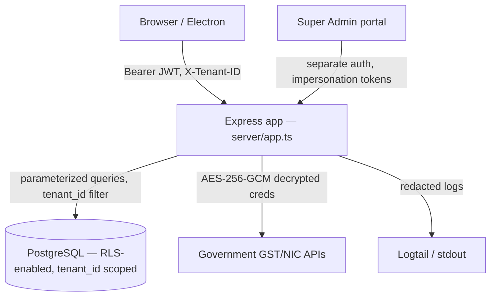
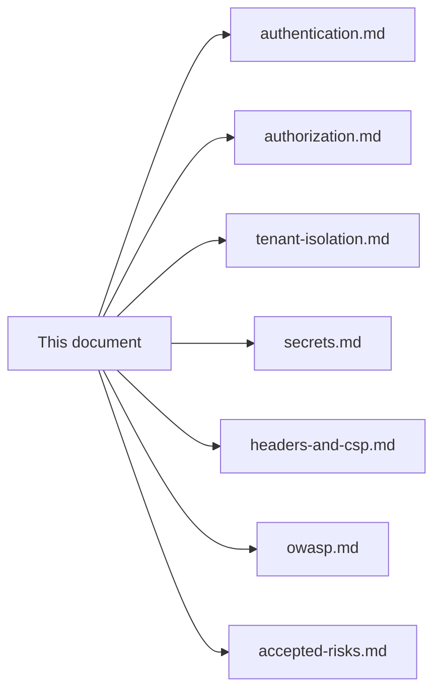

# Threat Model — Multi-Tenant ERP

Dhandho is a **multi-tenant SaaS ERP** (plus an on-prem/desktop variant) holding financial records, GST/tax credentials, customer PII, and vendor payment data for many independent businesses on shared infrastructure. This document applies **STRIDE** (Spoofing, Tampering, Repudiation, Information Disclosure, Denial of Service, Elevation of Privilege) to the architecture actually implemented, cross-referencing where each threat is mitigated elsewhere in these docs.

> [!NOTE]
> **Why STRIDE, and why here first?** A threat model is only useful if it's grounded in what the system actually does, not a generic checklist. Every row below points at real code — this document is the map; [authentication.md](./authentication.md), [authorization.md](./authorization.md), [tenant-isolation.md](./tenant-isolation.md), and [secrets.md](./secrets.md) are the terrain.

## System context

**Trust boundaries** (each is a place where an attacker-controlled input crosses into a more-trusted context):

1. Browser ⇄ Express (`server/app.ts`'s global middleware stack — the biggest boundary).
2. Express ⇄ PostgreSQL (parameterized queries + RLS as defense-in-depth).
3. Tenant A's data ⇄ Tenant B's data (the *entire point* of multi-tenancy — see [tenant-isolation.md](./tenant-isolation.md)).
4. Vendor-role user ⇄ another vendor's records within the same tenant (the vendor-portal IDOR surface — see [authorization.md](./authorization.md)).
5. Super Admin ⇄ tenant admin (the impersonation boundary — see [authentication.md](./authentication.md)).
6. Express ⇄ Government GST/NIC APIs (credentials at rest — see [secrets.md](./secrets.md)).

## STRIDE analysis

### Spoofing — pretending to be someone else

| Threat | Mitigation | Residual risk |
|---|---|---|
| Forging a JWT to impersonate a user | HS256 signature verified server-side on every request (`jwt.verify(token, JWT_SECRET, { algorithms: ['HS256'] })`) — see [authentication.md](./authentication.md) | `JWT_SECRET` compromise breaks this entirely; see [secrets.md](./secrets.md) for how that secret is protected |
| Client-side JWT decode used for UI trust | `App.tsx`'s `decodeJwtPayload` does **not** verify signature — used only for nav rendering, never for actual access control (see [../frontend/app-shell.md](../frontend/app-shell.md)) | None — every real decision re-verifies server-side |
| CSRF (forging a request as a logged-in user from another site) | Auth is Bearer-token-in-header, not cookie-based — a third-party site cannot attach a stolen browser's `Authorization` header to a cross-origin request the way it could ride along cookies automatically | The trade-off this buys is discussed in [accepted-risks.md](./accepted-risks.md) — token-in-localStorage instead of httpOnly cookie |
| Login as another tenant's user via email collision | `auth.ts` explicitly refuses ambiguous multi-tenant email matches without a `slug`, and scopes lookup by `t.slug` when provided (the `H3`/`M2` fixes) | Low — requires the attacker to know both a valid email and correct password anyway |

### Tampering — modifying data or requests in transit/at rest

| Threat | Mitigation | Residual risk |
|---|---|---|
| SQL injection | All queries use `pg`'s parameterized `$1, $2, ...` placeholders; dynamic identifiers (`DELETE FROM ${table}`) only ever come from **hardcoded arrays** in admin/backup code, never request input — see [owasp.md](./owasp.md) A03 | Any future code that string-interpolates a request value into SQL would reintroduce this — code review discipline is the control |
| Tampering with JWT claims (e.g., editing `role` in the payload) | Signature verification rejects any payload byte change | None if `JWT_SECRET` is strong and unleaked |
| Tampering with permission checks client-side | Every module/route re-checks permissions server-side (`enforceModulePermissions`) independent of what the client sends | None — see [authorization.md](./authorization.md) |
| A vendor editing another vendor's distribution/finance record by guessing an ID | `assertVendorAccess`/`vendorScopeId` guards on every vendor-scoped route | See [authorization.md](./authorization.md) for the specific IDOR guard inventory |

### Repudiation — denying an action was taken

| Threat | Mitigation | Residual risk |
|---|---|---|
| An admin deletes/modifies data and denies it | `audit_log` table records `LOGIN`, `PASSWORD_CHANGE`, `IMPERSONATE`, `ADMIN_PASSWORD_RESET`, deletions, and more, with `user_id`/`user_name`/`details` — see `logAudit` calls across `server/routes/*.ts` | Audit log itself is tenant-scoped and mutable by direct DB access; it's an operational record, not a tamper-evident ledger (e.g., no hash chaining) |
| Super Admin impersonates a tenant admin and denies actions taken during impersonation | The impersonation token carries `impersonatedBy: saId` and is logged via `logAudit(..., 'IMPERSONATE', ...)` at grant time | Actions *taken while impersonating* are logged under the tenant admin's identity, not double-tagged with the impersonator per-action — a real gap worth knowing about |

### Information Disclosure — exposing data to those who shouldn't see it

| Threat | Mitigation | Residual risk |
|---|---|---|
| Cross-tenant data leakage | Every query filters `WHERE tenant_id = $1`; Postgres RLS policies as a second layer | RLS is `ENABLE`d but not `FORCE`d — the pool-owner DB role bypasses it; see [tenant-isolation.md](./tenant-isolation.md) and [accepted-risks.md](./accepted-risks.md) |
| XSS reading `localStorage` (JWT, session data) | PII (phone/address/GST) explicitly stripped before persisting `user` (`sanitizeUserForStorage` in `session.ts`); no `dangerouslySetInnerHTML` anywhere (enforced by CI grep) | JWT itself is still in `localStorage` — accepted risk, see [accepted-risks.md](./accepted-risks.md) |
| PII leaking into logs | `redactPii`/`redactContext` in `server/utils/pii.ts` strip emails, phone numbers, JWTs, `Bearer` tokens, and password-like key/value pairs from every log line before it reaches stdout/Logtail | Regex-based redaction can miss novel PII shapes not matching the patterns |
| Stack traces leaking internals in error responses | Production 500 responses are rewritten to `{ error: 'Internal server error', correlationId }`; stack traces only attached to internal log entries when `!isProduction` | None in the happy path; a misconfigured `NODE_ENV` would be the failure mode |
| GST portal credentials exposed at rest | AES-256-GCM encryption before storing `gst_api_password`/`gst_api_client_secret` — see [secrets.md](./secrets.md) | Key is derived from `JWT_SECRET` — a single secret compromise affects both JWTs and encrypted credentials |

### Denial of Service

| Threat | Mitigation | Residual risk |
|---|---|---|
| Brute-forcing login | `express-rate-limit`: 5 login attempts/minute/IP | IP-based limiting can be bypassed by a distributed attacker; no account-level lockout |
| Credential-stuffing password reset | 3 forgot-password requests/hour, 5 reset attempts/hour | Same IP-based caveat |
| General API flooding | Global `/api/` limit: 300 requests/minute/IP | A large, legitimate multi-user tenant sharing a NAT'd IP could hit this ceiling — a real operational trade-off |
| Backup restore payload abuse | `/api/backup/restore` allows a 50MB JSON body (vs. 2MB default elsewhere) | Large-payload processing cost is bounded by size but not by processing complexity |
| Connection pool exhaustion | `pg.Pool` capped at `max: 10` (production) / `20` (dev), `connectionTimeoutMillis: 10000` | A slow query holding a connection under load reduces pool availability for everyone — see [../performance/database.md](../performance/database.md) |

### Elevation of Privilege

| Threat | Mitigation | Residual risk |
|---|---|---|
| Unknown/malformed role defaulting to full access | The `H10 fix` in `App.tsx`'s `getAccess()` explicitly defaults unknown roles to `'hidden'`, not `'full'` (client-side UI only) | Server-side `ROLE_PRESETS` fallback in `permissions.ts` defaults to `Staff` preset for an unrecognized role — worth confirming this stays conservative as roles evolve |
| A Staff/Manager user calling an Admin-only route directly (bypassing the UI) | `requireRole`/`requireAdmin` middleware on sensitive routes, `enforceModulePermissions` globally | Relies on every sensitive route remembering to apply the middleware — a missed route is a real, code-review-dependent risk |
| Password change on one device not invalidating sessions on other devices | `password_changed_at` compared against JWT `iat` on every request via `authMiddlewareStrict`/the global gate — a password change invalidates **all** existing tokens instantly, not just the current one | The 30s `authCache` window means a just-changed password could still work for up to 30s on other devices — see [../performance/caching.md](../performance/caching.md) |
| Super Admin impersonation used as a permanent backdoor | Token is scoped to **15 minutes** (`expiresIn: 900`), and every grant is audited | If the impersonation link itself leaks (e.g., via a compromised support channel) within that 15-minute window, it's a valid, if short-lived, admin session — see [authentication.md](./authentication.md) |

## Where each mitigation is documented in depth

## Quiz

1. Name two independent layers of defense against cross-tenant data leakage in this system, and explain why relying on only one of them would be riskier.
2. Why is client-side JWT decoding (in `App.tsx`) not a Spoofing vulnerability, even though it never checks the signature?
3. What residual risk does the 30-second `authCache` TTL introduce for the "revoke access on password change" mitigation?

Answers

1. (a) Every query explicitly filters `WHERE tenant_id = $1` at the application layer, and (b) Postgres Row-Level Security policies enforce the same filter at the database layer as a safety net. Relying only on (a) means a single forgotten `WHERE` clause in one route is a full cross-tenant leak with no backstop; relying only on (b) wouldn't work today anyway since RLS isn't forced on the pool-owner connection the app actually uses.
2. Because the decoded payload is used **only** to decide what to render in the UI (which nav items to show) — it is never trusted as an access-control decision. Every actual data-returning or data-mutating request re-verifies the token's cryptographic signature server-side, so a forged client-side payload can at most make the UI show/hide the wrong sidebar items, not access anything.
3. A user's password change is enforced by comparing `password_changed_at` to the JWT's `iat` claim, but that comparison happens against a row that may be served from the 30-second `authCache` rather than a fresh database read — so a token issued just before a password change could theoretically still pass validation for up to ~30 seconds after the change, on a request that hits a still-warm cache entry.

## Related reading

- [Authentication](./authentication.md), [Authorization](./authorization.md), [Tenant Isolation](./tenant-isolation.md), [Secrets](./secrets.md), [Headers & CSP](./headers-and-csp.md), [OWASP Top 10 Mapping](./owasp.md), [Accepted Risks](./accepted-risks.md)
