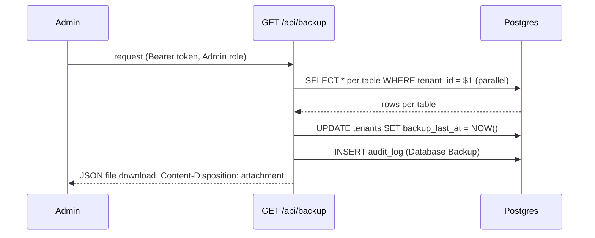

# Disaster Recovery

DG-ERP's backup story is deliberately simple: **per-tenant JSON export/import over HTTP**, not `pg_dump`/`pg_restore`, and not automated today. This page explains exactly how it works, why it was built this way, and what's genuinely missing.

## Why not `pg_dump`?

`pg_dump` is the obvious answer for "backup a Postgres database" — but this product needs backups that work identically for:

- **Cloud tenants**, sharing one managed Postgres instance with 100+ other tenants (you cannot `pg_dump` "just tenant A" out of a shared database with a single command, and you don't want customer-facing backup features that require SSH/DB access anyway).
- **On-prem installs**, where the customer's Electron app embeds Postgres locally (`electron/onprem/pg-manager.ts`) and there's no guarantee of `pg_dump` binary compatibility, disk space for a dump file, or an operator who knows how to run one.

A per-tenant, application-level JSON export solves both: it's just an authenticated HTTP call, works identically in both deployment modes, and produces a portable artifact a non-technical admin can download and store themselves.

## `GET /api/backup` — how export works

```ts
// server/routes/audit.ts (abridged)
router.get('/api/backup', requireAdmin, async (req: AuthRequest, res) => {
  const tenantId = req.headers['x-tenant-id'] as string;
  const tables = ['products', 'product_inventory', 'product_distribution', 'product_sales',
    'product_purchases', 'vendors', 'vendor_payments', 'customers', 'warranties', 'rewards',
    'reward_rules', 'quotations', 'orders', 'credit_debit_notes', 'price_lists', 'categories',
    'suppliers', 'supplier_payments', 'banks', 'bill_settings', 'staff_members',
    'staff_payments', 'audit_log'];

  // Fetch every table's rows scoped to this tenant, in parallel
  await Promise.all(tables.map(async (table) => {
    const { rows } = await pool.query(`SELECT * FROM ${table} WHERE tenant_id = $1`, [tenantId]);
    backup[table] = rows;
    counts[table] = rows.length;
  }));

  // + tenant metadata + users, wrapped in a _meta envelope
  const data = { _meta: { version: '1.0', exportedAt, tenantId, companyName, tableCounts, totalRecords }, users, ...backup };

  await pool.query('UPDATE tenants SET backup_last_at = NOW() WHERE id = $1', [tenantId]);
  await logAudit(pool, tenantId, 'Database Backup', 'system', undefined, `Exported ${totalRecords} records...`);

  res.setHeader('Content-Disposition', `attachment; filename="backup-${slug}-${date}.json"`);
  res.send(JSON.stringify(data, null, 2));
});
```



**What's included:** 22 tenant-scoped tables plus tenant metadata and `users` (id/email/name/role/phone/address — password hashes are **not** included; a restored tenant's users would need password resets, which is a deliberate security choice, not an oversight).

**What's not included:** anything not in the `tables` array — check the list above against the full 38-table schema in `server/pg-db.ts`. Notably absent: `expenses`, `standalone_invoices`, `invoice_payments`, `password_reset_tokens`, `tenant_stats`. If your team adds a new table, it does **not** automatically get backed up — see the [First Feature tutorial](/tutorials/first-feature)'s stretch goal on this exact gap.

## `POST /api/backup/restore` — how restore works, and why it's careful

Restore is the riskier half, and the code reflects that with an explicit allowlist:

```ts
const BACKUP_COLUMN_ALLOWLIST: Record<string, Set<string>> = {
  products: new Set(['id','name','barcode', /* ...only these columns... */ 'created_at']),
  // ...one entry per restorable table...
};
```

**Why an allowlist and not "insert whatever's in the JSON":** the restore endpoint builds SQL column lists dynamically from the uploaded file's keys. If it trusted arbitrary JSON keys as column names, a maliciously crafted backup file could attempt SQL injection via the column list (`INSERT INTO products (${cols.join(',')}) ...`), or write to columns that shouldn't be client-writable (`tenant_id` of a *different* tenant, internal-only fields). The allowlist is the specific defense — every column that's ever inserted during restore is named explicitly in this table, not derived from user input.

**Restore flow:**

```ts
router.post('/api/backup/restore', requireAdmin, async (req, res) => {
  const data = req.body; // up to 50mb — see express.json({ limit: '50mb' }) on this specific path
  if (!data?._meta) return res.status(400).json({ error: 'Invalid backup file — missing _meta header' });
  if (data._meta.version !== '1.0') return res.status(400).json({ error: `Unsupported backup version: ${data._meta.version}` });

  // 1. DELETE existing rows for tables in a dependency-safe order
  for (const table of clearOrder) await client.query(`DELETE FROM ${table} WHERE tenant_id = $1`, [tenantId]);

  // 2. Re-INSERT only allowlisted columns, forcing tenant_id to the *current* tenant
  for (const table of restoreTables) {
    for (const row of data[table] ?? []) {
      row.tenant_id = tenantId; // never trust the file's tenant_id
      const cols = Object.keys(row).filter(k => allowed.has(k));
      await client.query(`INSERT INTO ${table} (${cols.join(',')}) VALUES (...) ON CONFLICT ... DO NOTHING`, ...);
    }
  }
});
```

Three defenses worth naming explicitly:

1. **`row.tenant_id = tenantId` before insert** — even if you restore tenant A's backup file into tenant B's account, every row lands under tenant B. This prevents restore from becoming a cross-tenant data-injection vector.
2. **The whole thing runs in one transaction** (`BEGIN`/`COMMIT`/`ROLLBACK`) — a mid-restore failure rolls back cleanly rather than leaving a half-restored tenant.
3. **`ON CONFLICT DO NOTHING`** — restoring twice, or restoring over partially-existing data, doesn't throw duplicate-key errors; it silently skips rows that already exist by primary key.

**What restore does NOT protect against:** it does not verify the backup came from *this* tenant, or from any tenant at all that the calling Admin has rights to — only that the caller is an Admin of *some* tenant, and the restore always targets *their own* tenant (via `req.headers['x-tenant-id']`, not anything from the file). This is intentional — an Admin restoring "any JSON shaped like a Dhandho backup" into their own tenant is a feature (import from an old export, migrate between environments), not a bug, as long as tenant isolation on write is airtight (which the `row.tenant_id = tenantId` line guarantees).

## Backup settings — scheduling exists as configuration, not automation yet

`GET`/`PUT /api/backup/settings` let a tenant configure `backup_enabled`, `backup_frequency` (`daily`/`weekly`/`monthly`/`custom`), `backup_interval_days`, and `backup_email` — these columns exist on the `tenants` table (`server/pg-db.ts`):

```sql
ALTER TABLE tenants ADD COLUMN IF NOT EXISTS backup_enabled BOOLEAN DEFAULT false;
ALTER TABLE tenants ADD COLUMN IF NOT EXISTS backup_frequency TEXT DEFAULT 'weekly';
ALTER TABLE tenants ADD COLUMN IF NOT EXISTS backup_interval_days INTEGER DEFAULT 7;
ALTER TABLE tenants ADD COLUMN IF NOT EXISTS backup_last_at TIMESTAMPTZ;
ALTER TABLE tenants ADD COLUMN IF NOT EXISTS backup_email TEXT;
```

:::warning Gap: no scheduler actually reads these columns yet
There is no cron job, background worker, or scheduled task in this codebase that reads `backup_frequency`/`backup_interval_days` and automatically triggers `/api/backup` + emails the result. The settings UI/API exists; the automation that would act on it does not. Today, "backup" is something an Admin must remember to click. Treat this as a known, load-bearing gap — see the disaster-recovery checklist below and the [Tech Debt Register](/scaling/tech-debt-register).
:::

## What this means for actual disaster scenarios

| Scenario | Cloud tenant | On-prem tenant |
|---|---|---|
| Accidental mass-delete by a user | Restore from their last manual `/api/backup` export, if one exists and is recent | Same — but on-prem customers are even less likely to have remembered to export |
| Database corruption / Render-managed Postgres incident | Render's own managed-Postgres backup/PITR (outside this codebase's control) is the real safety net; `/api/backup` exports are a secondary, tenant-controlled layer | Not applicable — the DB is local; see hardware failure row |
| Customer's laptop/desktop (on-prem) dies or disk fails | Not applicable | **Total data loss** unless the customer exported a backup file and stored it elsewhere. This is the single biggest DR gap in the on-prem story and should be communicated clearly to on-prem customers at sale time |
| Malicious/compromised Admin account | `/api/backup/restore` could be misused to overwrite legitimate data with an old snapshot | Same risk, mitigated only by `requireAdmin` + audit logging (`logAudit`) after the fact, not prevented in real time |

## A practical DR checklist (what to actually do)

1. **For cloud**: confirm what backup/PITR guarantee your managed Postgres provider (Render) actually offers at your plan tier — this is your real safety net, not `/api/backup`.
2. **For on-prem**: make "export a backup before any major change" part of onboarding messaging, and make the Settings UI's backup button impossible to miss.
3. **Test restore, not just export**, at least once per quarter in a staging tenant — an export you've never restored is a hope, not a plan.
4. **Track `backup_last_at` across your tenant fleet** (this data already exists in the `tenants` table) and proactively nudge tenants whose last backup is stale — this is a natural [Metrics & Alerting](./metrics-alerting) addition (`dg_tenant_backup_age_seconds` gauge).
5. **Build the scheduler.** Given `backup_enabled`/`backup_frequency`/`backup_email` already exist as columns, the actual automation (a cron-style job calling the same logic as `GET /api/backup` per opted-in tenant, then emailing the result or storing it to object storage) is the highest-leverage DR improvement available and is not yet built.

## Related pages

- [Runbooks → DB Down](/runbooks/db-down)
- [Failure Scenarios](./failure-scenarios.md)
- [File Walkthrough: routes (audit.ts)](/files/server/routes)
- [Scaling → Tech Debt Register](/scaling/tech-debt-register)
- [Security → Threat Model](/security/threat-model)
