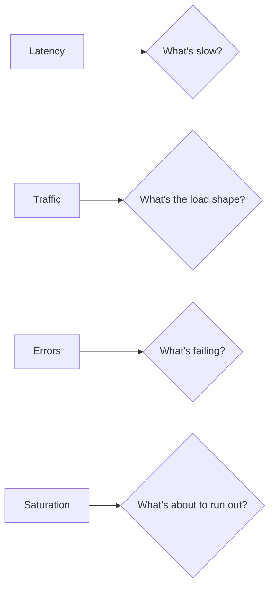
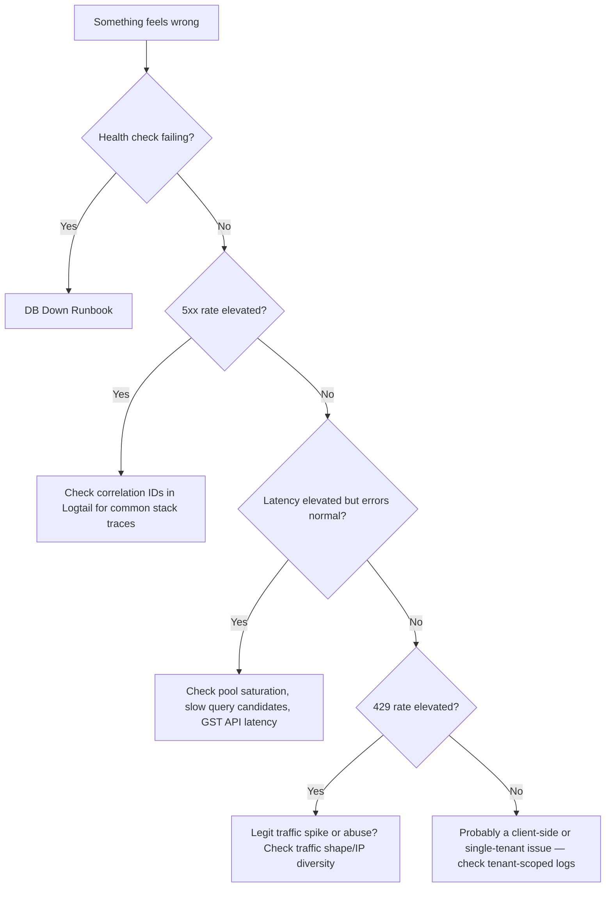

# Golden Signals

The four golden signals (from Google's *Site Reliability Engineering* book) are latency, traffic, errors, and saturation. This page maps each one to specific code, specific tables, and specific failure modes in DG-ERP — not the generic definition, the DG-ERP-specific one.

## Latency

**Definition here:** time from request received (correlation ID assigned in `server/app.ts`) to response sent.

| Route class | Expected latency | Why |
|---|---|---|
| `POST /api/auth/login` | Dominated by `bcrypt.compare` (cost factor 12) | Deliberately slow — see [SLIs & SLOs](./slis-slos) |
| Simple CRUD (`GET /api/products/:id`, `GET /api/customers`) | Sub-100ms in the common case | Single indexed query, `tenant_id` + PK or a covering index (`idx_products_tenant`, `idx_customers_name`, etc.) |
| List endpoints with pagination | Low hundreds of ms | `server/utils/pagination.ts` bounds `LIMIT`/`OFFSET` — but large `OFFSET` values still get slower as they page deeper (classic offset-pagination cost) |
| Aggregate reports (`/api/accounts`, `/api/reports`, `/api/dashboard`) | Hundreds of ms to low seconds | Multi-table `SUM`/`JOIN` across `product_sales`, `product_distribution`, `vendor_payments`, etc., with no materialized views or caching |
| GST E-Invoice/E-Way Bill (`/api/gst-api`) | Network-bound — depends on the NIC sandbox/production API | `server/services/nic-api.ts` calls out to a third party; latency here is largely outside your control |

**Where latency is currently invisible:** there is no persisted, production request-timing metric. The verbose per-request `console.log` in `server/app.ts` (with the ✅/⚠️/💥 emoji status indicators) is explicitly gated `if (!isTest && !isProduction)` — it's a local dev convenience, not a production signal. This is the single biggest gap called out across this SRE section; see [Metrics & Alerting](./metrics-alerting).

## Traffic

**Definition here:** requests per second/minute, segmented by route and by tenant.

Traffic shape you should expect, not be surprised by:

- **Bursty around business hours** — Indian SME retail/dealer usage clusters around opening hours and month-end/GST-filing-deadline days.
- **Login spikes** — after any deploy that invalidates sessions unexpectedly, or after a widely-shared "server was down" moment; `loginLimiter` (5/min/IP) exists specifically to survive a legitimate retry storm without becoming a self-inflicted DoS vector.
- **Mobile heartbeat traffic** — `src/platforms/mobile/online/mobileSync.ts` pings `/api/mobile/heartbeat` every 60 seconds per active device; at scale this is a steady, predictable background load, not spiky, and it's in `PUBLIC_PATHS` so it skips JWT verification overhead when unauthenticated.
- **On-prem heartbeat traffic** — every on-prem install calls `/api/onprem/heartbeat` roughly every 60 minutes (`HEARTBEAT_INTERVAL_MS` in `electron/shared/constants.ts`); low volume, but each miss is meaningful (see [On-Prem License Runbook](/runbooks/onprem-license)).
- **Rate limiting is your traffic-shaping tool today**, not a queue or a CDN. The global `/api/` limiter (300 req/min/IP) and per-route limiters (login, password reset, signup, chatbot) are the entire defense against both abuse and accidental traffic storms.

**Where to look for traffic anomalies:** without Prometheus, your best current signal is Render's platform-level request graphs, plus grep-ing Logtail for spikes in specific route patterns. `X-Correlation-ID` lets you at least de-duplicate retries from a single logical request once you're investigating.

## Errors

**Definition here:** any `4xx`/`5xx`, but weighted very differently.

| Error class | Signal strength | Example |
|---|---|---|
| `5xx` | **Always investigate.** Every one is logged via `logger.error('Unhandled error', ...)` or the `res.json` 500-wrapper in `server/app.ts`, with a correlation ID | Unhandled exception in a route handler, DB connection failure |
| `401` | Usually expected (expired token, bad password) — only alarming as a *rate*, not individually | JWT expired, wrong password |
| `403` | Sometimes expected (role gating working as intended), sometimes a bug (see [Debug-403 lab](/labs/lab-debug-403)) | `enforceModulePermissions` denial, suspended tenant, expired subscription |
| `429` | Expected under abuse or retry storms; a *sustained* high rate is a signal your limits may be miscalibrated for real usage | Login brute-force attempt, or a legitimate user double-clicking "Save" rapidly |
| `503` on `/api/health` | Treat as a **cloud-wide incident candidate** immediately | `pool.query('SELECT 1')` failed — see [DB Down Runbook](/runbooks/db-down) |

**The two-faced error contract** (see [Mental Models](/tutorials/mental-models)): clients only ever see `{ error: 'Internal server error', correlationId }` for 500s. This means your error *rate* must come from server-side logs, never from client-visible error messages — you cannot "grep the frontend" for what actually went wrong.

## Saturation

**Definition here:** how close a finite resource is to its limit.

| Resource | Limit | Where configured | What happens at saturation |
|---|---|---|---|
| Postgres connection pool | `DATABASE_POOL_SIZE` — 10 (prod default) / 20 (dev default) | `server/pg-db.ts` | New queries queue behind `connectionTimeoutMillis: 10000`; requests get slow, then start timing out |
| Render free/starter plan CPU & memory | Plan-dependent, not code-configured | `render.yaml` (`plan: free`) | Requests slow down or the dyno restarts; on the free tier, cold starts after idle are a real, expected latency spike |
| Rate limiter buckets | 300/min global, 5/min login, 30/min chatbot, etc. | `server/app.ts` | Legitimate users get `429`s during a real traffic spike, indistinguishable from abuse without deeper inspection |
| In-memory auth cache | `server/utils/authCache.ts` — process-local Map, no shared cache across instances | Not size-bounded by an LRU in the current implementation (verify before scaling horizontally) | On a single instance, saves a DB round-trip per request; on multiple instances, each one has a cold cache and no invalidation propagates between them |
| On-prem embedded Postgres disk | Local disk on the customer's machine | `electron/onprem/pg-manager.ts` | Customer's own machine running out of disk — outside your control, but worth surfacing via `onprem_licenses.disk_mb` telemetry already collected in heartbeats |
| JSON body size limits | `2mb` general, `50mb` on `/api/backup/restore` | `server/app.ts` `express.json({ limit: ... })` | Requests over the limit get rejected outright — a legitimate large CSV import or backup restore can hit this |

**Saturation you cannot see today:** CPU/memory utilization of the Render dyno, Postgres query planner stats (`pg_stat_statements` isn't enabled by default), and connection pool queue depth over time. All proposed additions in [Metrics & Alerting](./metrics-alerting).

## Putting it together: a triage flow using the four signals

## Related pages

- [SLIs & SLOs](./slis-slos.md)
- [Metrics & Alerting](./metrics-alerting.md)
- [Failure Scenarios](./failure-scenarios.md)
- [Runbooks Index](/runbooks/)
