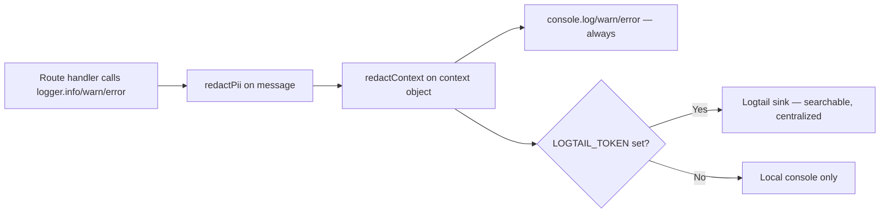

# Logging

Logging in this codebase is a small, deliberate pipeline: one wrapper module, one redaction module, one optional sink. Understanding all three files fully takes about ten minutes and pays for itself the first time you're debugging a production incident at 2am.

## The pipeline, end to end



## `server/utils/logger.ts` — the wrapper

```ts
export const logger = {
  info(message: string, context?: Record<string, unknown>) {
    const safeMsg = redactPii(message);
    const safeCtx = redactContext(context);
    console.log(safeMsg, safeCtx ? JSON.stringify(safeCtx) : '');
    logtail?.info(safeMsg, safeCtx);
  },
  warn(message, context) { /* same shape */ },
  error(message, context) { /* same shape */ },
  flush() { return logtail?.flush(); },
};
```

**The one rule this file enforces for you:** every message and every context object passed through `logger.*` is redacted *before* it reaches either sink. You cannot forget to redact if you use `logger` — the discipline is baked into the channel, not the caller. This is why [Mental Models](/tutorials/mental-models) calls this out as a named pattern: **"PII is redacted at the logging boundary, not at the call site."**

**The corollary:** any `console.log`/`console.error` call that bypasses `logger` entirely also bypasses redaction. The verbose dev-only request logger in `server/app.ts` (the ✅/⚠️/💥 line) is one such intentional exception — it already redacts tokens inline (`safeUrl = req.originalUrl.replace(/([?&](?:token|access_token|refresh_token)=)[^&]+/gi, '$1[REDACTED]')`) and is disabled in production (`if (!isTest && !isProduction)`), so the gap is scoped and known. Any *new* raw `console.*` call you add is not automatically safe — route it through `logger`.

`logtail?.info(...)` uses optional chaining — if `LOGTAIL_TOKEN` isn't set, `logtail` is `null` and the call is simply skipped. Logging never throws, never blocks a response, and never depends on an external service being reachable.

## `server/utils/pii.ts` — the redaction rules

```ts
const EMAIL_RE = /[a-zA-Z0-9._%+-]+@[a-zA-Z0-9.-]+\.[a-zA-Z]{2,}/g;
const PHONE_RE = /\b(?:\+?91[\s-]*)?[6-9]\d{9}\b/g;
const JWT_RE = /\b[A-Za-z0-9_-]{20,}\.[A-Za-z0-9_-]+\.[A-Za-z0-9_-]+\b/g;
const BEARER_RE = /Bearer\s+[A-Za-z0-9._-]+/gi;
const PASSWORD_ASSIGN_RE = /(password|passwd|pwd|secret|token)\s*[:=]\s*["']?[^"'\s,;}]+/gi;
```

| Pattern | Redacts | Notes |
|---|---|---|
| `EMAIL_RE` | Any email-shaped string | Simple, not RFC-perfect, but matches the realistic shapes you'd log |
| `PHONE_RE` | Indian mobile numbers (`+91` optional, starting `6`–`9`, 10 digits) | India-specific by design — this product is India-only, so a US/EU phone regex would be wasted generality |
| `JWT_RE` | Three dot-separated base64url segments, first ≥20 chars | Catches JWTs even outside an `Authorization:` header — e.g. accidentally logged in a query string |
| `BEARER_RE` | `Bearer <token>` header values specifically | Belt-and-suspenders with `JWT_RE` |
| `PASSWORD_ASSIGN_RE` | `password=...`, `secret: ...`, `token="..."` style key-value text | Catches stringified objects/config that leak into log messages |

`redactContext()` recurses into nested objects and maps over arrays, redacting every string value it finds — so passing a whole request body as context is *safer* than it looks, but still shouldn't be your default habit; prefer passing only the fields you actually need to debug.

`safeErrorMessage(err)` is the one-liner for catch blocks that want to log an error's message safely: `redactPii(err instanceof Error ? err.message : String(err))`. Postgres error messages can sometimes embed literal query values (e.g. a unique-constraint violation message repeating the duplicate email) — this function exists specifically to catch that class of leak.

## Correlation IDs — threading one request through everything

```ts
// server/app.ts — first middleware registered
app.use((req, res, next) => {
  const incoming = req.headers['x-correlation-id'];
  const correlationId = (typeof incoming === 'string' && incoming.trim())
    ? incoming.trim().slice(0, 64)
    : crypto.randomUUID();
  req.correlationId = correlationId;
  res.setHeader('X-Correlation-ID', correlationId);
  // ...wraps res.json to inject correlationId into every 500 response...
  next();
});
```

**Why this exists:** without a shared identifier, "the request that failed for this customer at 3:14pm" is unfindable across possibly-interleaved logs from possibly-concurrent requests. With it, you can:

1. Take the `correlationId` from a user-facing error message or the `X-Correlation-ID` response header.
2. Search Logtail (or grep container logs) for that exact string.
3. Find every log line — the specific `logger.error('Unhandled error', { correlationId, ... })` call, plus any `logger.info`/`warn` earlier in the same request if you add them — for that one request, and only that request.

**It's client-forwardable, not just server-generated.** If a client (e.g. a future support tool, or a retried request) sends its own `X-Correlation-ID`, the server honors it (capped at 64 chars, trimmed) instead of generating a new one — useful for tracing a single logical operation across a client-side retry loop.

**It appears in every 500 response**, via the wrapped `res.json`:

```ts
const origJson = res.json.bind(res);
res.json = ((body: unknown) => {
  if (res.statusCode >= 500) {
    logger.error('API 500 response', { correlationId, method: req.method, path: req.path });
    return origJson({ error: 'Internal server error', correlationId });
  }
  return origJson(body);
}) as typeof res.json;
```

This means **any** route that sets `res.statusCode = 500` and calls `res.json(...)` — even without explicitly logging — gets an automatic `logger.error` call and a correlation-ID-bearing response. It's a safety net for handlers that forget to log their own errors, not a replacement for doing so.

## What to log, and at what level

| Level | Use for | Example |
|---|---|---|
| `logger.info` | Meaningful state changes worth searching for later, not routine reads | Tenant provisioned, backup exported, license activated |
| `logger.warn` | Recoverable but noteworthy — degraded, not down | Logtail token missing in a context that expects it, a heartbeat from an unrecognized device |
| `logger.error` | Anything that resulted in a 5xx, or a caught exception that changed control flow | Unhandled route error, DB query failure, GST API call failure |

**Anti-pattern to avoid:** logging every successful `GET` at `info` level. At any real traffic volume this drowns the signal you actually need during an incident. The existing dev-only request logger already gives you per-request visibility locally; production logging should be event-driven, not request-driven.

## Logtail specifics

- Enabled only when `LOGTAIL_TOKEN` is set (see [Environment Variables](/deployment/env-vars)) — set via Render's dashboard as a `sync: false` secret in `render.yaml`, never committed.
- `logtail.flush()` exists for graceful-shutdown scenarios (flush buffered logs before process exit) — check whether your deployment's shutdown hook actually calls it; if not, that's a small, real gap worth filing.
- Logtail is a **sink**, not a query engine replacement for your own reasoning — you still need to know what correlation ID or tenant slug you're looking for before you search.

## Where logging is currently thin (be honest about the gaps)

1. **No production request-timing log.** The ✅/⚠️/💥 per-request line in `server/app.ts` is dev-only. Production has no persisted per-request latency trail beyond what Render's platform layer might expose. See [Metrics & Alerting](./metrics-alerting).
2. **No structured log levels beyond info/warn/error.** No `debug` level, no sampling — every `info` call is unconditional. Fine at current volume; revisit if it becomes a cost or noise problem.
3. **No log-based alerting configured.** Even with Logtail, nothing pages you when `logger.error` rate spikes — you have to be looking.

## Related pages

- [Golden Signals](./golden-signals.md)
- [Metrics & Alerting](./metrics-alerting.md)
- [Security → Secrets](/security/secrets)
- [File Walkthrough: utils](/files/server/utils)
- [Glossary: correlation ID](/glossary/engineering-terms)
