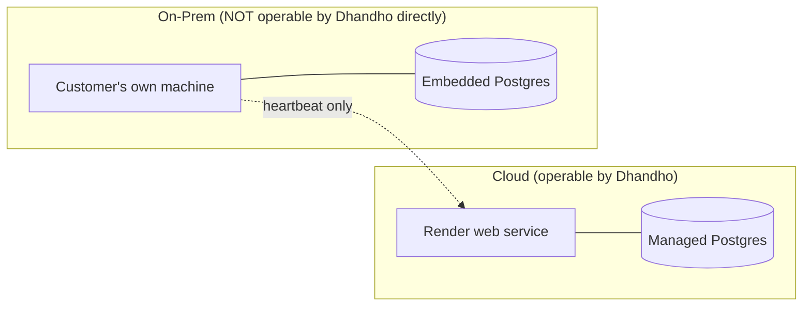
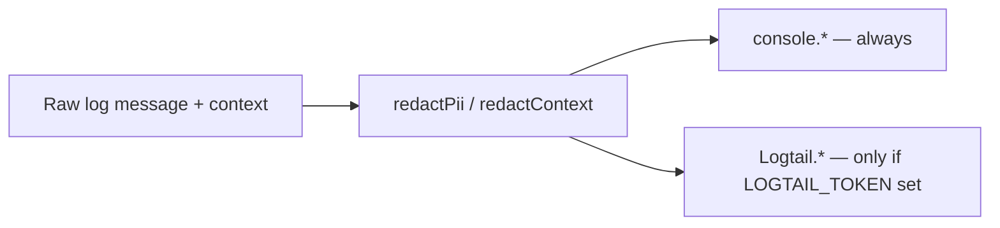

# SRE Overview — Keeping Dhandho Up for SMEs Who Can't Call IT

:::warning Deferred track
SRE chapters are **out of scope for the current academy push**. Skim if curious; do not block onboarding on this section. Resume deepening when asked.
:::

:::tip The operating context that shapes everything here
There is no dedicated SRE team. The engineers who write the code are also the ones paged when it breaks, for a product whose customers (small manufacturers/distributors) have zero technical staff of their own and will simply call support confused, not file a detailed bug report.
:::

## 1. Two very different things to operate



Cloud is a normal single-service web app you can SSH-adjacent-debug (Render logs, `psql` access to the managed DB). On-prem is fundamentally **unobservable** in real time — the only signal Dhandho's team gets is the periodic heartbeat (`POST /api/onprem/heartbeat`) recording `last_seen`, `app_version`, `active_users`, `disk_mb`. Debugging an on-prem issue means guiding a non-technical customer through steps over a support call, or requesting log files — not tailing a live stream.

## 2. Health checking

`GET /api/health` does a real `SELECT 1` against Postgres, not just "process is alive":

```ts
app.get('/api/health', async (_req, res) => {
  try {
    await pool.query('SELECT 1');
    res.json({ ok: true, db: 'up', message: 'API is running' });
  } catch {
    res.status(503).json({ ok: false, db: 'down', message: 'Database unavailable' });
  }
});
```

This single endpoint is consumed by: Render's own health check (deploy gating + auto-restart), the Docker image's `HEALTHCHECK` directive, and can be polled by any external uptime monitor. Because it's exempted from rate limiting (`skip: (req) => req.path === '/health'`), an aggressive monitoring interval won't accidentally trip abuse protection.

## 3. Structured logging with PII redaction baked in

`server/utils/logger.ts` wraps `console.log`/`console.warn`/`console.error` **and** an optional Logtail sink, but every message and context object passes through `redactPii()`/`redactContext()` first:



| Pattern redacted | Regex target | Replaced with |
|---|---|---|
| Email addresses | `EMAIL_RE` | `[REDACTED_EMAIL]` |
| Indian mobile numbers | `PHONE_RE` (`+91` + 10-digit starting 6-9) | `[REDACTED_PHONE]` |
| `Authorization: Bearer ...` headers | `BEARER_RE` | `Bearer [REDACTED]` |
| JWT-shaped strings (three dot-separated base64url segments) | `JWT_RE` | `[REDACTED_TOKEN]` |
| `password=`, `secret:`, `token=` style key-value pairs | `PASSWORD_ASSIGN_RE` | `key=[REDACTED]` |

This runs even for **local console output**, not just the remote Logtail sink — a deliberate choice, since local dev logs, screen-shared during a support call, or copy-pasted into a Slack thread while debugging, are just as capable of leaking PII as a remote log aggregator.

## 4. Correlation IDs — the thread connecting a user's bug report to a log line

Covered in depth in [Middleware Stack](/backend/middleware-stack). The short version for an SRE context: every response carries `X-Correlation-ID`; every 5xx log line is tagged with the same ID; support asks the customer (or reads it from a bug report screenshot) for that ID and greps logs for it — the *only* practical way to find the exact failing request in a shared, multi-tenant log stream without exposing other tenants' data.

## 5. Realistic failure modes, ranked by likelihood

| Failure | Likelihood | Blast radius | First response |
|---|---|---|---|
| Managed Postgres connection pool exhaustion | Medium | All cloud tenants, that request path only | Check `pool` size config, look for a slow/N+1 query holding connections |
| A single tenant's GST NIC API credentials misconfigured | High (per-tenant) | One tenant's e-invoicing only | See [Runbook: GST API Failures](/runbooks/gst-api-failures) |
| On-prem embedded Postgres data directory corruption after an ungraceful OS shutdown | Low but high-impact | One customer's entire business data | See [Runbook: On-Prem License](/runbooks/onprem-license) and disaster recovery guidance |
| Render deploy introduces a boot-time `assertCriticalEnv` failure | Low (caught by fail-fast + health check) | Entire cloud fleet, but fails *before* traffic shifts | Roll back via [Deploy Rollback](/runbooks/deploy-rollback) |
| A specific tenant hits a plan limit and support didn't warn them in advance | High | One tenant, one resource type, a confused support ticket | Check `checkPlanLimit`'s exact rejection message, offer an upgrade |
| Rate limiter false-positive (shared office NAT IP) | Medium | A handful of users behind the same IP | Distinguish legitimate shared-IP traffic from abuse; consider per-user, not just per-IP, limiting long-term |

## 6. What "on-call" realistically means here

Given the team size and product maturity, there's no formal SLA-backed on-call rotation with PagerDuty escalation policies. The practical loop is: Render's health check restarts a crashed process automatically → if that doesn't self-heal, whoever's available checks Render's dashboard/logs → correlation IDs and PII-redacted structured logs are the primary debugging tool → for on-prem, it's a support conversation, not a dashboard. See [Golden Signals](/sre/golden-signals) and [SLIs/SLOs](/sre/slis-slos) for how this maps (loosely) to formal SRE vocabulary.

## Hands-on exercise

1. Trigger a deliberate error locally (e.g. stop your local Postgres and hit any authenticated endpoint) and find the exact log line the server produces. Confirm no PII from your test data leaked into it.
2. Send a log message containing a fake email and a fake JWT-shaped string through `logger.info()` in a scratch script. Confirm both get redacted, and identify which regex is slightly over-eager (hint: `JWT_RE`'s pattern could theoretically also match other long dotted tokens that aren't JWTs — is that a real problem or an acceptable false positive?).
3. Curl `/api/health` while your local Postgres is stopped, then started. Confirm the exact status code and body difference.

## Debugging exercise

A customer's support ticket includes a screenshot showing a generic "Internal server error" message with a correlation ID. Walk through, step by step, exactly how you'd use that ID to find the specific failing request in the logs, and what you'd be able to determine about the failure **without** ever needing to see the customer's actual business data (tenant name, products, customers, etc.).

## Quiz

1. Why does `redactPii` run on local `console.*` output, not just the remote Logtail sink?
2. What does `/api/health` actually verify, beyond "the Node process didn't crash"?
3. Why is on-prem fundamentally harder to operate than cloud, from an SRE perspective?

<details>
<summary>Answers</summary>

1. Because local logs are just as capable of leaking PII when shared in a support channel, screen-shared during debugging, or copy-pasted into a ticket — redaction needs to be the default everywhere logs might end up, not just the remote aggregation path.
2. It runs a real `SELECT 1` against Postgres, confirming the database connection itself is healthy — not just that the Express process is technically running and able to respond to HTTP.
3. Because Dhandho's team has no live access to the customer's own machine or database — the only signal is the periodic, low-detail heartbeat; real debugging requires a support conversation and manually requested log files rather than direct observability tooling.

</details>

## Related pages

- [SLIs/SLOs](/sre/slis-slos)
- [Golden Signals](/sre/golden-signals)
- [Logging](/sre/logging)
- [Failure Scenarios](/sre/failure-scenarios)
- [Runbooks Index](/runbooks/index)
- [Middleware Stack](/backend/middleware-stack)
