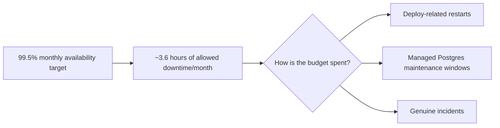

# SLIs and SLOs — What "Reliable" Means for Dhandho

:::info An honest starting point, not a marketing claim
Dhandho does not currently publish a formal SLA to customers, and there's no dashboard actively tracking every SLO below in production. This page defines what *should* be measured and gives a realistic assessment of what already can be, using existing code, versus what would need new instrumentation.
:::

## 1. Why an ERP has different reliability needs than a typical SaaS dashboard

A GST invoice that fails silently, or a sale that doesn't record a warranty, isn't just an inconvenience — it's a **compliance and money** problem for a small business owner. Dhandho's SLI priorities reflect this: correctness and durability of financial/compliance writes matter more than shaving milliseconds off a dashboard chart render.

## 2. Proposed SLIs, mapped to real code

| SLI | Definition | Measured how (today) | Measured how (proposed) |
|---|---|---|---|
| **Availability** | % of `/api/health` checks returning 200 | Render's own health-check history (external to the app) | Add a synthetic uptime monitor hitting `/api/health` from outside Render's own infra, independent of Render's self-reported status |
| **API latency (p50/p95/p99)** | Response time for authenticated API calls | Dev-only request logger prints per-request `ms` but is disabled in production (`!isProduction` gate in `app.ts`) | Add lightweight production-safe timing spans (see the optimization challenge in [Request Lifecycle](/architecture/request-lifecycle)) shipped to Logtail |
| **Error rate** | % of requests returning 5xx | Every 5xx is logged with `correlationId` via the `res.json` monkey-patch and the global error handler | Aggregate this into a rate metric (5xx count / total requests) rather than only individual log lines |
| **Auth success rate** | % of login attempts succeeding vs. failing (401/403) | `logAudit('LOGIN', ...)` records successes; failures currently are **not** separately audit-logged | Add explicit failed-login audit entries (careful: don't log the attempted password) |
| **GST/NIC API success rate** | % of e-invoice/e-way-bill calls to the NIC API that succeed | Whatever `nic-api.ts` itself logs on failure | Track this per-tenant — a single tenant's misconfigured GST credentials shouldn't look like a platform-wide reliability problem |
| **DB pool saturation** | How close the `pg.Pool` gets to its `max` connection limit | Not currently exposed | `pool.totalCount`/`pool.idleCount`/`pool.waitingCount` (properties `pg.Pool` exposes) could be sampled and logged periodically |
| **On-prem fleet health** | % of licensed on-prem installs with a recent heartbeat | `onprem_licenses.last_seen` column exists and is queryable | A Super Admin dashboard query, not yet a formal SLO with alerting |

## 3. Proposed SLOs — starting targets, not yet contractual

| SLO | Target | Rationale |
|---|---|---|
| Cloud API availability | 99.5% monthly | Generous enough for a single-region, single-instance Render deployment (no multi-region failover exists); tighter than this would require infrastructure investment not yet justified by customer contracts |
| p95 API latency (authenticated GET) | < 500ms | SME users on modest connections/hardware; a snappy dashboard matters for daily habitual use |
| 5xx error rate | < 0.5% of requests | Any higher and it's likely a real bug, not noise |
| Login success rate for correct credentials | > 99% | A login failure for a *correct* password (e.g. due to a bug, not user error) is a severe, trust-damaging bug |
| On-prem heartbeat freshness | 95% of active licenses report within 48h | Accounts for legitimately offline periods (weekends, planned downtime) without masking genuinely abandoned/broken installs |

:::warning These are proposed, not measured
As of this writing, there is no dashboard that would tell you today's actual number for most of these. Treat this table as the **target state** for observability investment, and the honest gap analysis in section 2 as the roadmap to get there.
:::

## 4. Error budget thinking, applied to a small team

With a 99.5% target, roughly 3.6 hours/month of downtime is "budgeted." A small team can use this practically: if a risky refactor (e.g. touching the auth middleware) is planned, doing it during a low-traffic window and accepting a few minutes of restart-related unavailability is well within budget — this framing helps avoid excessive caution that would slow down legitimate shipping velocity.

## 5. What's deliberately *not* an SLO target (yet)

- **On-prem uptime** — Dhandho cannot be responsible for a customer's own machine's uptime; only the *license/heartbeat visibility* into it is Dhandho's SLO surface.
- **Individual GST NIC API third-party uptime** — that's the Indian government's infrastructure, outside Dhandho's control; the SLO here is about Dhandho's own retry/error-surfacing behavior around it, not the third party's actual availability.
- **Mobile app offline-queue sync latency** — a UX quality concern more than a reliability SLO; tracked informally, not yet formalized.

## Hands-on exercise

1. Using only what's in the codebase today, write the exact SQL query you'd run against a production-mirrored database to compute "% of on-prem licenses with `last_seen` within the last 48 hours" — this is the one SLI in the table above that's fully computable *today* with zero new instrumentation.
2. Propose the minimal code change to `server/app.ts` that would let production safely log per-request latency (respecting the PII-redaction and no-perf-regression constraints already established elsewhere in the codebase) without simply removing the `!isProduction` gate on the existing dev logger (which prints too much and isn't PII-safe as-is).
3. If you had to pick **one** SLI to instrument first, given the current gaps, which would you choose and why? Justify against the business goals in [Business Goals](/overview/business-goals).

## Quiz

1. Why is a formal 99.99% SLA unrealistic for Dhandho's current infrastructure, and what would need to change to responsibly offer one?
2. Which SLI in this document is already fully computable today with existing schema and zero new code?
3. Why does Dhandho draw a boundary around on-prem uptime rather than including it directly in its own SLOs?

Answers

1. 99.99% implies near-zero downtime tolerance, which requires redundancy (multi-region, load-balanced multi-instance deployment, managed failover) that a single Render web service + single managed Postgres instance doesn't provide; achieving it would require meaningfully more infrastructure investment and operational maturity.
2. On-prem fleet heartbeat freshness — `onprem_licenses.last_seen` already exists and is queryable with a simple SQL query, no new instrumentation needed.
3. Because the customer's own machine, network, and OS are entirely outside Dhandho's control or visibility once the software is installed on-prem — Dhandho can only be accountable for what it can observe and influence, which is the license/heartbeat system, not the machine itself.

## Related pages

- [SRE Overview](/sre/overview)
- [Golden Signals](/sre/golden-signals)
- [Metrics & Alerting](/sre/metrics-alerting)
- [Disaster Recovery](/sre/disaster-recovery)
- [Business Goals](/overview/business-goals)
