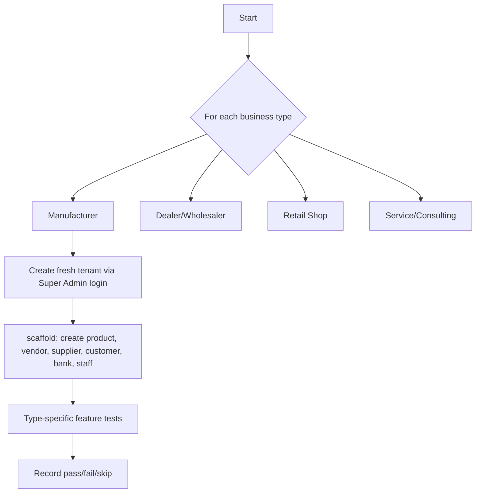

# E2E Testing

`tests/e2e_by_type.py` is deliberately not written in the same stack as everything else. It's a single, dependency-free Python 3 script (`urllib`, no `requests`, no `pytest`) that drives the **real, running** server over real HTTP, simulating the full lifecycle of four different business types.

## Why Python, and why no framework

This suite predates or intentionally sidesteps the Vitest/Supertest stack for a specific reason: it's meant to be runnable by *anyone*, including someone without the Node toolchain fully set up, against *any* running instance of the app — local, staging, or (carefully) production-adjacent — with a single command and zero `npm install`. `urllib` is in the Python standard library; there's nothing to install.

```bash
python3 tests/e2e_by_type.py --base http://localhost:3001
```

## What it actually does



1. **Log in as Super Admin** (`SA_EMAIL`/`SA_PASS` — note these are hardcoded test credentials in the script, matching what CI's `release.yml` sets via env for its own ephemeral database, not real production credentials).
2. **For each of the 4 business types** (manufacturer, dealer, retail, service): create a **fresh tenant** — real isolation, not shared fixtures, so one type's tests can never pollute another's.
3. **`scaffold(tok, tid)`** creates the common baseline entities every type needs: a product (with barcode via `add-stock`), a vendor, a supplier, a customer, a bank, a staff member, an expense — each creation is itself an assertion (`ok(name, cond, detail)` records pass/fail).
4. **Run type-specific tests** — e.g. a Manufacturer type exercises distribution + E-Invoice flows more heavily; a Retail type exercises POS sales + warranty + rewards more heavily.
5. **Report per-type pass/fail/skip counts** with ✅/❌/⏭ markers, printed to stdout — no HTML report, no JUnit XML (a real gap if you ever want this wired into a test-results UI).

## The `ok()` helper — the entire assertion framework

```python
def ok(name, cond, detail="", skip=False):
    bucket = RESULTS.setdefault(CURRENT_TYPE, {"pass":[], "fail":[], "skip":[]})
    if skip:
        bucket["skip"].append(name); print(f"  ⏭  {name} (skipped — {detail})")
    elif cond:
        bucket["pass"].append(name); print(f"  ✅ {name}")
    else:
        bucket["fail"].append(name); print(f"  ❌ {name}{detail and f' — {detail}'}")
```

That's it — no assertion library, no stack traces on failure, just a boolean condition and a human-readable label. This is intentionally low-tech: the entire suite is meant to be readable top-to-bottom by someone who's never seen it before, at the cost of less-precise failure diagnostics than a "real" test framework would give (`pytest`'s assertion introspection, for instance). When a test fails, you go read the corresponding `req(...)` call in the script and reproduce it manually with `curl` to actually diagnose it — the script tells you *what* failed, not *why*, in most cases.

## Where and when this runs

**Only in `release.yml`**, triggered by pushing a git tag `v*` — never on regular PRs (see [CI/CD](/deployment/cicd)). This is a deliberate speed/cost trade-off: 453 tests, each making real HTTP round-trips to a real server that itself needs ~8 seconds to boot (`sleep 8` in the workflow before the suite starts), takes minutes — too slow to gate every PR, but exactly the right cost for a pre-release gate given how much cross-feature integration it verifies that faster layers structurally cannot (a Vitest API test creates one tenant and tests one route file in isolation; this suite tests "does a quotation converted into an order actually decrement the right stock across two different route files' worth of logic").

```yaml
# .github/workflows/release.yml
- run: npm run server &
  sleep 8
- run: python3 tests/e2e_by_type.py --base http://localhost:3001
```

## Why "453 tests" and not a rounder number

The count emerges from the sum of: 4 business types × (shared scaffold assertions + type-specific feature assertions), where each type has a different-sized feature test list matching what that business type's `tab_config` actually exposes (a Service business type doesn't test Distribution's E-Way Bill flow, because that tab isn't even relevant to it — see [Mental Models](/tutorials/mental-models) on business type as data, not code fork). The number will drift slightly release-to-release as tests are added — treat "453" as "the current count," not a fixed target to preserve.

## `tests/e2e_full.py` — the older/broader sibling

A second Python E2E script exists alongside `e2e_by_type.py`, covering additional ground not tied to the four-business-type structure (or predating that structure). If you're adding a new E2E test, check both files before deciding where a new test belongs — duplicating coverage across both scripts wastes CI minutes on release day for no additional signal.

## Manual test cases (`tests/cases/*.md`) — the fourth, human layer

Not automated at all — markdown specs for a human QA pass, covering things genuinely hard to assert programmatically: `landing-page.md`, `multi-language.md`, `super-admin.md`, `cross-tenant.md`, `chatbot.md`, and others. These exist because some regressions (a broken layout, a mistranslated string, a confusing UX flow) are real risks the automated suites cannot catch, and pretending otherwise would be worse than admitting a human still needs to click through these before a significant release.

## Running it yourself, locally

```bash
# Terminal 1
npm run server

# Terminal 2 — wait for the server banner, then:
python3 tests/e2e_by_type.py --base http://localhost:3001
```

Requires `SUPER_ADMIN_EMAIL`/`SUPER_ADMIN_PASSWORD` in your local `.env` to match the script's hardcoded `SA_EMAIL`/`SA_PASS` (`admin@spre.ai` / `superadmin123`) **or** you'll need to edit the script's constants — check the top of the file before assuming it'll "just work" against your local seed.

## What to do when it fails on a release branch

1. Read the ❌ lines — note the business type and the specific assertion name.
2. Reproduce the exact `req(...)` call manually with `curl` against your local server.
3. Determine: is this a real regression (fix the code), or did the test's expectation drift from an intentional feature change (fix the test)?
4. Never skip/comment-out a failing E2E test to unblock a release without an explicit, documented decision — this suite is the last gate before real users get a build.

## Related pages

- [Testing Overview](./overview.md)
- [CI/CD](/deployment/cicd)
- [Coverage Gates](./coverage-gates.md)
- [Learning → Module: Distribution](/learning/module-distribution)
