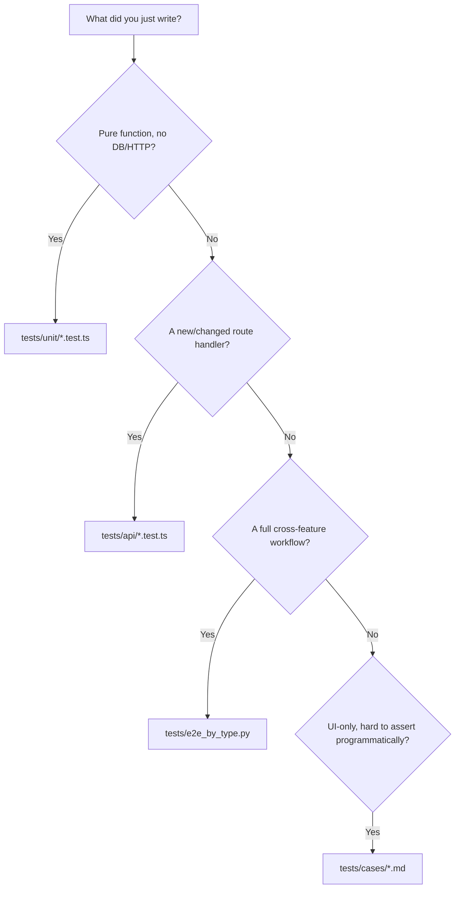

# How to Add Tests

This page is a decision procedure, not a philosophy essay. Use it every time you add code and aren't sure what test to write, or where it goes.

## Step 1 — Decide which layer



See [Testing Overview](./overview) for the full comparison table if you need more context on any layer.

## Step 2 — Templates

### Unit test template

```ts
// tests/unit/myHelper.test.ts
import { describe, it, expect } from 'vitest';
import { myHelperFn } from '../../server/utils/myHelper';

describe('myHelperFn', () => {
  it('handles the happy path', () => {
    expect(myHelperFn('input')).toBe('expected output');
  });

  it('handles the empty/edge case', () => {
    expect(myHelperFn('')).toBe('');
  });

  it('does not incorrectly match adjacent-looking input', () => {
    // The "what should NOT happen" test — often the most valuable one
  });
});
```

### API integration test template

```ts
// tests/api/myFeature.test.ts
import { describe, it, expect, beforeAll, afterAll } from 'vitest';
import request from 'supertest';
import { createApp } from '../../server/app';
import { createTestToken, cleanupTestData, pool } from '../helpers';

const app = createApp();
let tenantId: string;
let adminToken: string;
let staffToken: string;

beforeAll(async () => {
  tenantId = `TEST-${Date.now()}-${Math.random().toString(36).slice(2, 8)}`;
  await pool.query(
    `INSERT INTO tenants (id, company_name, slug, admin_email, admin_name, plan_id, status)
     VALUES ($1, 'Test Co', $1, 'a@b.com', 'Admin', 'TRIAL', 'active')`,
    [tenantId]
  );
  adminToken = createTestToken({ userId: 'U1', tenantId, email: 'a@b.com', role: 'Admin', name: 'Admin' });
  staffToken = createTestToken({ userId: 'U2', tenantId, email: 'staff@b.com', role: 'Staff', name: 'Staff' });
});

afterAll(async () => {
  await cleanupTestData(tenantId);
});

describe('GET /api/my-feature', () => {
  it('returns data for an authenticated tenant user', async () => {
    const res = await request(app)
      .get('/api/my-feature')
      .set('Authorization', `Bearer ${adminToken}`);
    expect(res.status).toBe(200);
  });

  it('rejects unauthenticated requests', async () => {
    const res = await request(app).get('/api/my-feature');
    expect(res.status).toBe(401);
  });

  it('does not leak another tenant\'s data', async () => {
    // Create a second tenant, assert isolation — see api-integration.md
  });
});

describe('PUT /api/my-feature', () => {
  it('rejects non-Admin roles', async () => {
    const res = await request(app)
      .put('/api/my-feature')
      .set('Authorization', `Bearer ${staffToken}`)
      .send({ text: 'x' });
    expect(res.status).toBe(403);
  });
});
```

### E2E addition (Python)

Only add here if the behavior genuinely spans multiple route files / a full business workflow. Follow the existing pattern in `tests/e2e_by_type.py`:

```python
def test_my_new_workflow(tok, tid, ids):
    sec("My New Workflow")
    s, res = req("POST", "/api/my-feature", {"key": "value"}, h(tok, tid))
    ok("create my-feature succeeds", s in (200, 201), f"status={s}")
```

## Step 3 — The checklist before opening a PR

- [ ] Does the new/changed route have a `tenant_id` isolation test (see [API Integration Testing](./api-integration))?
- [ ] Does a mutating route have a permission-boundary test (wrong role → `403`)?
- [ ] Did you run `npm run test:coverage` locally and confirm no threshold regression (only matters if you touched a file in the [coverage-gated scope](./coverage-gates))?
- [ ] Did you call `cleanupTestData(tenantId)` in `afterAll` for any new tenant your test created?
- [ ] If you added a genuinely new business workflow spanning features, does it belong in the E2E suite too?

## Common mistakes to avoid

1. **Testing only status 200/201.** The valuable tests are the boundary ones — wrong tenant, wrong role, missing field, malformed input.
2. **Hardcoding a shared `tenantId` across test files.** Vitest can run files in parallel; always generate a fresh, unique ID per file/suite.
3. **Asserting on `err.message` text from a 500 response.** Clients only ever see a generic `Internal server error` — see [Logging](/sre/logging)'s two-faced error contract. Assert on status codes and the documented generic shape, not internals.
4. **Mocking `pool.query`.** This suite's entire value proposition for the API layer is testing against real SQL — don't undermine it by mocking the one thing that makes it trustworthy.
5. **Adding a new table without updating `cleanupTestData`** (`tests/helpers.ts`) — your new table's test rows will silently accumulate in whatever database your tests run against.
6. **Skipping a flaky test instead of fixing it.** A `.skip()`'d test with no tracked follow-up is a silent coverage regression — if you must skip, leave a comment explaining why and link a tracked issue.

## Related pages

- [Testing Overview](./overview.md)
- [Unit Testing](./unit.md)
- [API Integration Testing](./api-integration.md)
- [Coverage Gates](./coverage-gates.md)
- [First Feature Tutorial](/tutorials/first-feature)
- [Lab: Add an Endpoint](/labs/lab-add-endpoint)
