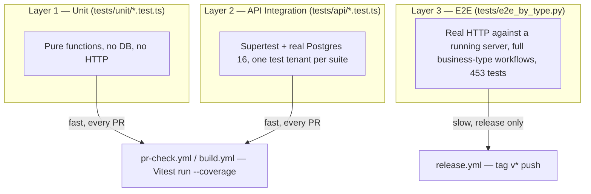

# Testing Overview

DG-ERP tests in three distinct layers, each with a different speed/confidence trade-off, and each gated at a different point in the CI pipeline.



## The three layers, compared

| | Unit | API Integration | E2E |
|---|---|---|---|
| **Tool** | Vitest | Vitest + Supertest | Python 3, `urllib` (no framework) |
| **Location** | `tests/unit/*.test.ts` | `tests/api/*.test.ts` | `tests/e2e_by_type.py` |
| **Talks to** | Nothing external — pure functions | Real PostgreSQL 16, via `createApp()` in-process (no network) | A **running** server over real HTTP |
| **Speed** | Milliseconds per test | Tens of ms per test (real queries, but local/CI DB) | Minutes for the full 453-test run |
| **Runs in CI** | Every PR (`pr-check.yml`, `build.yml`) | Every PR (same workflows, same Vitest invocation) | Only on release (`release.yml`, tag push) |
| **Coverage-gated** | Yes — counts toward the 90%/75% thresholds (see [Coverage Gates](./coverage-gates)) | Yes — same thresholds | No — separate pass/fail reporting, not coverage-instrumented |
| **What it catches** | Logic bugs in isolated helpers (PII redaction, pagination math, auth caching) | Wrong status codes, missing tenant scoping, permission bypasses, real SQL errors | Whole-workflow regressions across a full business type's feature set |

## Why three layers instead of one

A single layer would force an unpleasant trade-off: all-unit-tests would miss real SQL/permission bugs (mocking the DB hides exactly the bugs that matter most in a multi-tenant system); all-E2E would be too slow to run on every PR and too coarse to pinpoint a failure's exact cause. The three-layer split lets fast, precise tests gate every PR, while the slow, holistic suite gates only releases — where its cost is justified by catching the class of bug that only shows up when many features interact (e.g. "does creating a quotation that gets converted to a distribution batch correctly reduce the right stock").

## Where each layer lives, concretely

```
tests/
├── unit/                    # Layer 1 — no DB
│   ├── pii.test.ts
│   ├── pagination.test.ts
│   ├── authCache.test.ts
│   ├── env.test.ts
│   ├── impersonation-token.test.ts
├── api/                     # Layer 2 — Supertest + real Postgres
│   ├── auth.test.ts
│   ├── products.test.ts
│   ├── sales.test.ts
│   ├── security.test.ts     # ← cross-tenant isolation checks live here
│   └── ... ~26 more files
├── cases/                   # Manual QA specs (markdown, human-run)
│   ├── cross-tenant.md
│   ├── landing-page.md
│   └── ...
├── e2e_by_type.py           # Layer 3 — release E2E across business types
├── stress-test.ts           # load/perf probing, not correctness (manual)
├── globalSetup.ts           # runs initDatabase() once before the whole Vitest run
├── setup.ts                 # per-file env assertion (DATABASE_URL, JWT_SECRET present)
└── helpers.ts                # createTestToken, createSuperAdminToken, cleanupTestData
```

## The one shared rule across every layer: no hardcoded secrets in test code

```ts
// tests/globalSetup.ts and tests/setup.ts, independently
if (!process.env.DATABASE_URL || !process.env.JWT_SECRET) {
  throw new Error('... required for tests (set via .env or CI) ...');
}
```

Every layer requires `DATABASE_URL` and `JWT_SECRET` from the environment — never a fallback default baked into test code. This mirrors production's `assertCriticalEnv()` philosophy (see [Environment Variables](/deployment/env-vars)) and specifically prevents a class of bug where tests "accidentally" pass because they're using a hardcoded secret that happens to also work against a real environment.

## Cleanup discipline

`tests/helpers.ts`'s `cleanupTestData(tenantId)` deletes a test tenant's rows from ~30 tables, in dependency order, then deletes the tenant itself — every API integration test that creates a tenant is expected to call this in an `afterAll`/`afterEach`. Forgetting this leaves orphaned test tenants in whatever database the suite ran against — locally, this pollutes your dev DB, so periodically check for stray tenants if local testing feels "off."

## Reading order for this section

1. [Unit Testing](./unit.md)
2. [API Integration Testing](./api-integration.md)
3. [E2E Testing](./e2e.md)
4. [Coverage Gates](./coverage-gates.md)
5. [How to Add Tests](./how-to-add-tests.md)

## An analogy for the three layers

Think of it like a restaurant kitchen's quality checks: unit tests are a chef tasting a single sauce in isolation (fast, precise, but tells you nothing about whether the finished plate works); API integration tests are a line check on one full dish (real ingredients, real heat, but still just one dish at a time); E2E tests are a full dinner-service dry run (slow, expensive to set up, but the only check that catches "the appetizer and the main course don't arrive in the right order"). You wouldn't run a full dinner-service dry run before every single sauce adjustment — but you also wouldn't skip it entirely before opening night.

## Alternatives considered

| Approach | Trade-off |
|---|---|
| **Mock the database in API tests** | Faster, but hides exactly the bugs that matter most here — a missing `WHERE tenant_id` clause or a permission bypass is invisible against a mock that returns whatever you told it to |
| **Only E2E tests, no unit/integration layer** | Maximum realism, unacceptable speed — a 453-test Python suite on every single PR would make the feedback loop too slow for day-to-day development |
| **Snapshot testing for API responses** | Tempting for catching accidental shape changes, but brittle against Dhandho's frequently-evolving JSON shapes and doesn't test *behavior* (permissions, tenant scoping) the way explicit assertions do |

## Hands-on exercise

1. Pick one existing test in `tests/api/security.test.ts` and identify exactly which line asserts cross-tenant isolation. Temporarily comment out the corresponding `WHERE tenant_id` clause in the route it tests, rerun just that file, and confirm the test actually fails (if it doesn't, that's a gap worth flagging).
2. Add a new unit test to `tests/unit/pii.test.ts` for a PII pattern not yet covered (e.g. a GST number or PAN card format) and confirm `redactPii()` either already handles it or needs a new regex.
3. Run the full three-layer suite locally (`npm test`, then attempt `tests/e2e_by_type.py` against a running local server) and time each layer — compare your numbers against the "fast, every PR" vs. "slow, release only" framing above.

## Quiz

1. Why would mocking the database in API integration tests hide exactly the bugs this codebase cares most about?
2. Why does the E2E suite run only on release rather than on every PR?
3. What's the one environment-variable rule shared identically across all three test layers, and what production philosophy does it mirror?

<details>
<summary>Answers</summary>

1. Because the most dangerous bug class in a multi-tenant system — a missing `WHERE tenant_id` clause or a permission bypass — only manifests against a *real* database enforcing real constraints; a mock returns whatever canned data you configured, regardless of whether the query itself was actually scoped correctly.
2. Because it's slow (minutes for 453 tests) and coarse-grained (tells you *something* broke across a full workflow, not precisely *what*) — running it on every PR would slow the feedback loop for changes that don't need that level of scrutiny, so it's reserved for the higher-stakes moment of cutting a release.
3. Every layer requires `DATABASE_URL` and `JWT_SECRET` from the real environment, with no hardcoded fallback baked into test code — mirroring production's `assertCriticalEnv()` fail-fast philosophy, and specifically preventing tests from "accidentally" passing against a hardcoded secret that might also work in a real environment.

</details>

## Related pages

- [CI/CD](/deployment/cicd)
- [Lab: Add an Endpoint](/labs/lab-add-endpoint)
- [First Feature Tutorial](/tutorials/first-feature)
