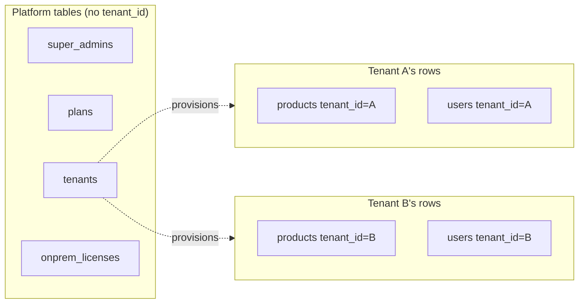
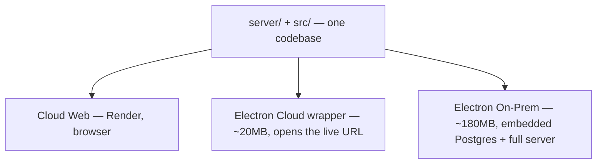

# Mental Models

Codebases feel chaotic until you find the handful of repeating shapes underneath. This page is those shapes for Dhandho. Read it once early, then re-read it after two weeks — it will mean more the second time.

## 1. Every table row belongs to exactly one tenant (except platform tables)

The single most important fact about this codebase: **almost every table has a `tenant_id` column**, and almost every query is `WHERE tenant_id = $1 AND ...`. The handful of tables *without* `tenant_id` — `super_admins`, `plans`, `tenants` itself, `onprem_licenses`, `platform_config` — are "platform" tables, owned by the SaaS operator, not by any customer.

Once this clicks, most route handlers stop looking like business logic and start looking like "fetch the tenant-scoped slice of one or two tables, shape it, return it." See [Multi-tenancy](/architecture/multi-tenancy) for the three enforcement layers (explicit `WHERE`, JWT-derived tenant, Postgres RLS as a safety net).

## 2. Views fetch their own data — there is no global store

There is no Redux, Zustand, or React Query cache shared across the app. Each `*View.tsx` component under `src/features/*` calls `useEffect` on mount, hits `src/api.ts`, and holds the result in local `useState`. Cross-cutting session data (current user, tenant slug, JWT) lives in `localStorage` via `src/lib/session.ts`, read synchronously wherever needed.

**Why not Redux/React Query?** With ~25 independent feature views that rarely share data with each other (Inventory doesn't need Sales' state, Accounts doesn't need Warranty's), a shared cache buys little and costs a dependency, a learning curve, and cache-invalidation bugs. The trade-off: pages that *do* need to react to another page's mutation (e.g. Sales reducing Inventory stock) simply refetch on their own next mount rather than subscribing to a shared cache. This is a deliberate simplicity-over-cleverness choice for a small team, not an oversight — see [Alternatives & Trade-offs in Scaling](/scaling/redesign-options) for when this would need to change.

## 3. No ORM — raw SQL with parameterized queries

`server/pg-db.ts` exports a single `pg.Pool`. Every route calls `pool.query('SELECT ... WHERE tenant_id = $1', [tenantId])` directly. There's no Prisma/Drizzle/TypeORM model layer.

**Why:** GST math (`splitGst`, inclusive/exclusive rates), slab pricing, and multi-table aggregate reports (P&L, GSTR registers) are naturally expressed as SQL, and an ORM's query builder would fight that more than help. The trade-off is you write raw SQL and must remember `tenant_id` yourself every time — the RLS policies exist specifically because humans forget. This is why [`docs/database/migrations-strategy`](/database/migrations-strategy) documents `initSchema()`'s always-additive philosophy instead of an ORM's migration tool.

## 4. Schema changes are additive and idempotent, forever

There is no migration history, no `up`/`down` files, no `schema_migrations` table. `initSchema()` in `server/pg-db.ts` is a long, hand-written, idempotent script: `CREATE TABLE IF NOT EXISTS`, then a long tail of `ALTER TABLE ... ADD COLUMN IF NOT EXISTS`. It runs on **every** server boot, in every environment (dev, CI, on-prem Electron, cloud). Adding a column means appending one more `ALTER TABLE` line at the end of the file — never editing an old `CREATE TABLE` block once it has shipped.

**Why:** On-prem installs run this exact file with no operator SQL access, no DBA, no downtime window — the schema must self-heal on every launch. The trade-off is you can never drop a column safely without an explicit multi-step deprecation, and there's no automatic rollback. See [Scaling → When to Split](/scaling/when-to-split) for when this stops being viable.

## 5. Four surfaces, one Express + React codebase

The same `server/index.ts` boots identically whether it's Render's container or an embedded process inside the on-prem Electron app (`DATABASE_URL` just points at a different Postgres). The same React bundle renders in a browser tab, inside an Electron `BrowserWindow`, — `src/platforms/` exists specifically to isolate the small amount of code that *does* differ per surface (API origin resolution, offline queueing, native bootstrap) from the 95% that doesn't. See [Deployment → Electron](/deployment/electron).

## 6. Business type is a data-driven feature flag, not a code fork

There's no `if (businessType === 'manufacturer')` scattered through feature code. Instead, `tenants.tab_config` (JSONB) says which tabs are visible and what they're labeled, set once at provisioning time from a `PRESETS` map in `server/routes/super-admin.ts`, and the frontend reads it from the JWT session (`src/lib/businessTypeConfig.ts`). Five business types, one codebase, zero forks.

**Why this matters when you're adding a feature:** don't ask "does this business type need this tab" in component code — ask "should this be in the tab_config preset for that type," which is a data change, not a code change.

## 7. Errors are two-faced: detailed to logs, generic to clients

Every route's `catch` block does the same thing: log the real `err.message` (and stack, in dev) server-side, and respond with a flat `{ error: 'Internal server error', correlationId }` to the client. The global error handler in `server/app.ts` does this too, as a last-resort safety net. The `X-Correlation-ID` header (generated per-request, or forwarded if the client already sent one) is the thread that lets you find "this specific failed request" in server logs without ever exposing internals to the browser. See [Logging](/sre/logging).

## 8. PII is redacted at the logging boundary, not at the call site

You will *not* find `logger.info(redactPii(...))` sprinkled everywhere. `server/utils/logger.ts` calls `redactPii`/`redactContext` (from `server/utils/pii.ts`) on every message and context object automatically, before it reaches `console` or Logtail. This means: always log through `logger`, never `console.log` directly in server code that might carry emails/phones/tokens — the redaction is a property of the *channel*, not of the caller's discipline.

## 9. Role presets exist so "reasonable defaults" don't require per-tenant configuration

`ROLE_PRESETS` in `server/middleware/permissions.ts` gives every role (`Admin`, `Manager`, `Staff`, `Warehouse`, `Vendor`) a sensible default access level per module, so a brand-new tenant works correctly with zero permission configuration. Per-user overrides (`users.permissions` JSONB) exist for the minority of cases that need finer control. When you're debugging a "why can't this user see X" ticket, always check: is there a `permissions` override, or is it falling through to the role preset?

## 10. Backups are JSON snapshots with an explicit column allowlist — not `pg_dump`

`GET /api/backup` doesn't shell out to `pg_dump`; it queries each tenant-scoped table and serializes to JSON. `POST /api/backup/restore` re-inserts rows but **only** into tables listed in `BACKUP_COLUMN_ALLOWLIST` (`server/routes/audit.ts`) — this is a deliberate SQL-injection defense (never build `INSERT` column lists from unvalidated JSON keys) and also means restoring an old backup can silently skip tables that were added after the backup was taken. See [Disaster Recovery](/sre/disaster-recovery).

## Three questions every file answers

When you open any file in `server/` or `src/`, ask:

1. **What tenant-scoped resource does this touch, and where's the `tenant_id` filter?** (If none — is it a platform/public route, and is that intentional?)
2. **What role/permission gates this, and is it enforced at the route level, the module level, or both?**
3. **If this handler throws, what does the client actually see, and what does the server log?**

If you can answer all three for a file, you understand it well enough to modify it safely.

## "Obvious" alternatives that were deliberately not chosen

| You might reach for... | Instead this codebase uses... | Why |
|---|---|---|
| Prisma / Drizzle / TypeORM | Raw `pg` + hand-written SQL | GST math and multi-table reports are naturally SQL; ORMs add friction for those without buying much for a small, stable schema |
| Migration framework (Flyway, Knex migrations) | Idempotent `initSchema()` run on every boot | On-prem installs must self-heal schema with zero operator SQL access |
| Redux / Zustand / React Query | Per-view local `useState` + fetch-on-mount | Feature views rarely share state; global cache invalidation isn't worth the complexity yet |
| React Router | Manual tab state + `/:slug` prefix parsing | The app is one tenant "workspace" with tabs, not a deep multi-route site |
| `pg_dump`/`pg_restore` for backup | Per-table JSON export/import with a column allowlist | Works identically for on-prem SQLite-free embedded Postgres and cloud managed Postgres, and is safe to expose over HTTP |
| Feature flags via LaunchDarkly/config service | `tenants.tab_config` JSONB + `PRESETS` | One more managed dependency for something a JSON column already solves at this scale |

## Related pages

- [Day-1 Onboarding](./day-1-onboarding.md)
- [Architecture → Multi-tenancy](/architecture/multi-tenancy)
- [Architecture → Design Decisions](/architecture/design-decisions)
- [Scaling → Redesign Options](/scaling/redesign-options)
- [Glossary](/glossary/)
